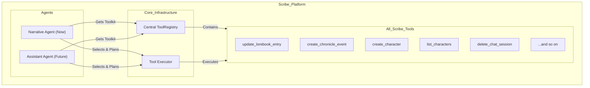
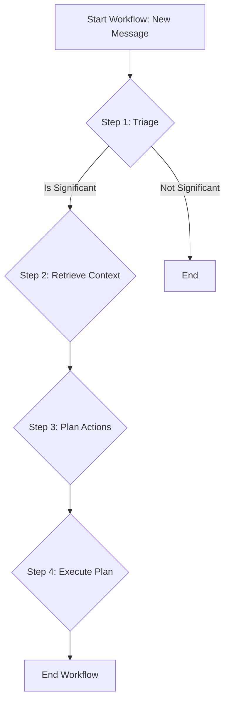

# Plan: Agentic Narrative Intelligence Layer

This document outlines the complete plan for evolving Scribe's current chronicle and lorebook features into a cohesive, autonomous "Narrative Intelligence Layer." This architecture is designed to be robust, efficient, and serve as the foundation for a future, fully agentic Scribe assistant.

## 1. Guiding Principle: "Everything as a Tool"

To prepare for a future where an AI assistant can manage the entire application, we will adopt a powerful architectural principle: **all business logic will be encapsulated within self-contained, discoverable "Tools."**

HTTP handlers will become thin wrappers that only parse requests and invoke the appropriate tool. This ensures that as we build features, we are simultaneously building the vocabulary for a future master agent, eliminating the need for a major refactor.

The "Narrative Intelligence" agent is the pilot program for this principle.

## 2. Architecture

The new architecture introduces a workflow that gives an AI agent the context and tools needed to reason about and manage the narrative state.

### 2.1. Architectural Components

*   **`ScribeTool` Trait:** A standardized trait for all tools in the system, defining its name, description (for AI reasoning), input schema, and execution logic.
*   **`ToolRegistry`:** A central, application-wide registry holding an instance of every `ScribeTool` available.
*   **`NarrativeIntelligenceService`:** The main service that orchestrates the agentic workflow.
*   **`WorkflowOrchestrator`:** A state machine that manages the multi-step agentic process.
*   **`ToolExecutor`:** The engine that executes tool calls based on the AI's generated plan.

### 2.2. Architecture Diagram: The Unified Tool Architecture

This diagram illustrates how both the immediate Narrative Agent and a future Assistant Agent will draw from the same central set of tools.

### 2.3. Agentic Workflow

The workflow consists of four main steps, managed by the `WorkflowOrchestrator`.

1.  **Step 1: Event Triage & Significance Analysis:** A cheap, fast LLM call to filter out mundane conversation and only trigger the full workflow when something important happens.
2.  **Step 2: Knowledge Retrieval:** The agent uses a `search_knowledge_base` tool to understand the existing state of the world, preventing duplication.
3.  **Step 3: Synthesis, Reasoning, and Action Planning:** The agent takes the new event and existing knowledge and formulates a structured JSON plan of which tools to call.
4.  **Step 4: Tool Execution:** The backend receives the plan and executes the tool calls, committing changes to the database.

### 2.4. Core Concept: Narrative Event System

The entire agentic workflow is predicated on the ability to understand and categorize narrative developments. To achieve this, the system uses a structured, hierarchical **Narrative Event System**. This system moves beyond simple event strings to a multi-level taxonomy that provides both high-level summaries and granular detail.

This allows the AI to reason about events like `CHARACTER_DEATH` under the broader categories of `STATE_CHANGE` and `CHARACTER`, enabling more flexible and powerful narrative analysis and tool usage.

For a complete breakdown of the event hierarchy and design principles, see the detailed documentation:
*   **[Narrative Event System Design](features/NARRATIVE_EVENT_SYSTEM.md)**

## 3. Error Handling & Rollback Strategy

To ensure data consistency in a multi-step workflow, the following strategy will be implemented:

*   **Atomicity:** The "Execution" step (Step 4) will be wrapped in a single database transaction. If any tool call in the AI's plan fails, the entire transaction will be rolled back. This guarantees that the system state remains consistent.
*   **Logging:** The state, inputs, outputs, and outcome of each step will be rigorously logged for debugging and monitoring.
*   **Stateful Orchestration:** The `WorkflowOrchestrator` will persist the state of each workflow, allowing for potential future enhancements like manual retries.

## 4. Model Selection Strategy

We will use a hybrid model approach to balance cost and capability:

| Workflow Step | Task | Recommended Model | Rationale |
| :--- | :--- | :--- | :--- |
| **Step 1: Triage** | Simple Classification | **Gemini 2.5 Flash-Lite** | High volume, low complexity. Optimize for cost and speed. |
| **Step 3: Planning** | Complex Reasoning & JSON Generation | **Gemini 2.5 Flash** | Lower volume, high complexity. Optimize for quality and reliability. |

## 5. Phased Implementation Roadmap

The project will be implemented in three phases:

*   **Phase 1: Foundation**
    *   **Goal:** Create the core components and foundational tools.
    *   **Tasks:**
        1.  Implement the generic `ScribeTool` trait and the central `ToolRegistry`.
        2.  Develop the `search_knowledge_base` tool.
        3.  Implement the `ToolExecutor` with transactional database logic.
        4.  Build the basic `WorkflowOrchestrator` state machine.

*   **Phase 2: Intelligence**
    *   **Goal:** Implement the AI-driven reasoning steps.
    *   **Tasks:**
        1.  Implement the Triage Agent (Step 1) using Gemini 2.5 Flash-Lite.
        2.  Integrate the Knowledge Retrieval step (Step 2).
        3.  Implement the Planning Agent (Step 3) using Gemini 2.5 Flash.

*   **Phase 3: Integration**
    *   **Goal:** Automate and replace the old system.
    *   **Tasks:**
        1.  Hook the `NarrativeIntelligenceService` into the main chat processing loop.
        2.  Deprecate and remove the old manual UI triggers and endpoints for chronicle/lorebook extraction.
        3.  Implement comprehensive monitoring and cost-tracking dashboards in CloudWatch.