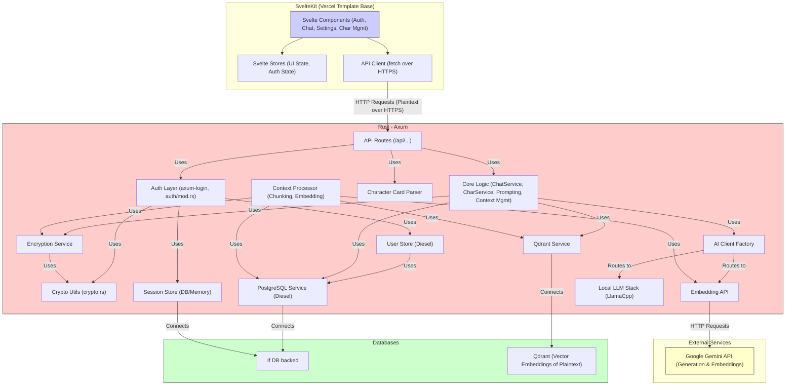

# Scribe - Architecture

## Overview

Scribe adopts a modern client-server architecture designed for performance, maintainability, and extensibility. It separates concerns between the frontend user interface, the backend business logic, data storage, and AI services (both external and local). HTTPS is used for secure communication between client and server.

The system implements a hybrid AI architecture that can seamlessly switch between cloud-based AI services (Google Gemini) and local AI models (llama.cpp) based on user preferences, privacy requirements, and resource availability.

## Components

1.  **Frontend (SvelteKit):**
    *   **Technology:** SvelteKit framework using Svelte and TypeScript. The UI is built upon the **Vercel SvelteKit AI chat template**, which utilizes **shadcn-svelte** for components and **TailwindCSS** for styling.
    *   **Responsibilities:**
        *   Rendering the user interface (login/register, chat, character management, settings).
        *   Handling user input and interactions.
        *   Managing local UI state (using Svelte Stores, including auth state).
        *   Communicating with the backend via RESTful API calls (`fetch` over HTTPS), managing session cookies automatically via the browser.
        *   Securely handling user credentials (e.g., password during login/recovery) for server-side key derivation. Chat messages are exchanged as plaintext with the backend over HTTPS.
    *   **Key Modules:** Auth views, Chat view, Character list/details, Settings panels, API client service.

2.  **Backend (Rust):**
    *   **Technology:** Rust language with the Axum web framework.
    *   **Responsibilities:**
        *   Providing a secure RESTful API for the frontend (endpoints served over HTTPS).
        *   Handling user authentication (including role-based access considerations) and session management using `axum-login` (See `docs/AUTH_DESIGN.md`).
        *   Managing the server-side encryption lifecycle: deriving Key Encryption Keys (KEKs) from user passwords, decrypting user Data Encryption Keys (DEKs) into session memory, using DEKs to encrypt/decrypt user data (chat messages, character details) before database persistence/after retrieval, and storing encrypted data with nonces. Also handles user roles and account status. (See `docs/ENCRYPTION_ARCHITECTURE.md`).
        *   Implementing core business logic (prompt assembly, context management).
        *   Interacting with databases (PostgreSQL for primary data and sessions, Qdrant for vectors).
        *   Routing AI requests through the AI Client Factory to appropriate providers (Google Gemini API or local llama.cpp models based on user preferences and availability).
        *   Parsing character card data.
        *   Processing chat history for the RAG system (chunking, embedding decrypted content).
    *   **Key Modules:** API route handlers (e.g., `routes/chats.rs`, `routes/characters.rs`, `routes/llm_routes.rs`), Authentication layer (`auth/mod.rs`, `axum-login`), Cryptography utilities (`crypto.rs`), Encryption Service (`services/encryption_service.rs`), Core logic services (e.g., `ChatService`, `CharacterService`), Database services (Diesel for PostgreSQL, Qdrant client), AI client services (`services/ai_client_factory.rs`, `llm/` module), Character parser, Context processor.

3.  **Databases:**
    *   **PostgreSQL:**
        *   **Purpose:** Primary relational database for structured, persistent data: `users` (with roles, E2EE key info, account status), `characters` (sensitive fields encrypted), `chat_sessions`, `chat_messages` (content encrypted), etc., and session state.
        *   **Interaction:** Via the Diesel ORM.
    *   **Qdrant:**
        *   **Purpose:** Vector database optimized for similarity search, powering the RAG system (stores embeddings of decrypted content).
        *   **Interaction:** Via official Qdrant Rust client library.

4.  **External Services:**
    *   **Google Gemini API:**
        *   **Purpose:** Provides large language models for text generation and text embedding.
        *   **Interaction:** Via dedicated Rust client making authenticated HTTP requests.
    *   **Local LLM (llama.cpp):** *(Optional - enabled with `local-llm` feature)*
        *   **Purpose:** Self-hosted large language models for privacy-focused AI generation with no API costs.
        *   **Interaction:** Via LlamaCpp server process managed by `LlamaCppServerManager`, accessed through `LlamaCppClient`.
        *   **Architecture:** Hybrid AI provider system with automatic fallback to Gemini API when local resources unavailable.
        *   **Documentation:** See `docs/LOCAL_LLM_ARCHITECTURE.md` for complete architectural details.

## Architecture Diagram

## Chronicle System (Optional Automatic Narrative Extraction)

Scribe includes an optional chronicle system that can automatically extract and store narrative events from chat conversations:

*   **Opt-In Per Chat:** Chronicles are only created and updated if the user enables chronicling for a specific chat session. This is a per-chat setting controlled by the user.
*   **Automatic Extraction:** When enabled for a chat, chronicles are automatically created and updated after each chat message via the narrative intelligence service.
*   **AI-Powered Chronicle Naming:** When no chronicle exists for an enabled session, the system automatically creates one with an AI-generated name based on the conversation content.
*   **Event Creation:** The system extracts significant narrative moments and creates chronicle events using AI analysis (only for enabled chats).
*   **Lorebook Integration:** The system can also extract world-building information into lorebook entries automatically (only for enabled chats).
*   **Legacy Re-chronicle:** The `/api/chronicles/:id/re-chronicle` endpoint exists for manual re-processing but is primarily for legacy/debugging use.

The agentic narrative extraction system runs automatically in the main chat flow after each assistant response, but only for chat sessions where chronicles have been explicitly enabled by the user.

## Data Flow (Core Chat Loop Example - Assumes Authenticated User)

1.  User types message in SvelteKit UI (plaintext).
2.  Frontend API Client sends the **plaintext message content** + session info to Backend API (`/api/chat/{id}/messages`) over HTTPS.
3.  Backend Auth Layer (`axum-login`) verifies the session cookie and identifies the authenticated user. The user's plaintext DEK is already in the server-side session memory from login.
4.  Backend (e.g., `ChatService`) **encrypts the user message** using the user's DEK (from session) and saves the ciphertext and nonce to PostgreSQL via `DB_SERVICE`.
5.  Backend triggers Context Processor (asynchronous) for RAG:
    *   Retrieves relevant recent (encrypted) messages from PostgreSQL.
    *   **Decrypts these messages** using the user's DEK.
    *   Chunks plaintext, embeds chunks via Gemini Embedding API.
    *   Stores vectors in Qdrant.
6.  Backend Core Logic prepares for LLM generation:
    *   Retrieves recent chat messages from PostgreSQL. **Decrypts message content** using user's DEK.
    *   Retrieves character data/settings (decrypting sensitive fields if necessary) from PostgreSQL.
    *   Queries Qdrant for relevant historical chunks (which are based on plaintext).
    *   Assembles the final prompt using **plaintext content**.
7.  Backend sends prompt to Gemini Generation API.
8.  Gemini streams response back (plaintext).
9.  Backend streams AI response (plaintext) back to Frontend over HTTPS.
10. Frontend UI displays the streamed (plaintext) response.
11. Backend (e.g., `ChatService`) **encrypts the final AI response** using user's DEK and saves ciphertext and nonce to PostgreSQL.
12. Backend triggers Context Processor again for the new AI message (decrypting it for RAG processing).

## Key Design Principles

*   **Separation of Concerns:** Frontend, backend, data, and AI logic are distinct.
*   **API-Driven:** Communication between frontend and backend is strictly via the defined REST API over HTTPS. Note: Due to specific routing behaviors encountered with Axum, API endpoints for resource operations often use explicit verbs in paths (e.g., `/characters/fetch/:id`, `/chats/remove/:id`) rather than relying solely on HTTP methods with a generic `/:id` path for all operations on a resource, to ensure reliable route matching. Authentication endpoints (e.g. `/api/auth/login`) follow standard patterns.
*   **Secure by Default:** Leverage established frameworks (`axum-login`) for authentication and session management. Implement rigorous ownership checks. User roles (`User`, `Moderator`, `Administrator`) are defined and can be used for authorization.
*   **Server-Side Data Encryption:** Sensitive user data (e.g., chat messages, character details) is encrypted on the server using user-specific Data Encryption Keys (DEKs) before being persisted to the database. DEKs are themselves encrypted with Key Encryption Keys (KEKs) derived from user passwords. The server holds the plaintext DEK only in memory during an authenticated user session. This model protects data at rest from unauthorized direct database access and system administrators.
*   **Asynchronous Processing:** Embedding and vector storage happen asynchronously.
*   **Session-Based Auth:** Use secure HttpOnly cookies managed by `axum-login` for session state.
*   **Configuration:** Manage AI keys, database connections, session secrets, etc., through configuration files or environment variables.

## Scalability and Future Platform Considerations
*(Content from original file, remains relevant)*

While the MVP focuses on a self-contained application experience, the chosen architecture is designed with long-term scalability and the broader Sanguine vision in mind:

*   **Client-Server Separation:** The distinct Rust backend API and SvelteKit frontend allow for flexible deployment. The backend can potentially serve multiple different clients (web, desktop, mobile, other Sanguine tools) or operate as a headless service within a larger infrastructure.
*   **API-Driven:** The strict API contract facilitates integration. The backend could become a core component within a larger SanguineHost platform or ecosystem.
*   **Federation Readiness:** The backend architecture is suitable for incorporating federation protocols (like ActivityPub or a custom Scribe protocol, potentially leveraging standards like Agent2Agent/A2A) in the future, enabling communication and data exchange between independent Scribe instances, aligning with the decentralization goal.
*   **Modularity:** The separation of concerns allows individual components (e.g., AI client, RAG processor) to be updated or replaced more easily as technology evolves or strategic needs change.

### Extension & Federation Hooks (post‑MVP)
*(Content from original file, remains relevant)*

* **Plugin / Tool API surface** – A thin `/api/tools/invoke` endpoint (Axum) will act as a generic broker for "tool calls" originating from the LLM. This could potentially leverage a standard like the Model Context Protocol (MCP) for integrating external resources and tools.
* **Federated Node Boundary** – Each node runs the exact same codebase.  Cross‑node sharing happens through signed `*.scribe-export.json` bundles (characters, chats).  Long‑term we expect ActivityPub‑style replication or potentially A2A-based interaction.
* **Content‑Rating Service** – Every stored entity (`characters`, `chat_sessions`, `chat_messages`) includes a `content_rating` ENUM (`SFW`, `NSFW`, `ILLEGAL`, `OTHER`).  Ratings are additive and bubble upward for fast filtering.
