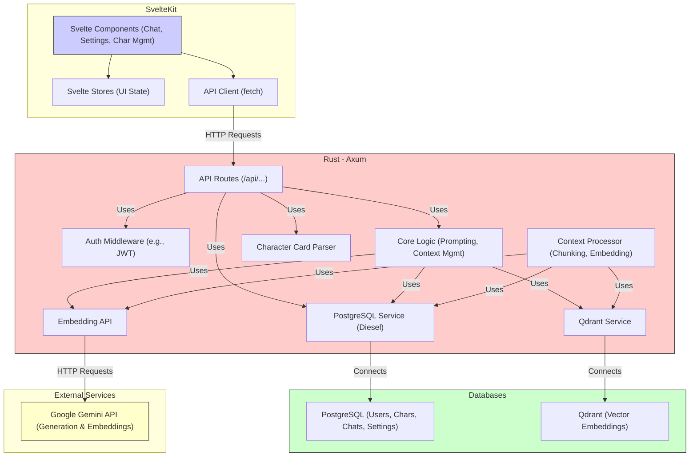

# Scribe - Architecture

## Overview

Scribe adopts a modern client-server architecture designed for performance, maintainability, and extensibility. It separates concerns between the frontend user interface, the backend business logic, data storage, and external AI services.

## Components

1.  **Frontend (SvelteKit):**
    *   **Technology:** SvelteKit framework using Svelte and TypeScript.
    *   **Responsibilities:**
        *   Rendering the user interface (chat window, character management, settings panels).
        *   Handling user input and interactions.
        *   Managing local UI state (using Svelte Stores).
        *   Communicating with the backend via a RESTful API client (`fetch`).
    *   **Key Modules:** Chat view, Character list/details, Settings panels, API client service.

2.  **Backend (Rust):**
    *   **Technology:** Rust language with the Axum web framework.
    *   **Responsibilities:**
        *   Providing a secure RESTful API for the frontend.
        *   Handling user authentication (e.g., JWT).
        *   Implementing core business logic (prompt assembly, context management).
        *   Interacting with databases (PostgreSQL, Qdrant).
        *   Communicating with external AI APIs (initially Google Gemini).
        *   Parsing character card data.
        *   Processing chat history for the RAG system (chunking, embedding).
    *   **Key Modules:** API route handlers, Authentication middleware, Core logic services (Prompting, Context), Database services (PostgreSQL, Qdrant), AI client services (Gemini Gen/Embed), Character parser, Context processor.

3.  **Databases:**
    *   **PostgreSQL:**
        *   **Purpose:** Primary relational database for structured, persistent data.
        *   **Schema:** Users, Characters (metadata), Chat Sessions, Chat Messages, Prompt Settings, etc.
        *   **Interaction:** Via the Diesel ORM.
    *   **Qdrant:**
        *   **Purpose:** Vector database optimized for similarity search, powering the RAG system.
        *   **Schema:** Collections storing vector embeddings of chat history chunks/summaries/facts, along with associated metadata (chat ID, message ID range, timestamp, speaker).
        *   **Interaction:** Via official Qdrant Rust client library.

4.  **External Services:**
    *   **Google Gemini API:**
        *   **Purpose:** Provides large language models for text generation and text embedding.
        *   **Interaction:** Via dedicated Rust client making authenticated HTTP requests.

## Architecture Diagram

## Data Flow (Core Chat Loop Example)

1.  User sends message via SvelteKit UI.
2.  Frontend API Client sends message content + session info to Backend API (`/api/chat/send`).
3.  Backend saves user message to PostgreSQL.
4.  Backend triggers Context Processor:
    *   Chunks recent history (including new message).
    *   Embeds chunks via Gemini Embedding API.
    *   Stores vectors in Qdrant.
5.  Backend Core Logic prepares for generation:
    *   Retrieves recent messages from PostgreSQL.
    *   Retrieves character data/settings from PostgreSQL.
    *   Embeds recent context via Gemini Embedding API.
    *   Queries Qdrant Vector Service for relevant historical context based on similarity search.
    *   Assembles the final prompt using character data, settings, recent history, and retrieved RAG context.
6.  Backend sends assembled prompt to Gemini Generation API via Gemini Client.
7.  Gemini streams response back to Backend.
8.  Backend streams response back to Frontend API Client.
9.  Frontend UI displays streamed response.
10. Backend saves final AI response to PostgreSQL.
11. Backend triggers Context Processor again for the new AI message.

## Key Design Principles

*   **Separation of Concerns:** Frontend, backend, data, and AI logic are distinct.
*   **API-Driven:** Communication between frontend and backend is strictly via the defined REST API.
*   **Asynchronous Processing:** Embedding and vector storage should ideally happen asynchronously to avoid blocking chat interactions.
*   **Stateless Backend (where possible):** Rely on JWT/session tokens for authentication and fetch necessary data from databases per request.
*   **Configuration:** Manage AI keys, database connections, etc., through configuration files or environment variables.