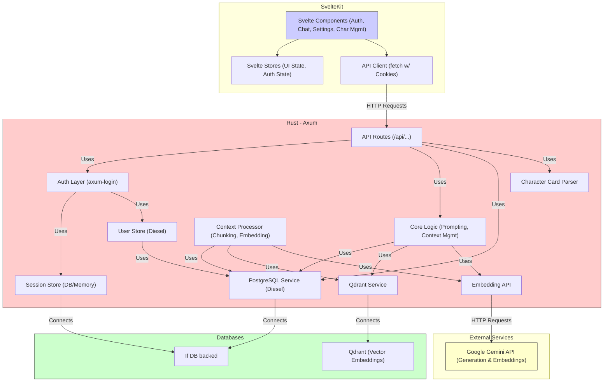

# Scribe - Architecture

## Overview

Scribe adopts a modern client-server architecture designed for performance, maintainability, and extensibility. It separates concerns between the frontend user interface, the backend business logic, data storage, and external AI services.

## Components

1.  **Frontend (SvelteKit):**
    *   **Technology:** SvelteKit framework using Svelte and TypeScript. UI components and styling provided by the **Skeleton UI toolkit** ([https://www.skeleton.dev/](https://www.skeleton.dev/)) integrated with TailwindCSS.
    *   **Responsibilities:**
        *   Rendering the user interface (login/register, chat, character management, settings).
        *   Handling user input and interactions.
        *   Managing local UI state (using Svelte Stores, including auth state).
        *   Communicating with the backend via RESTful API calls (`fetch`), managing session cookies automatically via the browser.
    *   **Key Modules:** Auth views, Chat view, Character list/details, Settings panels, API client service.

2.  **Backend (Rust):**
    *   **Technology:** Rust language with the Axum web framework.
    *   **Responsibilities:**
        *   Providing a secure RESTful API for the frontend.
        *   Handling user authentication and session management using `axum-login` (See `docs/AUTH_DESIGN.md`).
        *   Implementing core business logic (prompt assembly, context management).
        *   Interacting with databases (PostgreSQL for primary data and sessions, Qdrant for vectors).
        *   Communicating with external AI APIs (initially Google Gemini).
        *   Parsing character card data.
        *   Processing chat history for the RAG system (chunking, embedding).
    *   **Key Modules:** API route handlers, Authentication layer (`axum-login`), Core logic services, Database services (Diesel for PostgreSQL, Qdrant client), AI client services, Character parser, Context processor.

3.  **Databases:**
    *   **PostgreSQL:**
        *   **Purpose:** Primary relational database for structured, persistent data (`users`, `characters`, `chat_sessions`, `chat_messages`, etc.) and potentially session state.
        *   **Interaction:** Via the Diesel ORM.
    *   **Qdrant:**
        *   **Purpose:** Vector database optimized for similarity search, powering the RAG system.
        *   **Interaction:** Via official Qdrant Rust client library.

4.  **External Services:**
    *   **Google Gemini API:**
        *   **Purpose:** Provides large language models for text generation and text embedding.
        *   **Interaction:** Via dedicated Rust client making authenticated HTTP requests.

## Architecture Diagram

## Data Flow (Core Chat Loop Example - Assumes Authenticated User)

1.  User sends message via SvelteKit UI.
2.  Frontend API Client sends message content + session info to Backend API (`/api/chat/{id}/messages`). The browser automatically includes the session cookie.
3.  Backend Auth Layer (`axum-login`) verifies the session cookie and identifies the authenticated user.
4.  Backend saves user message to PostgreSQL, associating it with the **authenticated user's session**.
5.  Backend triggers Context Processor (asynchronous):
    *   Chunks recent history.
    *   Embeds chunks via Gemini.
    *   Stores vectors in Qdrant.
6.  Backend Core Logic prepares for generation:
    *   Retrieves recent messages **for the user's session** from PostgreSQL.
    *   Retrieves character data/settings **owned by the user** from PostgreSQL.
    *   Embeds recent context.
    *   Queries Qdrant for relevant historical chunks.
    *   Assembles the final prompt.
7.  Backend sends prompt to Gemini Generation API.
8.  Gemini streams response back.
9.  Backend streams response back to Frontend.
10. Frontend UI displays streamed response.
11. Backend saves final AI response to PostgreSQL **for the user's session**.
12. Backend triggers Context Processor again for the new AI message.

## Key Design Principles

*   **Separation of Concerns:** Frontend, backend, data, and AI logic are distinct.
*   **API-Driven:** Communication between frontend and backend is strictly via the defined REST API.
*   **Secure by Default:** Leverage established frameworks (`axum-login`) for authentication and session management. Implement rigorous ownership checks.
*   **Asynchronous Processing:** Embedding and vector storage should ideally happen asynchronously.
*   **Session-Based Auth:** Use secure HttpOnly cookies managed by `axum-login` for session state.
*   **Configuration:** Manage AI keys, database connections, session secrets, etc., through configuration files or environment variables.

## Scalability and Future Platform Considerations

While the MVP focuses on a self-contained application experience, the chosen architecture is designed with long-term scalability and the broader Sanguine vision in mind:

*   **Client-Server Separation:** The distinct Rust backend API and SvelteKit frontend allow for flexible deployment. The backend can potentially serve multiple different clients (web, desktop, mobile, other Sanguine tools) or operate as a headless service within a larger infrastructure.
*   **API-Driven:** The strict API contract facilitates integration. The backend could become a core component within a larger SanguineHost platform or ecosystem.
*   **Federation Readiness:** The backend architecture is suitable for incorporating federation protocols (like ActivityPub or a custom Scribe protocol, potentially leveraging standards like Agent2Agent/A2A) in the future, enabling communication and data exchange between independent Scribe instances, aligning with the decentralization goal.
*   **Modularity:** The separation of concerns allows individual components (e.g., AI client, RAG processor) to be updated or replaced more easily as technology evolves or strategic needs change.

### Extension & Federation Hooks (post‑MVP)

* **Plugin / Tool API surface** – A thin `/api/tools/invoke` endpoint (Axum) will act as a generic broker for "tool calls" originating from the LLM. This could potentially leverage a standard like the Model Context Protocol (MCP) for integrating external resources and tools.
* **Federated Node Boundary** – Each node runs the exact same codebase.  Cross‑node sharing happens through signed `*.scribe-export.json` bundles (characters, chats).  Long‑term we expect ActivityPub‑style replication or potentially A2A-based interaction.
* **Content‑Rating Service** – Every stored entity (`characters`, `chat_sessions`, `chat_messages`) includes a `content_rating` ENUM (`SFW`, `NSFW`, `ILLEGAL`, `OTHER`).  Ratings are additive and bubble upward for fast filtering.
