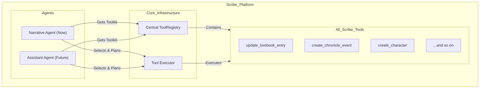
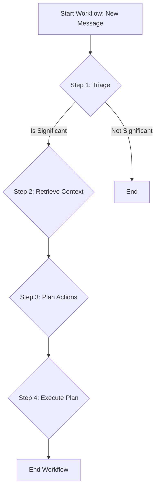

# Scribe: The Ars Fabula Implementation Plan
# Version 3.0

## 1. The Vision: A New Paradigm for Agentic AI

Scribe is architected to be more than a simple chatbot. It is a foundational platform for **agentic AI**, designed to understand, remember, and reason about narrative worlds with unprecedented depth. Our mission is to create an experience that surpasses existing platforms like Character.ai and SillyTavern, not just in text-based roleplaying, but as a stepping stone towards fully integrated AI in game worlds and, eventually, the physical world.

The core of this vision is the **Ars Fabula** architecture—a blueprint for a universal narrative engine. By implementing this, we are building a system capable of long-term memory, causal reasoning, and emergent storytelling, paving a potential route to more generalized forms of artificial intelligence.

## 2. The Strategy: MVP First, Then World Integration

Our implementation strategy is focused and pragmatic. We will first perfect the core of the narrative engine before expanding its reach.

*   **Phase 1: The Ars Fabula MVP (Current Focus):** We will complete the implementation of **Part I (The Event Ontology)** and **Part V (Memory & Consistency)** of the Ars Fabula paper. This will give us a state-of-the-art narrative memory and reasoning system, providing a robust foundation for all future work.
*   **Phase 2: Game World Integration:** Once the MVP is complete, we will focus on integrating Scribe into game engines, allowing it to ingest real-time events and influence the game world.
*   **Phase 3: Physical World & AGI:** The long-term vision is to apply these principles to robotics and real-world task planning, leveraging the full BDI cognitive architecture.

## 3. Core Architecture: Everything as a Tool

Our guiding architectural principle is **"Everything as a Tool."** All business logic is encapsulated within self-contained, discoverable `ScribeTool`s. This ensures that as we build features, we are simultaneously building the vocabulary for a future master agent, eliminating the need for major refactoring.



## 4. The Agentic Workflow

The narrative intelligence workflow is a four-step process that allows the agent to perceive, reason, and act upon new information.



1.  **Step 1: Triage & Significance Analysis:** A cheap, fast LLM call filters out mundane conversation, triggering the full workflow only for narratively significant events.
2.  **Step 2: Knowledge Retrieval:** The agent uses a `search_knowledge_base` tool to query the chronicle, understanding the existing state of the world to prevent duplication. This is powered by our structured `ChronicleDeduplicationService`.
3.  **Step 3: Synthesis, Reasoning, and Action Planning:** The agent takes the new event and existing knowledge and formulates a structured JSON plan of which tools to call, populating the rich `Ars Fabula` event schema.
4.  **Step 4: Tool Execution:** The backend receives the plan and executes the tool calls within a single database transaction, ensuring data consistency.

## 5. The Ars Fabula MVP: Definition of Done

This section outlines the concrete tasks required to complete our current strategic phase.

*   **[Done]** Implement the full `Ars Fabula` event schema in the database.
*   **[Done]** Implement the structured, query-based `ChronicleDeduplicationService`.
*   **[Done]** Integrate `UserPersonaContext` into the agentic workflow for consistent character voice.
*   **[Todo]** **Enhance AI Planning for Causality & Valence:**
    *   Update the agent's planning prompt in `agent_runner.rs` to instruct the AI to reason about and populate the `causality` and `valence` fields for new events. This is the final step to fully realize the richness of the event schema.
*   **[Todo]** **Implement a "Reflection Loop" for Memory:**
    *   Create a new background service that periodically runs a "reflection" process for an agent. This process will analyze the agent's event graph (using the `causality` links) to synthesize higher-level beliefs, as described in **Part V, Section 5.2**. This is the key to unlocking true long-term memory and character evolution.
*   **[Todo]** **Create Richer Embeddings:**
    *   Update the embedding generation logic in `EmbeddingPipelineService` to create a text representation from the structured event data (e.g., `"Action: [action], Actors: [actors], Summary: [summary]"`) instead of just using the summary. This will dramatically improve the accuracy of semantic search for RAG.

## 6. The Unified Roadmap

This roadmap visualizes our strategic path forward.

```mermaid
graph TD
    subgraph "Stage 1: Ars Fabula MVP (Current Focus)"
        direction TB
        T1["✅ Implement Full Event Schema"]
        T2["✅ Implement Structured De-duplication"]
        T3["✅ Integrate Persona Context"]
        T4["⬜️ TODO: Enhance AI to Populate Causality/Valence"]
        T5["⬜️ TODO: Implement Agent Reflection Loop"]
        T6["⬜️ TODO: Implement Richer Embeddings"]
        
        T1 & T2 & T3 --> T4 --> T5 --> T6
    end

    subgraph "Stage 2: Game World Integration"
        G1["Game Engine SDK (Unreal/Unity)"]
        G2["Real-time Event Ingestion API"]
        G3["Agent-driven Quest Generation"]
    end

    subgraph "Stage 3: Physical World & AGI"
        R1["Robotics & Sensor Integration"]
        R2["Real-world Task Planning (GOAP)"]
        R3["Full BDI Cognitive Architecture"]
    end

    T6 --> G1 --> G2 --> G3 --> R1 --> R2 --> R3

    style T1 fill:#9f9,stroke:#333,stroke-width:2px
    style T2 fill:#9f9,stroke:#333,stroke-width:2px
    style T3 fill:#9f9,stroke:#333,stroke-width:2px