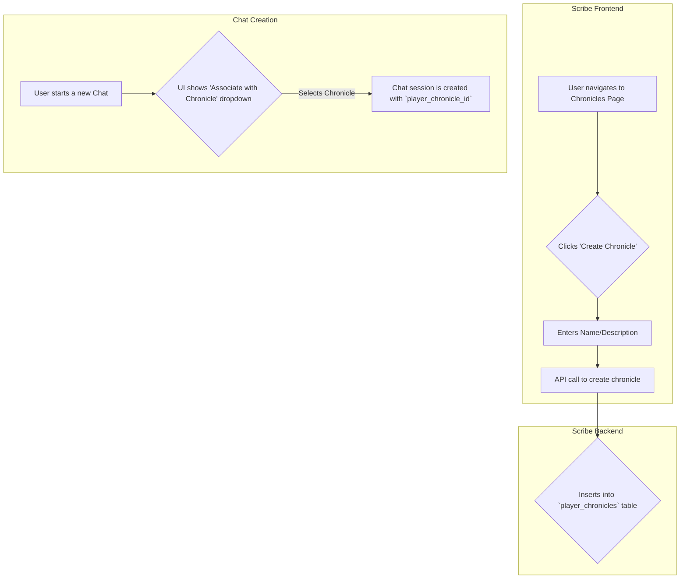

# Scribe Chronicle: Implementation Plan

## 1. Overview

This document outlines a phased implementation plan to integrate a long-term memory system, called the **Player Chronicle**, into the Scribe platform.

The primary goal is to deliver a functional version for the existing text-based web application within a two-week timeframe (Phase 1 & 2), while establishing a robust foundation for future integration with external game clients like Sanguine Ascend (Phase 3).

## 2. Core Concept: The Player Chronicle

The **Player Chronicle** is a persistent, time-ordered log of significant events that occur during a user's story or gameplay session. It moves beyond simple chat history to capture meaningful actions, decisions, and state changes, providing a rich source of long-term memory for the AI.

## 3. Phase 1: Foundational Models & UI (Target: Week 1)

This phase focuses on establishing the core data structures and UI components necessary for managing chronicles.

### 3.1. Database Schema

The following changes will be made to the Scribe database schema:

1.  **Create `player_chronicles` Table:**
    *   `id`: UUID, Primary Key
    *   `user_id`: UUID, Foreign Key to `users.id`
    *   `name`: Varchar, a user-defined name for the story/playthrough.
    *   `description`: Text, optional user-defined description.
    *   `created_at`, `updated_at`: Timestamps

2.  **Create `game_events` Table:**
    *   `id`: UUID, Primary Key
    *   `chronicle_id`: UUID, Foreign Key to `player_chronicles.id`
    *   `timestamp`: Timestamp, when the event occurred.
    *   `event_type`: Varchar, a string identifying the type of event (e.g., "PlotTwist", "ItemAcquired").
    *   `summary`: Text, a concise, human-readable summary of the event, optimized for RAG.
    *   `event_data`: JSONB, a flexible field for structured data related to the event.

3.  **Modify `chat_sessions` Table:**
    *   Add a nullable `player_chronicle_id` (UUID) column with a foreign key constraint to `player_chronicles.id`.

### 3.2. Frontend UI (Scribe Web App)

1.  **Chronicle Management Page:**
    *   Create a new page accessible from the main navigation.
    *   This page will display a list of the user's existing chronicles.
    *   It will provide functionality to **Create**, **Edit** (name/description), and **Delete** chronicles.

2.  **Chat Session Integration:**
    *   In the "New Chat" and/or "Chat Settings" modal, add a dropdown menu labeled "Associate with Chronicle".
    *   This dropdown will be populated with the user's list of chronicles.
    *   Selecting a chronicle will link the chat session to it by setting the `player_chronicle_id`.

### 3.3. Diagram: Phase 1 UI/DB Flow



## 4. Phase 2: AI-Powered Event Extraction (Target: Week 1-2)

This phase implements the core logic for automatically populating the chronicle from text-based conversations.

### 4.1. Event Extractor Service

A new asynchronous background service will be created in the Scribe backend.

*   **Trigger:** This service will be invoked automatically after a new AI-generated message is successfully saved to a `chat_session` that has a valid `player_chronicle_id`.
*   **Core Logic:**
    1.  The service will retrieve the last `N` messages (e.g., 4-6) from the chat history.
    2.  It will send this conversational snippet to a small, fast, and cost-effective LLM (e.g., Claude Haiku, Gemini Flash).
    3.  The LLM request will be framed with a specific prompt and a **function calling** tool definition for a function like `record_event(event_type: string, summary: string, data: json)`.
    4.  **Prompt Example:** `"Analyze the following conversation snippet for significant plot developments, character decisions, or changes in state. If a key event has occurred, call the 'record_event' function with the details. If no significant event has occurred, do nothing."`
*   **Persistence:** If the LLM calls the `record_event` function, the service will validate the data and insert a new record into the `game_events` table, linked to the correct chronicle.

### 4.2. Generation Flow Integration

The main AI response generation service (`generation.rs`) will be updated.

1.  **Context Gathering:** Before building the prompt, the service will check if the `chat_session` has a `player_chronicle_id`.
2.  **RAG on Chronicle:** If a chronicle is linked, the service will perform a vector search against the `summary` column of the `game_events` table for that chronicle, using the user's latest message as the query.
3.  **Prompt Injection:** The summaries of the most relevant events will be formatted and injected into a new `<player_chronicle_highlights>` section in the main prompt sent to the primary LLM.

### 4.3. Diagram: Phase 2 Service Flow

```mermaid
sequenceDiagram
    participant User
    participant ScribeServer as Scribe Backend
    participant MainLLM as Main AI (e.g., Gemini Pro)
    participant ExtractorLLM as Event Extractor AI (e.g., Haiku)

    User->>ScribeServer: Sends new chat message
    ScribeServer->>MainLLM: Generates response (using existing chronicle events for context)
    MainLLM-->>ScribeServer: Streams response back to User
    ScribeServer-->>User: Displays response

    Note over ScribeServer: After response is complete...
    ScribeServer-x>ExtractorLLM: Asynchronously sends recent chat history
    ExtractorLLM-->>ScribeServer: Calls `record_event()` function with summary
    ScribeServer->>ScribeServer: Stores new event in PlayerChronicle
```

## 5. Phase 3: Future Expansion - Game-Driven Events

This phase, to be undertaken after the web app MVP is live, enables direct integration with game clients.

*   **New API Endpoint:** Implement a new endpoint, `POST /api/chronicle/{chronicle_id}/events`, that allows an authenticated client to directly submit a `GameEvent`.
*   **Game Client Logic:** A game client (like Sanguine Ascend) will be responsible for determining when a significant event occurs in its own logic and sending a well-structured `GameEvent` to this new endpoint.
*   **Hybrid Context:** The prompt generation system will seamlessly use events from both the AI-Derived flow and the Game-Driven flow, creating a unified context for the AI.