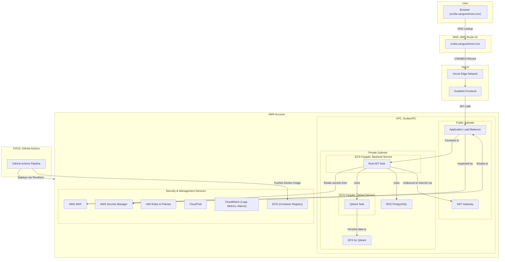

# Scribe - Cloud Architecture Plan

This document outlines the approved cloud architecture for the Scribe application, designed to be secure, scalable, and operationally excellent, in alignment with AWS Well-Architected principles.

## 1. Guiding Principles

*   **Well-Architected:** Adherence to AWS best practices for security, reliability, performance, cost, and operational excellence.
*   **Infrastructure as Code (IaC):** The entire AWS infrastructure will be defined, versioned, and deployed using Terraform, enabling reproducibility and easy teardown/rebuild.
*   **Zero Trust Security:** No implicit trust. We will enforce strict identity verification, least-privilege access, and network segmentation for every component.
*   **Scalability & Compliance:** The architecture is designed to scale and to provide the foundational controls necessary for future GDPR/PCI DSS compliance.

## 2. Core Architecture

*   **Frontend:** SvelteKit application hosted on **Vercel**, leveraging its global CDN and seamless CI/CD for rapid development. DNS for `scribe.sanguinehost.com` will be a `CNAME` record pointing to Vercel.
*   **Backend:** A Rust application running as a containerized service on **AWS Fargate** within a private network.
*   **Databases:**
    *   **PostgreSQL:** Managed via **Amazon RDS**, running in a private subnet.
    *   **Qdrant:** Running as a containerized service on **AWS Fargate** in a private subnet, with data persisted to **Amazon EFS**.
*   **Networking:** A custom **VPC** with public subnets for ingress (ALB, NAT Gateways) and private subnets for all application and data services.
*   **Security:**
    *   **AWS WAF** to protect the Application Load Balancer.
    *   **AWS Secrets Manager** for all credentials, with automated rotation for RDS.
    *   **IAM Roles** providing least-privilege permissions for all services.
*   **CI/CD:** **GitHub Actions** will be used to build, test, and push the backend Docker image to **ECR**, and then to run Terraform to deploy infrastructure changes.

## 3. Architecture Diagram

## 4. Database Administration Access

### Tailscale Subnet Router
For secure database administration without exposing RDS to the public internet, we use a Tailscale subnet router:

*   **EC2 Instance**: A t3.micro instance in the public subnet running Tailscale
*   **Subnet Routing**: Advertises the VPC CIDR (10.0.0.0/16) to the Tailscale network
*   **Security**: End-to-end encrypted WireGuard tunnels via Tailscale
*   **Access Control**: Managed through Tailscale ACLs and AWS security groups
*   **Benefits**: 
    *   No bastion host complexity or SSH key management
    *   Zero-trust network access with MFA support
    *   Easy to enable/disable access as needed
    *   Works seamlessly with local database tools

The RDS security group is configured to allow connections from:
*   Backend ECS tasks (primary application access)
*   Tailscale CGNAT range (100.64.0.0/10)
*   VPC CIDR range (10.0.0.0/16) for subnet router access

## 5. Terraform Environment Strategy

*   We will use a **Directory-based Layout** to manage environments.
*   This provides strong isolation between `staging` and `production`, with common infrastructure components defined in reusable modules.
*   This structure enhances safety and clarity, preventing accidental changes to the production environment.