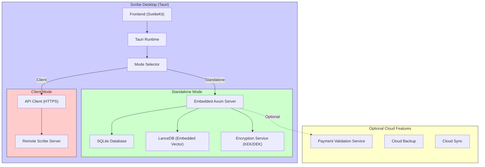
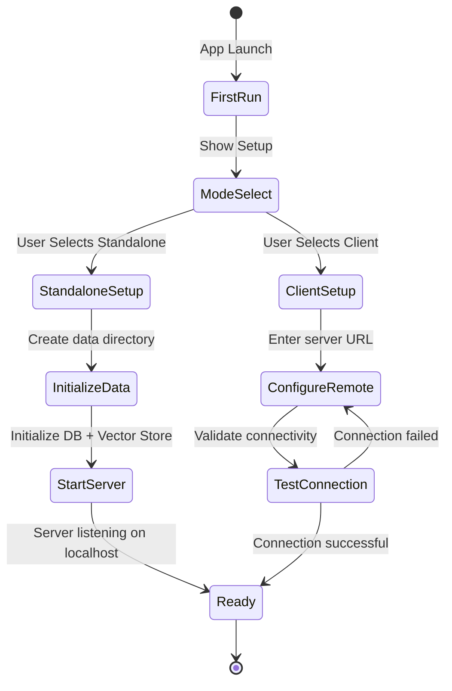
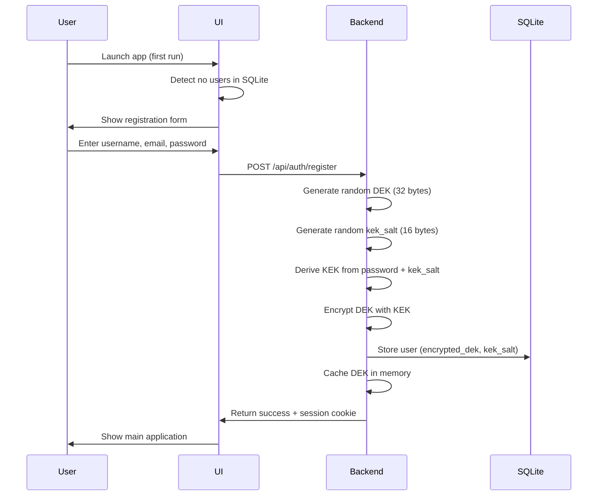

# Scribe Desktop Architecture

## Overview

This document describes the architecture for Scribe Desktop, a standalone desktop application that packages the full Scribe stack (frontend + backend + database + vector store) into a single distributable binary. The desktop version targets the SillyTavern community and content creators, providing a simpler user experience while maintaining equal or better customizability.

**Strategic Purpose**: The desktop application serves as a stepping stone toward game engine integration (Unreal/Unity), proving the embeddability, local data handling, API solidification, and performance optimization needed for running Scribe as an embedded component in games.

**Target Platforms**:
- Windows (x64)
- macOS (Intel + Apple Silicon)

**Binary Size Target**: <200MB

## Design Principles

1. **Dual-Mode Architecture**: Support both standalone mode (embedded backend) and client mode (connect to remote server)
2. **Zero Docker Dependencies**: Completely self-contained binary with no container requirements
3. **Full Encryption Preservation**: Maintain complete KEK/DEK encryption system even for local-only deployments
4. **Database Agnostic**: Support both PostgreSQL (cloud) and SQLite (desktop) through abstraction layer
5. **Feature Flag Based**: Clean separation of desktop vs cloud features through Cargo feature flags
6. **Test-Driven**: Follow TESTING_PATTERNS.md with comprehensive OWASP security testing
7. **Simpler Than SillyTavern**: Provide superior UX while matching or exceeding customizability

## Architecture Diagram



## Component Architecture

### 1. Desktop Framework: Tauri 2.0

**Technology Choice**: Tauri 2.0
- **Bundle Size**: Core runtime ~3-5MB (vs Electron's ~100MB)
- **Performance**: Native WebView, no Chromium embedding
- **Security**: Process isolation, capability-based permissions
- **Cross-Platform**: Single codebase for Windows/macOS/Linux

**Key Tauri Integration Patterns**:

```rust
// Tauri command for IPC
#[tauri::command]
async fn start_embedded_server(
    app_handle: tauri::AppHandle,
    mode: ServerMode,
) -> Result<ServerInfo, String> {
    match mode {
        ServerMode::Standalone => {
            // Initialize SQLite + LanceDB
            // Start embedded Axum server
            // Return localhost URL
        }
        ServerMode::Client => {
            // Return user-configured remote URL
        }
    }
}

// Event emission for server status
app_handle.emit_all("server-status", ServerStatusEvent {
    status: "running",
    port: 8080,
    mode: "standalone",
})?;
```

**Frontend Communication**:
```typescript
import { invoke } from '@tauri-apps/api/tauri';
import { listen } from '@tauri-apps/api/event';

// Server status types
interface ServerStatus {
    type: 'Starting' | 'Running' | 'Error' | 'Stopped';
    progress?: number;
    message?: string;
    port?: number;
    url?: string;
    error?: string;
    recovery_hint?: string;
}

// Start server
const serverInfo = await invoke('start_embedded_server', {
    mode: 'standalone'
});

// Listen for status updates with error handling
await listen('server-status', (event) => {
    const status = event.payload as ServerStatus;

    if (status.type === 'Error') {
        // Show user-friendly error dialog
        showError({
            title: 'Server Error',
            message: status.error,
            hint: status.recovery_hint,
            actions: ['Retry', 'Reset Database', 'View Logs']
        });
    } else if (status.type === 'Running') {
        // Navigate to main app
        navigateTo(`/chat`);
    }
});
```

### 2. Dual-Mode Architecture

#### Mode Selection Flow



#### Configuration Storage

**Location**: Platform-specific config directory
- **Windows**: `%APPDATA%/scribe/config.json`
- **macOS**: `~/Library/Application Support/scribe/config.json`
- **Linux**: `~/.config/scribe/config.json`

**Config Structure**:
```json
{
    "mode": "standalone",
    "standalone": {
        "data_dir": "/path/to/scribe-data",
        "port": 8080,
        "bind_address": "127.0.0.1"
    },
    "client": {
        "server_url": "https://scribe.example.com",
        "api_key": "encrypted_api_key"
    }
}
```

**Note**: Single build artifact supports both modes. User can switch modes at runtime without reinstalling.

### 3. Database Abstraction Layer

#### Feature Flag Strategy

**Cargo.toml**:
```toml
[features]
default = ["desktop"]

# Deployment modes
desktop = ["sqlite-backend", "embedded-vector", "local-llm"]
cloud = ["postgres-backend", "remote-vector", "payment"]

# Backend options (mutually exclusive)
sqlite-backend = ["diesel/sqlite"]
postgres-backend = ["diesel/postgres"]

# Vector store options (mutually exclusive)
embedded-vector = ["lancedb"]
remote-vector = ["qdrant-client"]

# Optional features
payment = ["stripe"]  # Cloud-only, excluded from desktop builds
local-llm = ["llama-cpp"]
```

**Note**: Desktop builds do NOT include payment processing code. Payment validation (if needed) is handled via optional cloud API calls.

#### Database Backend Abstraction

**Design Pattern**: Conditional compilation with trait abstraction

```rust
// backend/src/db/mod.rs

#[cfg(feature = "sqlite-backend")]
pub type DbConnection = diesel::sqlite::SqliteConnection;

#[cfg(feature = "postgres-backend")]
pub type DbConnection = diesel::pg::PgConnection;

pub trait DbBackend {
    type Connection: diesel::Connection;

    fn establish_connection(url: &str) -> Result<Self::Connection, DbError>;
    fn run_migrations(conn: &mut Self::Connection) -> Result<(), MigrationError>;
}

#[cfg(feature = "sqlite-backend")]
pub struct SqliteBackend;

#[cfg(feature = "sqlite-backend")]
impl DbBackend for SqliteBackend {
    type Connection = diesel::sqlite::SqliteConnection;

    fn establish_connection(url: &str) -> Result<Self::Connection, DbError> {
        SqliteConnection::establish(url)
            .map_err(|e| DbError::ConnectionFailed(e.to_string()))
    }

    fn run_migrations(conn: &mut Self::Connection) -> Result<(), MigrationError> {
        use diesel_migrations::MigrationHarness;
        conn.run_pending_migrations(SQLITE_MIGRATIONS)
            .map(|_| ())
            .map_err(|e| MigrationError::Failed(e.to_string()))
    }
}
```

#### Type Mapping Strategy

**PostgreSQL → SQLite Conversion**:

| PostgreSQL Type | SQLite Type | Rust Handling |
|-----------------|-------------|---------------|
| `UUID` | `TEXT` | Custom `FromSql`/`ToSql` with validation |
| `BYTEA` | `BLOB` | Direct mapping |
| `JSONB` | `TEXT` | `serde_json::to_string()` / `from_str()` |
| `ARRAY<TEXT>` | `TEXT` | JSON array serialization |
| `NUMERIC(precision, scale)` | `INTEGER` (cents) or `TEXT` | Currency handling or precise decimals |
| `TIMESTAMPTZ` | `TEXT` (ISO 8601) | `chrono::DateTime<Utc>` |
| Custom ENUMs | `TEXT` | Rust enum with `Display`/`FromStr` |

**Custom Type Implementations**:

```rust
// backend/src/db/sqlite_types.rs

#[cfg(feature = "sqlite-backend")]
use diesel::deserialize::{self, FromSql};
use diesel::serialize::{self, ToSql, Output};
use diesel::sql_types::Text;
use uuid::Uuid;

impl FromSql<Text, diesel::sqlite::Sqlite> for Uuid {
    fn from_sql(bytes: Option<&[u8]>) -> deserialize::Result<Self> {
        let s = <String as FromSql<Text, diesel::sqlite::Sqlite>>::from_sql(bytes)?;
        Uuid::parse_str(&s).map_err(|e| e.into())
    }
}

impl ToSql<Text, diesel::sqlite::Sqlite> for Uuid {
    fn to_sql<W: std::io::Write>(&self, out: &mut Output<W, diesel::sqlite::Sqlite>) -> serialize::Result {
        <String as ToSql<Text, diesel::sqlite::Sqlite>>::to_sql(&self.to_string(), out)
    }
}

// JSONB handling
#[derive(Debug, Clone, Serialize, Deserialize)]
pub struct JsonValue(pub serde_json::Value);

impl FromSql<Text, diesel::sqlite::Sqlite> for JsonValue {
    fn from_sql(bytes: Option<&[u8]>) -> deserialize::Result<Self> {
        let s = <String as FromSql<Text, diesel::sqlite::Sqlite>>::from_sql(bytes)?;
        serde_json::from_str(&s)
            .map(JsonValue)
            .map_err(|e| e.into())
    }
}

impl ToSql<Text, diesel::sqlite::Sqlite> for JsonValue {
    fn to_sql<W: std::io::Write>(&self, out: &mut Output<W, diesel::sqlite::Sqlite>) -> serialize::Result {
        let s = serde_json::to_string(&self.0)?;
        <String as ToSql<Text, diesel::sqlite::Sqlite>>::to_sql(&s, out)
    }
}
```

### 4. Vector Store: LanceDB (Recommended)

#### Selection Rationale

After comprehensive research comparing LanceDB, Qdrant Embedded, and usearch, **LanceDB is the recommended choice**:

**LanceDB Advantages**:
- ✅ **Native Hybrid Search**: Built-in Tantivy integration for vector + full-text search
- ✅ **Moderate Binary Size**: 10-25MB impact (vs Qdrant's 50-80MB+)
- ✅ **Excellent Performance**: <1ms for 1M vectors (128D), 25-50ms with filtering
- ✅ **Idiomatic Rust API**: Clean integration with existing codebase
- ✅ **SQL-like Filtering**: Metadata filtering using SQL WHERE clauses
- ✅ **Active Development**: Apache Arrow ecosystem, strong community

**LanceDB Trade-offs**:
- ⚠️ **Newer Technology**: Less battle-tested than Qdrant (launched 2023 vs 2021)
- ⚠️ **Smaller Ecosystem**: Fewer integrations compared to Qdrant

**Qdrant Embedded** (Alternative if maturity critical):
- ✅ Production-proven, battle-tested
- ✅ Full feature parity with cloud version
- ❌ 50-80MB+ binary size impact
- ❌ Requires separate hybrid search implementation

**usearch** (Not Recommended):
- ✅ Minimal size (~5MB)
- ❌ No built-in filtering or hybrid search
- ❌ Would require custom full-text search integration

#### LanceDB Integration Pattern

```rust
// backend/src/vector_db/lancedb_client.rs

use lancedb::{Connection, Table};
use lancedb::query::{QueryBuilder, VectorQuery};
use arrow::array::{Float32Array, StringArray};

pub struct LanceDbClient {
    connection: Connection,
    table_name: String,
}

impl LanceDbClient {
    pub async fn new(data_dir: &Path) -> Result<Self, VectorDbError> {
        let db_path = data_dir.join("vectors.lance");
        let connection = lancedb::connect(db_path.to_str().unwrap()).await?;

        Ok(Self {
            connection,
            table_name: "embeddings".to_string(),
        })
    }

    pub async fn ensure_table_exists(&self, dimension: usize) -> Result<(), VectorDbError> {
        // Create table with schema if not exists
        if !self.connection.table_names().await?.contains(&self.table_name) {
            let schema = Arc::new(Schema::new(vec![
                Field::new("id", DataType::Utf8, false),
                Field::new("vector", DataType::FixedSizeList(
                    Arc::new(Field::new("item", DataType::Float32, true)),
                    dimension as i32,
                ), false),
                Field::new("text", DataType::Utf8, false),
                Field::new("metadata", DataType::Utf8, true),
            ]));

            self.connection
                .create_empty_table(&self.table_name, schema)
                .await?;
        }

        Ok(())
    }

    pub async fn store_points(
        &self,
        points: Vec<PointStruct>,
    ) -> Result<(), VectorDbError> {
        let table = self.connection.open_table(&self.table_name).await?;

        // Convert to Arrow RecordBatch
        let batch = self.points_to_batch(points)?;
        table.add(batch).await?;

        Ok(())
    }

    pub async fn hybrid_search(
        &self,
        query_vector: Vec<f32>,
        query_text: &str,
        limit: usize,
        filter: Option<&str>,
    ) -> Result<Vec<ScoredPoint>, VectorDbError> {
        let table = self.connection.open_table(&self.table_name).await?;

        // Vector similarity search
        let mut query = table
            .vector_search(query_vector.as_slice())
            .limit(limit * 2); // Over-fetch for re-ranking

        // Add metadata filter if provided
        if let Some(filter_expr) = filter {
            query = query.filter(filter_expr);
        }

        let vector_results = query.execute().await?;

        // Full-text search using Tantivy (built into LanceDB)
        let text_results = table
            .search(query_text)
            .limit(limit * 2)
            .execute()
            .await?;

        // Merge and re-rank results
        let merged = self.merge_results(vector_results, text_results, limit)?;

        Ok(merged)
    }
}

#[async_trait]
impl VectorStoreService for LanceDbClient {
    async fn ensure_collection_exists(&self, dimension: usize) -> Result<(), VectorDbError> {
        self.ensure_table_exists(dimension).await
    }

    async fn store_points(&self, points: Vec<PointStruct>) -> Result<(), VectorDbError> {
        self.store_points(points).await
    }

    async fn search_points(
        &self,
        query_vector: Vec<f32>,
        limit: usize,
        filter: Option<Filter>,
    ) -> Result<Vec<ScoredPoint>, VectorDbError> {
        let filter_expr = filter.map(|f| self.filter_to_sql(&f));

        let table = self.connection.open_table(&self.table_name).await?;
        let results = table
            .vector_search(query_vector.as_slice())
            .limit(limit)
            .filter(filter_expr.as_deref().unwrap_or(""))
            .execute()
            .await?;

        self.results_to_scored_points(results)
    }

    async fn hybrid_search(
        &self,
        query_vector: Vec<f32>,
        query_text: &str,
        limit: usize,
        filter: Option<Filter>,
    ) -> Result<Vec<ScoredPoint>, VectorDbError> {
        let filter_expr = filter.map(|f| self.filter_to_sql(&f));
        self.hybrid_search(query_vector, query_text, limit, filter_expr.as_deref()).await
    }
}
```

### 5. Encryption Architecture Preservation

**Critical Requirement**: The desktop version MUST maintain the complete KEK/DEK encryption system even for local-only deployments to protect against:
- Physical device theft
- Malware with filesystem access
- Unauthorized local user access
- Data exfiltration from backups

#### KEK/DEK System Architecture

**Current System** (from ENCRYPTION_ARCHITECTURE.md):

```
User Password
    ↓
Argon2id KDF (with kek_salt)
    ↓
KEK (Key Encryption Key) - 32 bytes
    ↓
AES-256-GCM Decrypt
    ↓
DEK (Data Encryption Key) - 32 bytes [IN MEMORY ONLY]
    ↓
AES-256-GCM Encrypt/Decrypt
    ↓
User Data (chat messages, character details, etc.)
```

**Storage**:
- `encrypted_dek` (BYTEA) - Stored in `users` table
- `kek_salt` (BYTEA) - Stored in `users` table
- `dek_cache` (HashMap<Uuid, SerializableSecretDek>) - **In-memory only**, never persisted

**Desktop-Specific Considerations**:

1. **DEK Cache Management**: Must survive app restarts in standalone mode
   - Solution: Prompt for password on app launch
   - Cache DEK in memory during session
   - Clear on app shutdown or idle timeout

2. **SQLite Storage**: Maintain same schema
   ```sql
   CREATE TABLE users (
       id TEXT PRIMARY KEY,  -- UUID as TEXT
       username TEXT NOT NULL UNIQUE,
       email TEXT NOT NULL UNIQUE,
       password_hash TEXT NOT NULL,
       encrypted_dek BLOB NOT NULL,        -- Same as PostgreSQL BYTEA
       kek_salt BLOB NOT NULL,             -- Same as PostgreSQL BYTEA
       recovery_phrase_encrypted_dek BLOB, -- Optional recovery
       -- ... other fields
   );
   ```

3. **AuthBackend Integration**:
   ```rust
   // backend/src/auth/mod.rs

   #[cfg(feature = "sqlite-backend")]
   impl AuthBackend<SqliteConnection> {
       pub fn new(pool: Pool<SqliteConnection>) -> Self {
           Self {
               pool,
               dek_cache: Arc::new(RwLock::new(HashMap::new())),
           }
       }

       // Same login flow as PostgreSQL version
       pub async fn authenticate(
           &self,
           username: &str,
           password: &str,
       ) -> Result<User, AuthError> {
           // 1. Fetch user from SQLite
           // 2. Verify password_hash
           // 3. Derive KEK from password + kek_salt
           // 4. Decrypt encrypted_dek to get DEK
           // 5. Cache DEK in dek_cache
           // 6. Return user (with dek = None)
       }
   }
   ```

#### First-Run Key Generation

**Desktop-Specific Flow**:



### 6. Migration Strategy

#### Pragmatic Approach: Core Schema Only (MVP)

**Original Challenge**: Convert all 176 PostgreSQL migration files to SQLite equivalents

**Revised Strategy**: Convert only **core schema** needed for MVP (~30 migrations)
- **Core tables**: users, chat_sessions, chat_messages, characters, character_greetings
- **Essential supporting tables**: user_personas, lorebook_entries, chronicles
- **Defer**: Payment tables, advanced features, optional subsystems

**Benefits**:
- Reduces critical path from 176 → 30 migrations
- Faster verification and testing
- Lower risk of edge case failures
- Remaining migrations converted on-demand as features are needed

#### Automated Migration Conversion Script

**Solution**: Python script for automated conversion with manual review checkpoints

```python
# scripts/convert_migrations.py

import re
from pathlib import Path
from typing import Dict, List, Tuple

class MigrationConverter:
    """Converts PostgreSQL migrations to SQLite."""

    TYPE_MAPPINGS = {
        r'UUID': 'TEXT',
        r'BYTEA': 'BLOB',
        r'JSONB': 'TEXT',
        r'ARRAY<TEXT>': 'TEXT',
        r'NUMERIC\(\d+,\s*\d+\)': 'INTEGER',  # For currency (cents)
        r'TIMESTAMPTZ': 'TEXT',
        r'BOOLEAN': 'INTEGER',
    }

    def convert_create_table(self, sql: str) -> str:
        """Convert CREATE TABLE statement."""
        # Replace types
        for pg_type, sqlite_type in self.TYPE_MAPPINGS.items():
            sql = re.sub(pg_type, sqlite_type, sql, flags=re.IGNORECASE)

        # Remove PostgreSQL-specific clauses
        sql = re.sub(r'USING\s+\w+', '', sql)  # Remove USING clauses

        return sql

    def convert_create_index(self, sql: str) -> Tuple[str, List[str]]:
        """Convert CREATE INDEX, return (sql, warnings)."""
        warnings = []

        # GIN indexes not supported in SQLite
        if 'USING GIN' in sql.upper():
            warnings.append(f"GIN index not supported: {sql}")
            return None, warnings

        # Remove USING BTREE (default in SQLite)
        sql = re.sub(r'USING\s+BTREE', '', sql, flags=re.IGNORECASE)

        return sql, warnings

    def convert_alter_table(self, sql: str) -> Tuple[str, List[str]]:
        """Convert ALTER TABLE, return (sql, warnings)."""
        warnings = []

        # SQLite has limited ALTER TABLE support
        if 'DROP COLUMN' in sql.upper():
            warnings.append(f"DROP COLUMN requires table recreation: {sql}")
            return None, warnings

        # Convert ADD COLUMN
        for pg_type, sqlite_type in self.TYPE_MAPPINGS.items():
            sql = re.sub(pg_type, sqlite_type, sql, flags=re.IGNORECASE)

        return sql, warnings

    def convert_migration(self, up_sql: str, down_sql: str) -> Dict:
        """Convert entire migration file."""
        result = {
            'up_sql': [],
            'down_sql': [],
            'warnings': [],
            'manual_review': False,
        }

        # Process UP migration
        statements = self.split_statements(up_sql)
        for stmt in statements:
            if 'CREATE TABLE' in stmt.upper():
                converted = self.convert_create_table(stmt)
                result['up_sql'].append(converted)
            elif 'CREATE INDEX' in stmt.upper():
                converted, warnings = self.convert_create_index(stmt)
                result['warnings'].extend(warnings)
                if converted:
                    result['up_sql'].append(converted)
            elif 'ALTER TABLE' in stmt.upper():
                converted, warnings = self.convert_alter_table(stmt)
                result['warnings'].extend(warnings)
                if converted:
                    result['up_sql'].append(converted)
                else:
                    result['manual_review'] = True
            else:
                result['up_sql'].append(stmt)

        # Process DOWN migration (similar logic)
        # ...

        return result

# Usage
converter = MigrationConverter()
postgres_migrations = Path('backend/migrations')
sqlite_migrations = Path('backend/migrations_sqlite')

for migration_dir in sorted(postgres_migrations.iterdir()):
    if migration_dir.is_dir():
        up_sql = (migration_dir / 'up.sql').read_text()
        down_sql = (migration_dir / 'down.sql').read_text()

        result = converter.convert_migration(up_sql, down_sql)

        if result['warnings']:
            print(f"⚠️  {migration_dir.name}:")
            for warning in result['warnings']:
                print(f"   {warning}")

        if result['manual_review']:
            print(f"🔍 {migration_dir.name} requires manual review")

        # Write converted migrations
        output_dir = sqlite_migrations / migration_dir.name
        output_dir.mkdir(parents=True, exist_ok=True)
        (output_dir / 'up.sql').write_text('\n\n'.join(result['up_sql']))
        (output_dir / 'down.sql').write_text('\n\n'.join(result['down_sql']))
```

#### Manual Review Checklist

Migrations requiring manual review:
1. **GIN Index Migrations**: No direct SQLite equivalent
   - Solution: Use FTS5 virtual tables for full-text search
   - Impact: RAG queries may need optimization

2. **Complex ALTER TABLE**: SQLite requires table recreation
   - Solution: Write custom migration with `CREATE TABLE temp AS SELECT...`

3. **Array Operations**: PostgreSQL array operators (`@>`, `&&`, etc.)
   - Solution: Convert to JSON array + SQLite JSON functions

4. **Custom Enum Types**: PostgreSQL `CREATE TYPE`
   - Solution: Use TEXT with CHECK constraints or trigger validation

### 7. Data Portability

**Design Philosophy**: Users own their data and can move it freely between standalone and cloud instances.

#### Export/Import (MVP)

**Export** (Standalone → Encrypted Bundle):
```typescript
// Export all user data to encrypted file
POST /api/export
Response: scribe-backup-2025-10-18.enc

// Includes:
// - Characters (with all greetings, settings)
// - Chat sessions and messages
// - Lorebooks and entries
// - User personas
// - Chronicles and events
// Excludes:
// - Vector embeddings (regenerated on import)
```

**Import** (Encrypted Bundle → Standalone or Cloud):
```typescript
POST /api/import
multipart: { file: scribe-backup-2025-10-18.enc, mode: 'merge' | 'replace' }

// Decrypt using user password
// Validate schema compatibility
// Merge (keep existing data) or Replace (wipe and restore)
```

#### Future: Selective Sync (Post-MVP)

Real-time sync of specific characters/chats to cloud:
- WebSocket connection for live updates
- Conflict resolution (last-write-wins or manual merge)
- Requires cloud account and active connection

### 8. Cloud Features (Optional)

**Note**: Desktop build does NOT include payment processing. Cloud features are optional and require connecting to a cloud backend.

**Free (Local Only)**:
- Unlimited local characters and chats
- Full encryption and privacy
- Local LLM support
- Export/import functionality

**Cloud Connected** (if user configures remote URL):
- Cloud backup via export/import
- Access cloud-hosted characters
- Use cloud AI models
- Collaborative features (future)

### 9. Security Architecture (OWASP Integration)

#### OWASP Top 10 Mapping

**From OWASP-TOP-10.md**, map each risk to desktop-specific mitigations:

##### A01: Broken Access Control
- **Risk**: Unauthorized access to encrypted data files
- **Mitigation**:
  - File system permissions (chmod 600 on data directory)
  - KEK/DEK encryption prevents direct file access
  - Session timeout enforcement
  - Test: `test_file_permissions_restrictive()`

##### A02: Cryptographic Failures
- **Risk**: Weak encryption or key exposure
- **Mitigation**:
  - AES-256-GCM for data encryption
  - Argon2id for KEK derivation
  - DEK never persisted, memory-only
  - Secure memory wiping on app shutdown
  - Test: `test_dek_never_persisted()`, `test_argon2id_parameters()`

##### A03: Injection
- **Risk**: SQL injection in SQLite queries
- **Mitigation**:
  - Diesel ORM prevents SQL injection
  - All queries use parameterized statements
  - Input validation on all user data
  - Test: `test_sql_injection_prevention()`

##### A04: Insecure Design
- **Risk**: Architectural flaws allowing data leakage
- **Mitigation**:
  - Principle of least privilege
  - Defense in depth (encryption + permissions + validation)
  - Secure defaults (encryption mandatory)
  - Test: Architecture review per this document

##### A05: Security Misconfiguration
- **Risk**: Insecure default settings
- **Mitigation**:
  - Default to localhost-only binding (127.0.0.1)
  - No remote access without explicit user configuration
  - Automatic updates with signature verification
  - Test: `test_default_config_secure()`

##### A06: Vulnerable and Outdated Components
- **Risk**: Dependency vulnerabilities
- **Mitigation**:
  - `cargo audit` in CI/CD pipeline
  - Dependabot for automated updates
  - Minimal dependency footprint
  - Test: CI job `cargo audit --deny warnings`

##### A07: Identification and Authentication Failures
- **Risk**: Weak password or session handling
- **Mitigation**:
  - Password strength requirements
  - Argon2id with appropriate parameters
  - Session timeout (15 min idle, 24h absolute)
  - Rate limiting on login attempts
  - Test: `test_password_strength_requirements()`, `test_session_timeout()`

##### A08: Software and Data Integrity Failures
- **Risk**: Tampered updates or data corruption
- **Mitigation**:
  - Code signing for all releases
  - Update signature verification
  - SQLite integrity checks on startup
  - Test: `test_update_signature_validation()`, `test_database_integrity_check()`

##### A09: Security Logging and Monitoring Failures
- **Risk**: Undetected security incidents
- **Mitigation**:
  - Audit log for all sensitive operations
  - Failed login attempt logging
  - Encryption operation logging
  - Optional telemetry (opt-in only)
  - Test: `test_audit_log_completeness()`

##### A10: Server-Side Request Forgery
- **Risk**: SSRF via cloud API connections
- **Mitigation**:
  - Whitelist for cloud API endpoints
  - URL validation before HTTP requests
  - No user-controlled URLs in payment validator
  - Test: `test_ssrf_prevention()`

#### Security Testing Strategy

**Test Structure** (per TESTING_PATTERNS.md):

```rust
// backend/tests/security/owasp_a02_cryptographic_tests.rs

#[cfg(test)]
mod owasp_a02_cryptographic_failures {
    use scribe_backend::test_fixtures::TestFixtures;
    use scribe_backend::crypto::*;

    #[test]
    fn test_dek_never_persisted_to_disk() {
        // Verify DEK is never written to SQLite database
        let (pool, config) = TestFixtures::setup_sqlite_test_db();
        let auth_backend = AuthBackend::new(pool.clone());

        // Create user with encrypted DEK
        let user = create_test_user(&pool, "test_user", "strong_password");

        // Login to cache DEK
        let session = auth_backend
            .authenticate("test_user", "strong_password")
            .await
            .expect("Authentication failed");

        // Verify DEK is in memory cache
        assert!(auth_backend.dek_cache.read().unwrap().contains_key(&user.id));

        // Search entire SQLite file for plaintext DEK
        let db_file = std::fs::read(config.database_url.strip_prefix("sqlite://").unwrap())
            .expect("Failed to read database file");

        let plaintext_dek = auth_backend.dek_cache
            .read()
            .unwrap()
            .get(&user.id)
            .unwrap()
            .expose_secret();

        // Assert DEK is NOT in database file
        assert!(
            !db_file.windows(plaintext_dek.len()).any(|window| window == plaintext_dek),
            "CRITICAL: Plaintext DEK found in database file!"
        );
    }

    #[test]
    fn test_argon2id_parameters_meet_owasp_standards() {
        // OWASP recommendation: Argon2id with m=19456, t=2, p=1
        let params = get_argon2_params();

        assert_eq!(params.m_cost, 19456, "Memory cost below OWASP recommendation");
        assert_eq!(params.t_cost, 2, "Time cost below OWASP recommendation");
        assert_eq!(params.p_cost, 1, "Parallelism cost below OWASP recommendation");
    }

    #[test]
    fn test_encrypted_data_uses_unique_nonces() {
        // Verify each encryption operation uses a unique nonce
        let (pool, _) = TestFixtures::setup_sqlite_test_db();
        let user = create_test_user(&pool, "test_user", "password");

        let encryption_service = EncryptionService::new();

        let mut nonces = std::collections::HashSet::new();

        for i in 0..1000 {
            let plaintext = format!("Test message {}", i);
            let (ciphertext, nonce) = encryption_service
                .encrypt(&plaintext, &user.dek)
                .expect("Encryption failed");

            assert!(
                nonces.insert(nonce.clone()),
                "Nonce reused after {} iterations!",
                i
            );
        }
    }
}
```

### 10. Performance Considerations

#### Benchmarking Targets

**SQLite Performance**:
- **Goal**: Match or exceed PostgreSQL for desktop use cases
- **Target Queries**:
  - Chat message retrieval: <10ms for 100 messages
  - Character search: <50ms for 1000 characters
  - Session creation: <5ms

**LanceDB Performance**:
- **Goal**: <50ms for hybrid search (vector + text)
- **Target Operations**:
  - Vector search: <10ms for 10k vectors
  - Hybrid search: <50ms for 10k vectors with text filter
  - Embedding insertion: <100ms for batch of 10 chunks

**Startup Time**:
- **Goal**: <2 seconds from launch to ready
- **Breakdown**:
  - Tauri initialization: <500ms
  - Database connection: <300ms
  - Vector store initialization: <500ms
  - UI render: <700ms

#### Optimization Strategies

**SQLite Tuning**:
```sql
-- backend/src/db/sqlite_config.sql
PRAGMA journal_mode = WAL;           -- Write-Ahead Logging for concurrency
PRAGMA synchronous = NORMAL;         -- Balance safety and performance
PRAGMA cache_size = -64000;          -- 64MB cache
PRAGMA temp_store = MEMORY;          -- Temp tables in memory
PRAGMA mmap_size = 268435456;        -- 256MB memory-mapped I/O
```

**LanceDB Tuning**:
```rust
let config = LanceDbConfig {
    ivf_partitions: 256,           // For 10k-100k vectors
    pq_subvectors: 16,             // Product quantization
    index_cache_size: 100_000,     // Cache 100k vectors
};
```

## Platform-Specific Considerations

### Windows (x64)

**Bundle Structure**:
```
scribe-desktop-1.0.0-x64-setup.exe
    ├── scribe.exe                    (~15MB)
    ├── WebView2Loader.dll            (~2MB)
    ├── sqlite3.dll                   (~1MB)
    ├── lancedb.dll                   (~12MB)
    └── resources/
        ├── frontend/                 (~5MB)
        └── icon.ico
```

**Installer**:
- NSIS or WiX for MSI installer
- Install to `%PROGRAMFILES%/Scribe`
- Data directory: `%APPDATA%/Scribe`
- Start menu shortcut
- Automatic WebView2 installation

**Code Signing**:
- DigiCert or similar code signing certificate
- Sign `.exe` and installer with Authenticode

### macOS (Intel + Apple Silicon)

**Bundle Structure** (Universal Binary):
```
Scribe.app/
    ├── Contents/
        ├── Info.plist
        ├── MacOS/
        │   └── scribe                 (~30MB universal binary)
        ├── Resources/
        │   ├── frontend/              (~5MB)
        │   └── icon.icns
        └── Frameworks/
            ├── libsqlite3.dylib       (~1MB)
            └── liblancedb.dylib       (~12MB)
```

**Distribution**:
- DMG installer with drag-to-Applications
- Notarization via Apple Developer account
- Code signing with Developer ID certificate
- Universal binary (x86_64 + arm64 via `lipo`)

**Entitlements**:
```xml
<?xml version="1.0" encoding="UTF-8"?>
<!DOCTYPE plist PUBLIC "-//Apple//DTD PLIST 1.0//EN" "http://www.apple.com/DTDs/PropertyList-1.0.dtd">
<plist version="1.0">
<dict>
    <key>com.apple.security.app-sandbox</key>
    <true/>
    <key>com.apple.security.files.user-selected.read-write</key>
    <true/>
    <key>com.apple.security.network.client</key>
    <true/>
</dict>
</plist>
```

**Data Directory**:
- `~/Library/Application Support/Scribe`
- Sandboxed access via entitlements

## Binary Size Budget

**Target**: <200MB total

**Component Breakdown** (Estimated):

| Component | Windows x64 | macOS Universal |
|-----------|-------------|-----------------|
| Tauri Runtime | 3MB | 5MB |
| Rust Backend | 10MB | 15MB (universal) |
| SQLite | 1MB | 1MB |
| LanceDB | 12MB | 15MB (universal) |
| Frontend Assets | 5MB | 5MB |
| WebView2/WebKit | N/A (system) | N/A (system) |
| Dependencies | 10MB | 15MB |
| **Total** | **~41MB** | **~56MB** |

**Optimization Techniques**:
- Strip debug symbols (`strip` command)
- Link-time optimization (LTO) in `Cargo.toml`
- Compress frontend assets (gzip/brotli)
- Remove unused dependencies
- Feature flags to exclude cloud-only code

```toml
[profile.release]
opt-level = "z"          # Optimize for size
lto = true               # Link-time optimization
codegen-units = 1        # Better optimization
panic = "abort"          # Smaller binaries
strip = true             # Strip symbols
```

## Future Extensibility

### Game Engine Integration Path

**Phase 1: Desktop Standalone** (Current):
- Prove embeddability
- Optimize local data handling
- Solidify API contracts

**Phase 2: Plugin Architecture**:
- Extract core logic into `scribe-core` library crate
- Define C FFI bindings for Unreal/Unity
- Create plugin SDKs for major engines

**Phase 3: Game Integration**:
- Unreal Engine plugin (C++ wrapper around Rust core)
- Unity plugin (C# P/Invoke to Rust core)
- Real-time game event integration (`EventSource::GameApi`)

**Design Considerations**:
- All core logic in `scribe-core` crate (no Tauri dependencies)
- Trait-based abstractions for easy mocking in game engines
- Headless mode (no UI, API-only)
- Hot-reload support for character/lorebook updates

## Summary

The Scribe Desktop architecture is designed to:

1. ✅ **Simplify User Experience**: Single binary, no Docker, easy setup
2. ✅ **Maintain Security**: Full KEK/DEK encryption even locally
3. ✅ **Enable Flexibility**: Dual-mode (standalone + client)
4. ✅ **Optimize Performance**: LanceDB for hybrid search, SQLite for local data
5. ✅ **Support Growth**: Feature flags for cloud features, game integration path
6. ✅ **Ensure Quality**: TDD with OWASP security testing
7. ✅ **Target Market**: SillyTavern community with superior UX

**Key Technology Choices**:
- **Desktop Framework**: Tauri 2.0 (small bundle, native performance)
- **Database**: SQLite with custom type mappings
- **Vector Store**: LanceDB (hybrid search, moderate size)
- **Encryption**: Full KEK/DEK system preserved
- **Distribution**: Platform-specific installers with code signing
