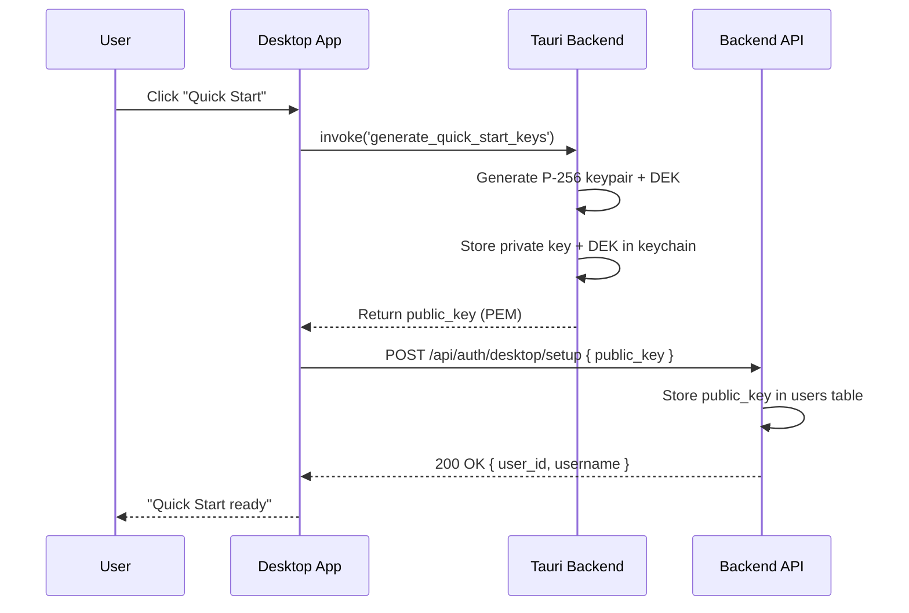
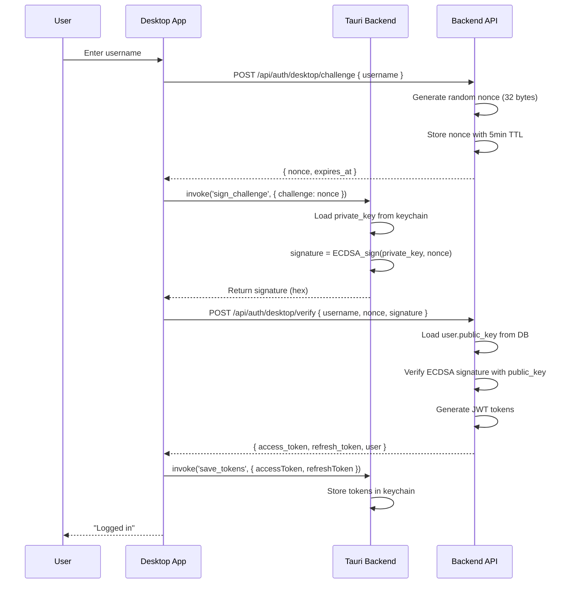
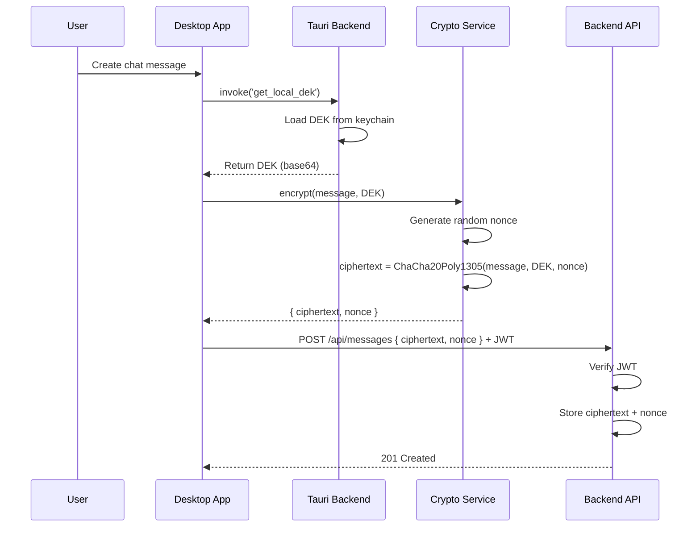

# Desktop Quick Start - Encryption Architecture (Client-Side E2EE)

## Overview

This document outlines the encryption architecture for Scribe's Desktop Quick Start mode, which provides a fundamentally different security model than the cloud KEK/DEK architecture described in `ENCRYPTION_ARCHITECTURE.md`.

**Key Principle**: Desktop Quick Start uses client-side key generation with challenge-response authentication and end-to-end encryption (E2EE). The Data Encryption Key (DEK) **never leaves the client device**.

## Architecture Comparison

### Cloud Mode (Password-Based)
```
User Password → KEK (Argon2id) → Encrypts DEK → Stored in DB
Login: Password → Derive KEK → Decrypt DEK → Load in memory → Encrypt/decrypt data
```
- Server generates and stores encrypted DEK
- DEK transmitted during login (encrypted by KEK)
- See `ENCRYPTION_ARCHITECTURE.md` for full details

### Desktop Quick Start Mode (Passwordless)
```
Client generates: P-256 keypair + ChaCha20Poly1305 DEK → Stores locally
Registration: Send public key only → Server stores
Login: Challenge-response (ECDSA signature) → JWT tokens
Data operations: Client encrypts with local DEK → Send ciphertext → Server stores
```
- Client generates all cryptographic material
- DEK **never transmitted** to server
- Public key authentication via ECDSA signatures

## Core Components

### 1. Key Hierarchy

**Client-Side Keys** (Generated on device, stored in Tauri secure storage):

1. **P-256 ECDSA Private Key**
   - **Purpose**: Authentication via challenge-response
   - **Format**: PKCS#8 PEM-encoded
   - **Storage**: Tauri secure store (`ecdsa_private_key` key)
   - **Transmission**: NEVER transmitted

2. **P-256 ECDSA Public Key**
   - **Purpose**: Server-side signature verification
   - **Format**: PEM-encoded
   - **Storage**:
     - Client: Derived from private key as needed
     - Server: `users.public_key` column (VARCHAR)
   - **Transmission**: Sent once during Quick Start setup

3. **ChaCha20Poly1305 Data Encryption Key (DEK)**
   - **Purpose**: Client-side encryption of all user data
   - **Size**: 32 bytes (256 bits)
   - **Format**: Base64-encoded for storage
   - **Storage**: Tauri secure store (`dek` key)
   - **Transmission**: NEVER transmitted

**Server-Side Data**:

1. **Public Key** (`users.public_key`)
   - Used for ECDSA signature verification
   - Indexed for fast lookups

2. **Encrypted User Data**
   - All user content stored as ciphertext
   - Encrypted by client before transmission
   - Server cannot decrypt (no DEK access)

### 2. Cryptographic Algorithms

**Key Generation**:
- **ECDSA**: P-256 (NIST P-256, secp256r1) elliptic curve
- **Random Generation**: OS-provided cryptographically secure RNG (`OsRng`)
- **DEK**: 32 random bytes for ChaCha20Poly1305

**Encryption**:
- **Algorithm**: ChaCha20Poly1305 (AEAD cipher)
- **Key Size**: 256 bits
- **Nonce**: 96 bits (12 bytes), unique per operation
- **Authentication**: Poly1305 MAC (built into AEAD)

**Authentication**:
- **Signature Scheme**: ECDSA with P-256
- **Hash Function**: SHA-256 (part of ECDSA)
- **Challenge**: 32-byte random nonce (server-generated)
- **Signature Format**: Hex-encoded for transmission

## Implementation (Phase 1.5)

### Phase 1.5.1: Client-Side Key Generation ✅ COMPLETE

**Tauri Commands** (`desktop/src/lib.rs`):

1. **`generate_quick_start_keys()`** (Line 282)
   ```rust
   // Generates P-256 keypair + ChaCha20Poly1305 DEK
   // Stores private key (PKCS#8 PEM) + DEK (base64) in secure storage
   // Returns: PEM-encoded public key (safe to transmit)
   ```

2. **`sign_challenge(challenge: String)`** (Line 326)
   ```rust
   // Loads private key from secure storage
   // Signs challenge string with ECDSA
   // Returns: Hex-encoded signature
   ```

3. **`get_local_dek()`** (Line 356)
   ```rust
   // Returns base64-encoded DEK from secure storage
   // Used for client-side encryption only
   // DEK NEVER transmitted to server
   ```

4. **`clear_tokens()`** (Line 267)
   ```rust
   // Clears JWT tokens, private key, and DEK
   // Complete logout cleanup
   ```

**Dependencies** (`desktop/Cargo.toml`):
```toml
p256 = { version = "0.13", features = ["ecdsa", "pkcs8"] }
rand = "0.8"
base64 = "0.21"
hex = "0.4"
```

**Storage** (Tauri Plugin Store):
- File: `.tokens.dat` (OS-encrypted keychain/credential manager)
- Keys:
  - `ecdsa_private_key`: PKCS#8 PEM string
  - `dek`: Base64-encoded 32 bytes
  - `access_token`: JWT access token
  - `refresh_token`: JWT refresh token

### Phase 1.5.2: Backend Challenge-Response (IN PROGRESS)

**Database Schema**:
```sql
ALTER TABLE users ADD COLUMN public_key VARCHAR(128) NULLABLE;
CREATE INDEX idx_users_public_key ON users(public_key) WHERE public_key IS NOT NULL;
```

**Challenge Service** (`backend/src/auth/challenge_service.rs`):
```rust
// In-memory challenge store with 5-minute TTL
HashMap<Uuid, (Nonce, ExpiryTime)>

generate_challenge(user_id) -> Nonce
verify_signature(user_id, nonce, signature) -> Result<bool>
```

**Authentication Flow**:
```
1. POST /api/auth/desktop/challenge { username }
   → Server generates 32-byte random nonce
   → Returns { nonce, expires_at }

2. Client signs nonce with private key
   → signature = ECDSA_sign(private_key, nonce)

3. POST /api/auth/desktop/verify { username, nonce, signature }
   → Server loads user.public_key from DB
   → Verifies ECDSA signature
   → Issues JWT tokens on success
   → Returns { access_token, refresh_token, user }
```

### Phase 1.5.3: Frontend Auth Service (PLANNED)

**DesktopAuthService Redesign** (`frontend/src/lib/api/desktop-auth.ts`):

```typescript
// Remove DEK transmission code
async setupQuickStart() {
  // Generate keys locally
  const publicKey = await invoke('generate_quick_start_keys');

  // Register with backend (send public key only)
  await fetch('/api/auth/desktop/setup', {
    method: 'POST',
    body: JSON.stringify({ publicKey })
  });
}

async challengeResponseLogin(username: string) {
  // Request challenge
  const { nonce } = await fetch('/api/auth/desktop/challenge', {
    method: 'POST',
    body: JSON.stringify({ username })
  }).then(r => r.json());

  // Sign challenge locally (private key never leaves device)
  const signature = await invoke('sign_challenge', { challenge: nonce });

  // Verify signature and get tokens
  const { access_token, refresh_token } = await fetch('/api/auth/desktop/verify', {
    method: 'POST',
    body: JSON.stringify({ username, nonce, signature })
  }).then(r => r.json());

  // Store tokens in secure storage
  await invoke('save_tokens', { accessToken: access_token, refreshToken: refresh_token });
}
```

### Phase 1.5.4: Client-Side Encryption Layer (PLANNED)

**Encryption Service** (`frontend/src/lib/crypto/encryption.ts`):

```typescript
import { xchacha20poly1305 } from '@noble/ciphers/chacha';

class DesktopEncryptionService {
  private async getDek(): Promise<Uint8Array> {
    const dek64 = await invoke('get_local_dek');
    return base64ToBytes(dek64);
  }

  async encrypt(plaintext: string): Promise<{ ciphertext: string, nonce: string }> {
    const dek = await this.getDek();
    const nonce = randomBytes(24); // XChaCha20 uses 24-byte nonce

    const cipher = xchacha20poly1305(dek, nonce);
    const ciphertext = cipher.encrypt(utf8ToBytes(plaintext));

    return {
      ciphertext: bytesToBase64(ciphertext),
      nonce: bytesToBase64(nonce)
    };
  }

  async decrypt(ciphertext: string, nonce: string): Promise<string> {
    const dek = await this.getDek();
    const cipher = xchacha20poly1305(dek, base64ToBytes(nonce));
    const plaintext = cipher.decrypt(base64ToBytes(ciphertext));

    return bytesToUtf8(plaintext);
  }
}
```

**API Client Middleware**:
```typescript
// Encrypt before sending to server
async function encryptSensitiveFields(data: any): Promise<any> {
  if (data.content) {
    const { ciphertext, nonce } = await encryption.encrypt(data.content);
    data.content = ciphertext;
    data.content_nonce = nonce;
  }
  return data;
}

// Decrypt after receiving from server
async function decryptSensitiveFields(data: any): Promise<any> {
  if (data.content && data.content_nonce) {
    data.content = await encryption.decrypt(data.content, data.content_nonce);
  }
  return data;
}
```

## Security Analysis

### Threat Model

**Protected Against**:

1. **Server Compromise**
   - Server stores only ciphertext + public keys
   - Cannot decrypt user data without DEK
   - DEK never transmitted or stored server-side

2. **Network Interception (MitM)**
   - No sensitive keys transmitted
   - Challenge-response prevents replay attacks
   - JWT tokens provide session security

3. **Offline Data Breach**
   - Database contains only encrypted data
   - Public keys alone cannot decrypt

4. **Session Hijacking**
   - JWT tokens are short-lived (15min access, 7-day refresh)
   - Tokens stored in OS-encrypted secure storage
   - No DEK in session data

**Assumptions**:

1. **Client Device Security**
   - OS keychain/credential manager is secure
   - Client binary is not tampered with
   - User's device is not compromised

2. **Cryptographic Primitives**
   - P-256 ECDSA is secure (NIST standard)
   - ChaCha20Poly1305 is secure (RFC 8439)
   - OS RNG is cryptographically secure

3. **Implementation Correctness**
   - No timing attacks in signature verification
   - Nonces are unique per operation
   - Keys are properly zeroized on logout

### Limitations

1. **No Password Recovery**
   - Losing device = losing access to DEK
   - No recovery mechanism (by design)
   - Fresh Start mode is ephemeral

2. **Single Device**
   - Keys tied to one device
   - No multi-device sync (intentional)
   - Use account mode for multi-device

3. **Trust in Client**
   - Zero-knowledge but relies on client integrity
   - Malicious client could exfiltrate DEK
   - Mitigated by: code signing, binary verification

## Data Flow Diagrams

### Quick Start Setup Flow



### Challenge-Response Login Flow



### Data Encryption Flow



## Testing Strategy

### Unit Tests (Desktop Tauri Commands)

**File**: `desktop/tests/crypto_commands_tests.rs`

```rust
#[test]
fn test_generate_quick_start_keys() {
    // Generate keys
    let public_key = generate_quick_start_keys();

    // Verify PEM format
    assert!(public_key.starts_with("-----BEGIN PUBLIC KEY-----"));

    // Verify storage
    let store = load_store();
    assert!(store.get("ecdsa_private_key").is_some());
    assert!(store.get("dek").is_some());

    // Verify DEK is 32 bytes when decoded
    let dek_b64 = store.get("dek").unwrap();
    let dek_bytes = base64::decode(dek_b64).unwrap();
    assert_eq!(dek_bytes.len(), 32);
}

#[test]
fn test_sign_challenge_valid() {
    // Setup: Generate keys
    let public_key = generate_quick_start_keys();

    // Sign a challenge
    let challenge = "test_nonce_12345";
    let signature = sign_challenge(challenge.to_string()).unwrap();

    // Verify signature format (hex)
    assert!(signature.len() > 0);
    assert!(signature.chars().all(|c| c.is_ascii_hexdigit()));

    // Verify with public key (using p256 crate)
    let verifying_key = VerifyingKey::from_public_key_pem(&public_key).unwrap();
    let sig_bytes = hex::decode(&signature).unwrap();
    let sig = Signature::from_bytes(&sig_bytes).unwrap();
    assert!(verifying_key.verify(challenge.as_bytes(), &sig).is_ok());
}

#[test]
fn test_clear_tokens_clears_all_secrets() {
    // Setup: Generate keys and tokens
    generate_quick_start_keys();
    save_tokens("access".to_string(), "refresh".to_string());

    // Clear all
    clear_tokens().unwrap();

    // Verify everything is gone
    let store = load_store();
    assert!(store.get("ecdsa_private_key").is_none());
    assert!(store.get("dek").is_none());
    assert!(store.get("access_token").is_none());
    assert!(store.get("refresh_token").is_none());
}
```

### Integration Tests (Backend Challenge-Response)

**File**: `backend/tests/desktop_auth_tests.rs`

```rust
#[tokio::test]
async fn test_challenge_response_flow() {
    let test_app = TestApp::new().await;

    // 1. Generate keys on "client"
    let signing_key = SigningKey::random(&mut OsRng);
    let public_key_pem = signing_key.verifying_key()
        .to_public_key_pem(LineEnding::LF).unwrap();

    // 2. Setup Quick Start user
    let response = test_app.post("/api/auth/desktop/setup")
        .json(&json!({
            "username": "testuser",
            "public_key": public_key_pem
        }))
        .send()
        .await;
    assert_eq!(response.status(), 201);

    // 3. Request challenge
    let challenge_resp = test_app.post("/api/auth/desktop/challenge")
        .json(&json!({ "username": "testuser" }))
        .send()
        .await;
    assert_eq!(challenge_resp.status(), 200);
    let challenge: ChallengeResponse = challenge_resp.json().await;

    // 4. Sign challenge
    let signature: Signature = signing_key.sign(challenge.nonce.as_bytes());
    let signature_hex = hex::encode(signature.to_bytes());

    // 5. Verify signature
    let verify_resp = test_app.post("/api/auth/desktop/verify")
        .json(&json!({
            "username": "testuser",
            "nonce": challenge.nonce,
            "signature": signature_hex
        }))
        .send()
        .await;
    assert_eq!(verify_resp.status(), 200);

    let tokens: TokenResponse = verify_resp.json().await;
    assert!(!tokens.access_token.is_empty());
    assert!(!tokens.refresh_token.is_empty());
}

#[tokio::test]
async fn test_challenge_response_invalid_signature() {
    // ... setup ...

    // Sign with wrong key
    let wrong_key = SigningKey::random(&mut OsRng);
    let signature: Signature = wrong_key.sign(challenge.nonce.as_bytes());

    let verify_resp = test_app.post("/api/auth/desktop/verify")
        .json(&json!({
            "username": "testuser",
            "nonce": challenge.nonce,
            "signature": hex::encode(signature.to_bytes())
        }))
        .send()
        .await;

    assert_eq!(verify_resp.status(), 401);
}
```

### Security Tests

**File**: `backend/tests/desktop_security_tests.rs`

```rust
#[tokio::test]
async fn test_challenge_expires_after_5_minutes() {
    // Request challenge
    // Wait 5 minutes (or mock time)
    // Attempt to verify with valid signature
    // Assert: 401 Unauthorized (challenge expired)
}

#[tokio::test]
async fn test_challenge_cannot_be_reused() {
    // Request challenge
    // Use it successfully
    // Try to use same challenge again
    // Assert: 401 Unauthorized (replay attack prevented)
}

#[tokio::test]
async fn test_server_never_receives_dek() {
    // Comprehensive audit of all endpoints
    // Assert: No endpoint accepts or stores DEK
    // Assert: No DEK in request logs
}

#[tokio::test]
async fn test_encrypted_data_unreadable_without_dek() {
    // Create encrypted chat message on client
    // Store in database
    // Attempt to read from database directly
    // Assert: Data is ciphertext, cannot be decrypted server-side
}
```

## Migration from Old Approach

### Old Approach (DEPRECATED)
```typescript
// Backend generated DEK, transmitted in response
const { dek } = await login(username, password);
await invoke('save_dek', { dek }); // ❌ DEK transmitted over network
```

### New Approach (Secure)
```typescript
// Client generates DEK, never transmitted
await invoke('generate_quick_start_keys'); // ✅ DEK stays local
const publicKey = await getPublicKey();
await registerWithServer(publicKey);
```

## References

- **NIST P-256**: [FIPS 186-4](https://nvlpubs.nist.gov/nistpubs/FIPS/NIST.FIPS.186-4.pdf)
- **ChaCha20Poly1305**: [RFC 8439](https://www.rfc-editor.org/rfc/rfc8439)
- **ECDSA**: [RFC 6979](https://www.rfc-editor.org/rfc/rfc6979) (Deterministic ECDSA)
- **Tauri Security**: [Tauri Security Best Practices](https://tauri.app/v1/guides/building/security)

## Future Enhancements

1. **Hardware Security Module (HSM) Support**
   - Use OS-native secure enclaves (TPM, Secure Enclave, etc.)
   - Prevent key extraction even with device compromise

2. **Biometric Authentication**
   - TouchID/FaceID/Windows Hello for key access
   - Additional layer before using stored private key

3. **Key Rotation**
   - Periodic re-generation of ECDSA keypair
   - Re-encrypt data with new DEK
   - Maintain backward compatibility

4. **Multi-Device Sync (Optional)**
   - User-controlled export/import of encrypted keychain
   - QR code-based secure key transfer
   - Requires manual user action (no automatic sync)

5. **Audit Logging**
   - Log all cryptographic operations
   - Tamper-evident audit trail
   - Privacy-preserving (no sensitive data in logs)
