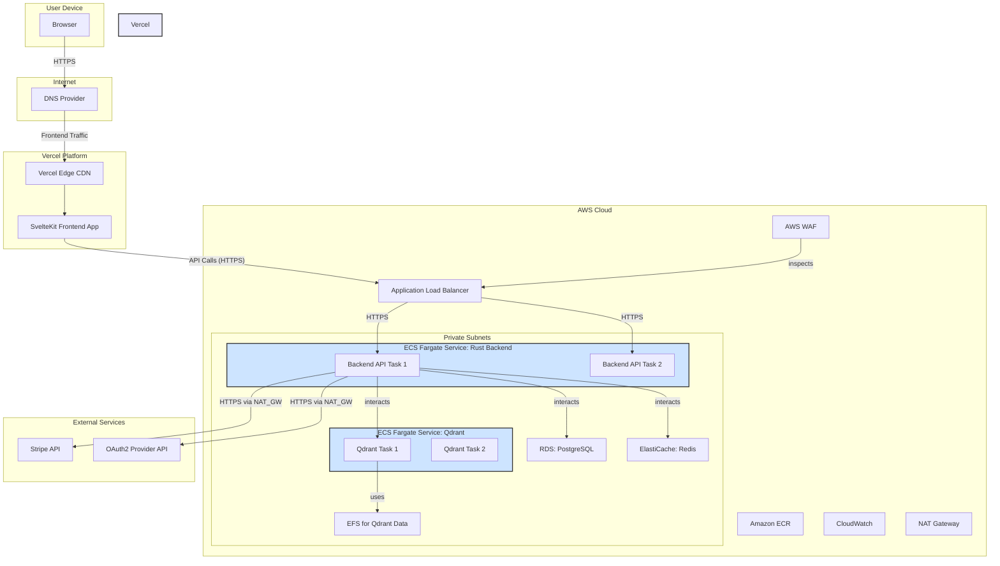

# Scribe - Hosting Plan

This document outlines the proposed hosting architecture for the Scribe application, focusing on leveraging Vercel for the frontend and AWS for backend services to maximize efficiency and utilize available AWS credits effectively.

## 1. Overall Architecture Summary

The hosting strategy is designed to be scalable, secure, and cost-effective, particularly in the initial phases.

*   **Frontend (SvelteKit):** Deployed and hosted on **Vercel**. This leverages Vercel's generous free/low-cost tiers, global CDN, built-in CI/CD, and simplified operations for frontend deployment.
*   **Backend Services (Rust):** Hosted on **AWS**.
    *   **API:** Rust application running on AWS Fargate.
    *   **Relational Database:** Amazon RDS for PostgreSQL.
    *   **Vector Database:** Qdrant running on AWS Fargate with Amazon EFS for persistence.
    *   **Caching:** Amazon ElastiCache for Redis.
*   **External Integrations:** Stripe (for payments) and an OAuth2 provider.

## 2. Architecture Diagram

## 3. Component Breakdown

### 3.1. Frontend (Vercel)
*   **Platform:** Vercel.
*   **Application:** SvelteKit frontend (using `adapter-vercel`).
*   **Key Features Leveraged:**
    *   Global Edge Network (CDN) for fast content delivery.
    *   Automatic HTTPS/SSL.
    *   Integrated CI/CD from Git repository (e.g., GitHub).
    *   Serverless Functions for SvelteKit SSR/API routes.
    *   Preview deployments.
*   **Cost Strategy:** Utilize Vercel's free "Hobby" tier initially. Monitor usage and upgrade to "Pro" plan if/when necessary.

### 3.2. Backend API (AWS Fargate)
*   **Platform:** AWS Fargate (running on Amazon ECS).
*   **Application:** Rust backend API.
*   **Networking:**
    *   Tasks run in private subnets.
    *   Exposed via an Application Load Balancer (ALB) in public subnets.
    *   ALB secured with AWS WAF.
    *   Outbound internet access via NAT Gateways.
*   **Container Registry:** Amazon ECR for storing Docker images.
*   **Scalability:** Start with 1-2 tasks with minimal CPU/memory; configure autoscaling based on metrics (CPU/Memory utilization) in Phase 2.

### 3.3. Relational Database (Amazon RDS)
*   **Service:** Amazon RDS for PostgreSQL.
*   **Instance Sizing:** Start small (e.g., `db.t4g.micro` or `db.t3.micro`).
*   **High Availability:** Consider Multi-AZ deployment in later phases or if uptime is critical from day one (cost implication).
*   **Storage:** Start with minimal provisioned storage and enable auto-scaling.
*   **Security:** Encryption at rest and in transit. Network access restricted to backend services within the VPC.

### 3.4. Vector Database (Qdrant on AWS Fargate)
*   **Platform:** Qdrant running as a Docker container on AWS Fargate.
*   **Networking:** Runs in private subnets, accessible only by the backend API.
*   **Persistence:** Amazon EFS for storing Qdrant data.
    *   *Consideration:* Monitor EFS performance. If bottlenecks arise for Qdrant's I/O patterns, migrating Qdrant to EC2 with EBS volumes is a fallback.
*   **Scalability:** Start with a single task; scale as needed.

### 3.5. Caching (Amazon ElastiCache)
*   **Service:** Amazon ElastiCache for Redis.
*   **Instance Sizing:** Start small (e.g., `cache.t4g.micro` or `cache.t3.micro`).
*   **Use Cases:**
    *   Session caching (for `axum-login`).
    *   API response caching.
    *   Caching results from Qdrant.
    *   Application-level caching of pre-computed data or aggregations.
*   **Security:** Encryption at rest and in transit. Network access restricted.

### 3.6. Networking (AWS VPC)
*   **VPC:** Custom Virtual Private Cloud.
*   **Subnets:** Public subnets (for ALB, NAT Gateways) and private subnets (for Fargate tasks, RDS, ElastiCache).
*   **Security Groups & NACLs:** Implement least-privilege access rules.

### 3.7. Monitoring & Logging (AWS CloudWatch)
*   **Services:** AWS CloudWatch Logs, Metrics, and Alarms.
*   **Scope:** Collect logs and metrics from Fargate tasks, ALB, RDS, ElastiCache, etc.
*   **Alarms:** Configure alarms for critical thresholds (e.g., high CPU, low disk space, error rates).

### 3.8. CI/CD
*   **Frontend (Vercel):** Use Vercel's native Git integration for automated builds and deployments.
*   **Backend (AWS):**
    *   **Source Control:** GitHub (or similar).
    *   **Pipeline:** GitHub Actions.
        1.  Build Rust application and Docker image.
        2.  Run tests.
        3.  Push image to Amazon ECR.
        4.  Update AWS Fargate service to deploy the new image.

### 3.9. External Service Integrations
*   **Stripe:** For payment processing. Implement using Stripe.js/Elements on the frontend to minimize PCI-DSS scope (SAQ A). Backend handles Payment Intents and webhooks.
*   **OAuth2 Provider:** For user authentication via third-party identity providers.

## 4. Phased Rollout Plan

### Phase 1: MVP Foundation & AWS Credit Utilization
*   **Goal:** Get core functionality live with a secure baseline, maximizing initial AWS credit usage.
*   **Frontend (Vercel):** Deploy SvelteKit application.
*   **AWS Setup:**
    *   VPC, Subnets, NAT Gateway, Security Groups.
    *   ECR for Rust backend Docker images.
    *   ALB (with ACM certificate) + basic AWS WAF rules.
    *   Fargate Service for Rust Backend (1-2 small tasks).
    *   RDS PostgreSQL (smallest `t4g` or `t3` instance).
    *   Fargate Service for Qdrant (1 small task) with EFS.
    *   Basic CloudWatch logging and metrics.
    *   Strict IAM roles (least privilege).
*   **CI/CD:** Vercel CI/CD for frontend. Manual or simple scripted backend deployments.
*   **Compliance Focus:** Foundational security practices (TLS, encryption at rest for DBs, network segmentation).

### Phase 2: Scaling, Caching & Operational Maturity
*   **Goal:** Enhance performance, scalability, and operational efficiency.
*   **Caching:** Integrate Amazon ElastiCache for Redis.
*   **Autoscaling:** Configure autoscaling for Fargate services (Backend & Qdrant) based on CloudWatch metrics.
*   **Database Scaling:** Monitor RDS performance; consider read replicas if DB load increases significantly.
*   **CI/CD Backend:** Implement robust GitHub Actions pipeline for automated build, test, and deployment of backend services.
*   **Monitoring:** Develop comprehensive CloudWatch Dashboards and set up critical alarms.
*   **Optimization:** Review and optimize Fargate task sizes and RDS instance types based on observed load.

### Phase 3: Advanced Compliance, Resilience & Optimization
*   **Goal:** Achieve target compliance levels, ensure high availability, and perform cost/performance optimizations.
*   **Compliance Deep Dive:**
    *   Rigorous review and implementation of remaining controls for GDPR, PCI-DSS, ISO 27001.
    *   Potentially engage with auditors.
*   **Security Enhancements:**
    *   Explore AWS Security Hub, Amazon GuardDuty for advanced threat detection.
    *   Regular vulnerability scanning (e.g., ECR scanning, Inspector).
*   **High Availability:**
    *   Ensure RDS is Multi-AZ.
    *   Evaluate HA options for Qdrant (e.g., multi-AZ EFS, Qdrant clustering if applicable and running on EC2).
    *   Ensure Fargate services are designed for resilience across Availability Zones.
*   **Performance & Cost:**
    *   Conduct load testing and performance tuning across the stack.
    *   Review AWS costs and implement cost optimization strategies (e.g., AWS Savings Plans, Reserved Instances for stable workloads).

This plan provides a roadmap for deploying and scaling the Scribe application. It will require ongoing monitoring and adjustments as the application evolves and user traffic grows.