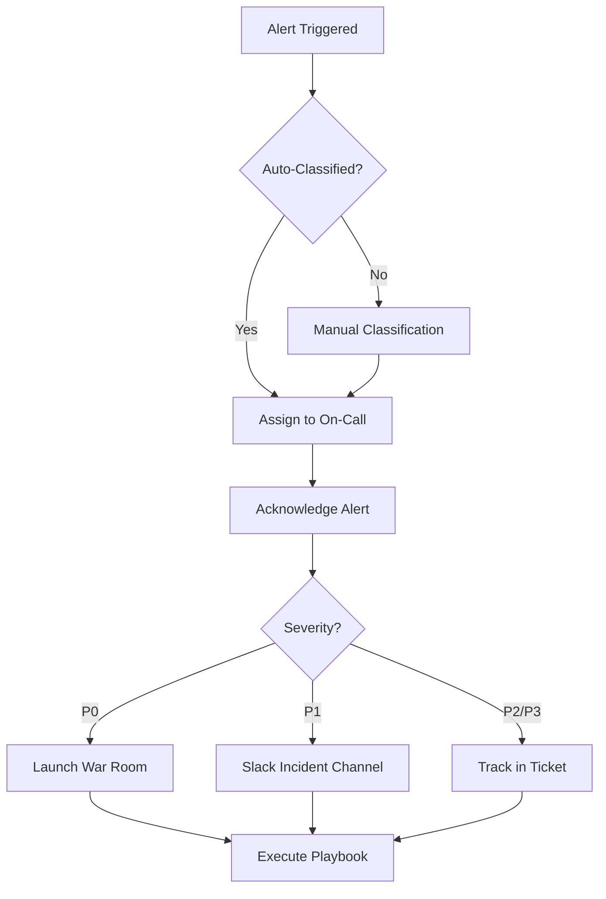

# Incident Response Procedures

**Version:** 1.0
**Last Updated:** 2025-10-04
**Owner:** CISO, Security Operations Team
**Review Cycle:** Quarterly

## Table of Contents

1. [Overview](#overview)
2. [Incident Response Team](#incident-response-team)
3. [Incident Classification](#incident-classification)
4. [Response Workflow](#response-workflow)
5. [Communication Protocols](#communication-protocols)
6. [Incident Playbooks](#incident-playbooks)
7. [Post-Incident Procedures](#post-incident-procedures)
8. [Compliance & Reporting](#compliance--reporting)
9. [Training & Exercises](#training--exercises)
10. [Appendices](#appendices)

## Overview

This document establishes the comprehensive incident response framework for Sanguine Scribe's payment and security infrastructure. It defines roles, responsibilities, procedures, and playbooks for detecting, containing, and recovering from security incidents.

### Goals

1. **Rapid Detection:** MTTD <5 minutes for P0 incidents, <15 minutes for P1
2. **Effective Containment:** MTTR <30 minutes for P0, <1 hour for P1
3. **Privacy Preservation:** No PII/PCI data exposure during investigation
4. **Regulatory Compliance:** GDPR, PCI DSS, SOC 2, OWASP alignment
5. **Continuous Improvement:** Post-incident reviews, playbook updates

### Scope

**In Scope:**
- Payment system security incidents
- Authentication and authorization failures
- Data exfiltration attempts
- Encryption system failures
- Infrastructure compromise
- Lateral movement attacks

**Out of Scope:**
- General application bugs (non-security)
- Performance issues (unless attack-related)
- Third-party service outages (unless compromise suspected)

## Incident Response Team

### Roles & Responsibilities

| Role | Primary Responsibilities | Contact Method | Escalation Time |
|------|-------------------------|----------------|-----------------|
| **Security Operations Manager** | Incident triage, initial response, playbook execution | PagerDuty (24/7) | Immediate |
| **CISO** | Strategic decisions, regulatory compliance, executive communication | Phone + PagerDuty | P0: 5min, P1: 15min |
| **Infrastructure Lead** | AWS infrastructure, database operations, service restoration | Slack + PagerDuty | P0: 5min, P1: 30min |
| **Development Lead** | Code analysis, vulnerability assessment, hotfix deployment | Slack + PagerDuty | P0: 15min, P1: 1hr |
| **Data Protection Officer (DPO)** | GDPR compliance, breach notification, user privacy | Email + Phone | P0: 15min, P1: 1hr |
| **Legal Counsel** | Legal obligations, law enforcement coordination, contracts | Phone | P0: 30min, P1: 2hr |
| **PR/Communications** | Public statements, user communication, media relations | Email + Phone | P1: 1hr, P2: 4hr |
| **Incident Commander** (P0 only) | Coordination, decision-making, resource allocation | War room + Phone | P0: 5min |

### On-Call Schedule

- **Security Operations:** 24/7 rotation (1-week shifts)
- **Infrastructure:** 24/7 rotation (1-week shifts)
- **Development:** On-call during business hours, escalation path for after-hours
- **Executive (CISO, CTO):** Always reachable for P0 incidents

### Communication Channels

- **PagerDuty:** Primary alerting system (integrated with CloudWatch alarms)
- **Slack #security-incidents:** Real-time incident coordination
- **Zoom War Room:** P0 incidents only, launched automatically
- **Email:** Non-urgent updates, post-incident reports
- **Phone:** Executive escalation, legal/regulatory notifications

## Incident Classification

### Severity Levels

| Severity | Description | Examples | MTTD Target | MTTR Target | Escalation |
|----------|-------------|----------|-------------|-------------|------------|
| **P0 (Critical)** | Active attack, data breach, system compromise | Account takeover with data exfiltration, nonce reuse, IAM compromise | <5 minutes | <30 minutes | CISO, Incident Commander |
| **P1 (High)** | Attempted attack, security vulnerability, fraud | Credential stuffing (no takeover), webhook attack (blocked), payment fraud | <15 minutes | <1 hour | Security Ops Manager |
| **P2 (Medium)** | Security anomaly, potential threat | High auth failure rate (single user), geographic anomaly | <1 hour | <4 hours | Security Ops |
| **P3 (Low)** | Security event, informational | Failed login, expired certificate warning | <24 hours | <48 hours | Security Ops (next business day) |

### Escalation Triggers

**Automatic P0 Escalation:**
- Any GuardDuty finding severity = CRITICAL
- Nonce reuse detected (encryption system)
- >10 successful account takeovers
- Database credentials compromised
- IAM privilege escalation successful
- Data breach confirmed (>1000 records)

**Automatic P1 → P0 Escalation:**
- Incident duration >2 hours
- Financial impact >$10,000
- Media inquiry received
- Regulatory authority contact

## Response Workflow

### Phase 1: Detection & Triage (0-5 minutes)



**Actions:**
1. **Acknowledge Alert** (0-2 min)
   - On-call engineer acknowledges PagerDuty alert
   - Log acknowledgment in incident tracking system

2. **Initial Triage** (2-5 min)
   - Review alert context (CloudWatch logs, metrics, GuardDuty)
   - Classify severity (P0-P3)
   - Identify incident type (credential stuffing, webhook attack, etc.)
   - Select appropriate playbook

3. **Escalate** (if P0 or complex P1)
   - Notify Incident Commander (P0) or Security Ops Manager (P1)
   - Launch war room (P0) or create Slack incident channel (P1)
   - Brief team on initial findings

### Phase 2: Investigation (5-15 minutes)

**Actions:**
1. **Follow Playbook** (see [Incident Playbooks](#incident-playbooks))
   - Execute investigation steps from relevant playbook
   - Document findings in incident log (Slack channel or war room)

2. **Assess Impact**
   - Identify affected users (hashed IDs only, privacy-safe)
   - Calculate financial impact (fraud, credit manipulation)
   - Determine data exposure risk (encrypted vs. plaintext)
   - Check for lateral movement or escalation

3. **Correlate Indicators**
   - Cross-reference with other security events (GuardDuty, CloudTrail)
   - Check for related incidents (attack campaign vs. isolated)
   - Review threat intelligence feeds

### Phase 3: Containment (0-30 minutes from detection)

**Immediate Containment (0-5 min):**
- Revoke compromised sessions/credentials
- Block attacking IPs (WAF rules)
- Freeze affected accounts
- Isolate compromised services

**Short-Term Containment (5-30 min):**
- Rotate credentials (database passwords, API keys)
- Implement emergency rate limits
- Enable enhanced monitoring
- Clear DEK cache (if compromised)

**Long-Term Containment (30min-7 days):**
- Code fixes and deployment
- Infrastructure hardening
- Permanent security enhancements
- Monitoring improvements

### Phase 4: Eradication & Recovery (30min-7 days)

**Eradication:**
- Remove attacker access (close all backdoors)
- Patch vulnerabilities
- Rebuild compromised infrastructure from IaC
- Restore from clean backups (if needed)

**Recovery:**
- Gradually restore services
- Verify security posture before full restoration
- Monitor for reinfection/persistence
- Unfreeze legitimate accounts

### Phase 5: Post-Incident (Within 48 hours)

**Actions:**
1. **Post-Incident Review** (within 24 hours)
   - Conduct blameless retrospective
   - Document timeline, attack path, impact
   - Identify gaps in detection/response
   - Propose preventive measures

2. **Evidence Preservation** (within 24 hours)
   - Archive all logs to tamper-proof storage (S3 Object Lock)
   - Export CloudWatch, CloudTrail, database logs
   - Document attacker IOCs (IPs, techniques)

3. **Reporting** (within 48 hours)
   - Internal report (executive summary + technical details)
   - Regulatory reporting (if required: GDPR 72hr, PCI DSS)
   - User notification (if data breach)
   - Update playbooks with lessons learned

## Communication Protocols

### Internal Communication

**During Incident:**
- **P0:** Zoom war room (all hands), updates every 15 minutes
- **P1:** Slack #security-incidents channel, updates every 30 minutes
- **P2/P3:** Ticket updates, daily summary

**Incident Log Format:**
```markdown
## Incident Log Entry

**Time:** [HH:MM UTC]
**Author:** [Name/Role]
**Action:** [What was done]
**Outcome:** [Result of action]
**Next Steps:** [Planned next actions]
```

### External Communication

**User Notification (Data Breach):**
- **Trigger:** Plaintext data exfiltrated (>100 users affected)
- **Timeline:** Within 72 hours (GDPR requirement)
- **Method:** Email to affected users (privacy-safe: use hashed_user_id mapping)
- **Content:** See playbook templates (e.g., DATA_EXFILTRATION.md)
- **Approval:** Legal Counsel + DPO + CISO

**Regulatory Notification:**
- **GDPR (EU):** Data Protection Authority within 72 hours (high risk)
- **CCPA (California):** Attorney General + affected users without unreasonable delay
- **PCI DSS:** Payment card brands + acquiring bank immediately
- **Coordination:** Legal Counsel + DPO

**Public Statement:**
- **Trigger:** Media inquiry, public disclosure, >10,000 users affected
- **Timeline:** As needed, no delay >24 hours after public awareness
- **Approval:** CEO + Legal + PR
- **Channels:** Website, social media, press release

### Stakeholder Updates

**Executive Team:**
- **P0:** Immediate notification, updates every 30 minutes until contained
- **P1:** Within 15 minutes, updates every hour
- **P2/P3:** Daily summary email

**Board of Directors:**
- **P0 with impact >$100k or data breach >10k users:** Within 24 hours
- **All P0:** Summary in next board meeting

**Customers/Users:**
- **Data breach affecting them:** Within 72 hours (GDPR) or per state law
- **Service outage (if attack-related):** Status page updates every 30 minutes

## Incident Playbooks

Detailed playbooks are available in [`docs/playbooks/`](./playbooks/):

### 1. [Webhook Attack](./playbooks/WEBHOOK_ATTACK.md)
**Incident Type:** Paddle webhook signature verification failures, replay attacks
**Severity:** P1 (High)
**MTTD Target:** <15 minutes
**MTTR Target:** <1 hour

**Key Indicators:**
- >5 signature failures from single IP in 5 minutes
- >20 total signature failures in 15 minutes
- Duplicate webhook event_ids (replay attack)

**Containment:**
- Rate limit webhook endpoint (10/min)
- Block attacking IPs via WAF
- Rotate webhook secret (if compromised)
- Enable Paddle IP allowlisting

---

### 2. [Credential Stuffing](./playbooks/CREDENTIAL_STUFFING.md)
**Incident Type:** Authentication failures, brute force, account takeover
**Severity:** P0 (Critical) if successful logins, P1 (High) if failed attempts only
**MTTD Target:** <5 minutes (P0), <15 minutes (P1)
**MTTR Target:** <30 minutes (P0), <1 hour (P1)

**Key Indicators:**
- >10 failed auth attempts for single user in 5 minutes
- >50 total failed auth attempts in 5 minutes (system-wide)
- Successful login after multiple failures from flagged IP

**Containment:**
- Enable aggressive rate limiting (1/sec, 3 burst)
- Block attacking IPs via WAF
- Revoke active sessions (if takeover confirmed)
- Implement account lockout (5 failures → 1 hour lock)
- Force password reset (compromised accounts)

---

### 3. [Payment Fraud](./playbooks/PAYMENT_FRAUD.md)
**Incident Type:** Anomalous credit operations, subscription fraud, card testing
**Severity:** P0 (Critical) if active fraud, P1 (High) if suspected anomaly
**MTTD Target:** <5 minutes (P0), <15 minutes (P1)
**MTTR Target:** <30 minutes (P0), <1 hour (P1)

**Key Indicators:**
- >100 credit operations in 5 minutes (single user)
- Credit balance change >1M tokens in 1 hour
- >10 subscription creations from same payment method in 1 hour
- Geographic impossibility (US transaction, then India <1hr)

**Containment:**
- Freeze suspicious accounts
- Revoke active sessions
- Prevent new credit operations (account freeze flag)
- Contact Paddle support
- Implement velocity limits (50 ops/5min)
- Enable enhanced monitoring

---

### 4. [Data Exfiltration](./playbooks/DATA_EXFILTRATION.md)
**Incident Type:** Bulk data access, unauthorized queries, training data theft
**Severity:** P0 (Critical)
**MTTD Target:** <5 minutes
**MTTR Target:** <30 minutes

**Key Indicators:**
- >1000 chat messages accessed in 5 minutes
- >100 character records accessed in 5 minutes
- Database query returning >10,000 rows
- API list endpoint calls >100/minute
- Off-hours access (3am-6am) with >50 records retrieved

**Containment:**
- Revoke active sessions
- Clear DEK cache immediately
- Block API access (1 req/min)
- Freeze affected accounts
- Block source IPs
- Enable query logging
- Restrict database access (revoke read permissions temporarily)
- Implement response size limits (10MB max)

---

### 5. [Encryption Failure](./playbooks/ENCRYPTION_FAILURE.md)
**Incident Type:** DEK/KEK decryption errors, nonce reuse, cryptographic integrity failure
**Severity:** P0 (Critical) - Data loss risk
**MTTD Target:** <5 minutes
**MTTR Target:** <30 minutes

**Key Indicators:**
- >10 decryption failures for single user in 5 minutes
- Nonce reuse detected (ANY occurrence)
- DEK cache corruption detected
- AES-GCM authentication failures >5/minute

**Containment:**
- **CRITICAL:** Stop write operations (if nonce reuse) - enable read-only mode
- Clear corrupted DEK cache
- Revoke all sessions (force re-authentication)
- Fix nonce generation (use cryptographically secure RNG)
- Re-encrypt data with reused nonces (NEW nonces)
- Implement nonce deduplication (Redis-backed)

---

### 6. [Lateral Movement](./playbooks/LATERAL_MOVEMENT.md)
**Incident Type:** Privilege escalation, service-to-service attack, infrastructure compromise
**Severity:** P0 (Critical)
**MTTD Target:** <5 minutes
**MTTR Target:** <30 minutes

**Key Indicators:**
- IAM role assumption from unauthorized source
- Database connection from non-application IP
- AWS Secrets Manager access from unauthorized service
- Unusual service-to-service API calls
- GuardDuty privilege escalation findings

**Containment:**
- Isolate compromised service (stop ECS tasks, modify security groups)
- Revoke compromised IAM credentials
- Rotate database credentials
- Clear DEK cache
- Enable AWS Security Services (GuardDuty, Security Hub, CloudTrail)
- Implement network segmentation (restrict security groups)
- Enable service-to-service authentication
- Implement database row-level security

## Post-Incident Procedures

### Post-Incident Review (PIR)

**Timeline:** Within 24 hours of incident resolution

**Participants:**
- Incident responders (all roles involved)
- Security Operations Manager (facilitator)
- CISO (observer)
- Development/Infrastructure leads

**Agenda:**
1. **Timeline Review** (15 min)
   - Walk through incident from detection to resolution
   - Identify critical decision points

2. **What Went Well** (10 min)
   - Effective detection mechanisms
   - Successful containment actions
   - Good communication/coordination

3. **What Could Be Improved** (20 min)
   - Missed indicators
   - Delayed responses
   - Communication gaps
   - Tool/playbook deficiencies

4. **Action Items** (15 min)
   - Preventive measures (code fixes, monitoring enhancements)
   - Playbook updates
   - Training needs
   - Assign owners and deadlines

**Output:**
- PIR document (stored in `docs/pir/`)
- Action items (tracked in project management tool)
- Playbook updates (PR to documentation repo)

### Evidence Preservation

**Requirements:**
- **Retention:** 1 year minimum (PCI DSS Requirement 10)
- **Integrity:** Tamper-proof storage (S3 Object Lock, write-once-read-many)
- **Confidentiality:** Encrypted at rest, access restricted to Security Ops + Legal

**What to Preserve:**
1. **CloudWatch Logs** (application, payment, auth)
2. **AWS CloudTrail** (API calls, IAM activity)
3. **Database Query Logs** (PostgreSQL pg_stat_statements)
4. **Network Traffic** (VPC Flow Logs, if enabled)
5. **Incident Log** (Slack channel export, war room notes)
6. **Attacker IOCs** (IP ranges, user-agents, attack patterns)

**Preservation Process:**
```bash
# Export CloudWatch logs to S3
aws logs create-export-task \
  --log-group-name /aws/scribe/payment \
  --from <incident_start_epoch> \
  --to <incident_end_epoch> \
  --destination scribe-security-incident-logs \
  --destination-prefix incident-<YYYYMMDD>-<type>

# Enable Object Lock (prevent deletion/modification)
aws s3api put-object-lock-configuration \
  --bucket scribe-security-incident-logs \
  --object-lock-configuration '{
    "ObjectLockEnabled": "Enabled",
    "Rule": {"DefaultRetention": {"Mode": "COMPLIANCE", "Years": 1}}
  }'
```

### Playbook Updates

**When to Update:**
- New attack techniques discovered
- False positive/negative from detection rules
- Containment action ineffective
- Process improvement identified

**Update Process:**
1. Create PR in documentation repo
2. Review by Security Ops Manager + CISO
3. Approve and merge
4. Communicate changes to incident response team
5. Schedule training/tabletop exercise (if significant change)

## Compliance & Reporting

### Regulatory Requirements

| Regulation | Trigger | Timeline | Reporting To | Content |
|------------|---------|----------|--------------|---------|
| **GDPR (EU)** | Personal data breach (high risk) | 72 hours | Data Protection Authority | Nature of breach, categories/records affected, measures taken, contact point |
| **CCPA (California)** | Personal information breach | Without unreasonable delay | Attorney General + affected users | Type of information, date/estimated date, measures taken, contact info |
| **PCI DSS Requirement 10/12** | Cardholder data compromise | Immediately | Payment card brands, acquiring bank | Incident details, affected records, forensic investigation report |
| **SOC 2 Type II** | Control failure, security incident | Next audit cycle | External auditor | Incident description, impact on controls, remediation |

### Internal Reporting

**Incident Report Template:**
```markdown
# Security Incident Report: [Incident Type]

**Incident ID:** INC-[TYPE]-[YYYYMMDD]-[seq]
**Date/Time:** [UTC timestamp]
**Severity:** P0/P1/P2/P3
**Status:** RESOLVED / IN PROGRESS

## Executive Summary
[2-3 sentences: What happened, impact, current status]

## Timeline
- [HH:MM UTC] Detection: [How incident was detected]
- [HH:MM UTC] Investigation: [Key findings]
- [HH:MM UTC] Containment: [Actions taken]
- [HH:MM UTC] Resolution: [How incident was resolved]

## Impact
- **Users Affected:** [Count, privacy-safe hashed IDs]
- **Data Exposure:** YES/NO, [type of data, encrypted/plaintext]
- **Financial Impact:** $[amount] USD
- **Service Downtime:** [minutes/hours]
- **Regulatory Notification:** YES/NO

## Root Cause
[Technical analysis of how incident occurred]

## Preventive Actions
1. [Action 1] - Owner: [Name], Deadline: [Date]
2. [Action 2] - Owner: [Name], Deadline: [Date]

## Compliance Notes
- GDPR: [Notification status, DPA contact]
- PCI DSS: [Requirement 10/12 compliance]
- SOC 2: [Control impact assessment]

## Lessons Learned
[Key takeaways from PIR]
```

### Metrics & KPIs

**Security Operations Metrics:**
- **MTTD (Mean Time To Detect):** P0 <5min, P1 <15min, P2 <1hr
- **MTTR (Mean Time To Respond):** P0 <30min, P1 <1hr, P2 <4hr
- **False Positive Rate:** <5% for automated alerts
- **Incident Volume:** Track by severity and type
- **Playbook Effectiveness:** % of incidents resolved using playbooks

**Compliance Metrics:**
- **Breach Notification Timeliness:** 100% within regulatory deadlines
- **Log Retention:** 100% compliance with 1-year PCI DSS requirement
- **Quarterly PIR Completion:** 100% within 24 hours

**Report Cadence:**
- **Weekly:** Security Operations Manager → CISO (incidents, trends)
- **Monthly:** CISO → Executive Team (metrics, major incidents)
- **Quarterly:** CISO → Board of Directors (strategic overview)

## Training & Exercises

### Incident Response Training

**New Hire Onboarding:**
- Overview of incident response procedures (1 hour)
- Playbook walkthrough (2 hours)
- Shadow on-call engineer (1 week)

**Ongoing Training:**
- **Quarterly:** Incident response refresher (all engineers)
- **Annually:** Advanced threat hunting workshop
- **Ad-hoc:** Training on new playbooks or major updates

### Tabletop Exercises

**Frequency:** Quarterly

**Scenarios:**
1. **Q1:** Credential stuffing → account takeover → data exfiltration
2. **Q2:** Payment fraud → credit manipulation → Paddle dispute
3. **Q3:** Webhook attack → signature bypass → fraudulent credits
4. **Q4:** Lateral movement → IAM compromise → infrastructure takeover

**Format:**
- 2-hour facilitated exercise
- All incident response roles participate
- Walk through scenario using actual playbooks
- Identify gaps in procedures/tools
- Update playbooks based on findings

**Documentation:**
- Exercise scenario script
- Participant feedback
- Identified gaps and action items
- Playbook updates implemented

### Red Team Exercises

**Frequency:** Annually (or after major infrastructure changes)

**Scope:**
- Simulate APT-level attacker
- Test detection and response capabilities
- Identify blind spots in monitoring
- Validate playbook effectiveness

**Coordination:**
- External security firm or internal red team
- Notify only CISO and Security Ops Manager (not full team)
- Debrief all participants after exercise
- Update playbooks and monitoring based on findings

## Appendices

### A. Contact Information

| Role | Name | Email | Phone | PagerDuty |
|------|------|-------|-------|-----------|
| CISO | [Name] | ciso@sanguinescribe.com | +1-XXX-XXX-XXXX | @ciso |
| Security Ops Manager | [Name] | secops@sanguinescribe.com | +1-XXX-XXX-XXXX | @secops-oncall |
| Infrastructure Lead | [Name] | infra@sanguinescribe.com | +1-XXX-XXX-XXXX | @infra-oncall |
| Development Lead | [Name] | dev@sanguinescribe.com | +1-XXX-XXX-XXXX | @dev-oncall |
| DPO | [Name] | dpo@sanguinescribe.com | +1-XXX-XXX-XXXX | N/A |
| Legal Counsel | [Firm] | legal@sanguinescribe.com | +1-XXX-XXX-XXXX | N/A |

### B. Tool Access

| Tool | Purpose | Access Level | URL/Command |
|------|---------|--------------|-------------|
| **PagerDuty** | Alerting | All incident responders | https://scribe.pagerduty.com |
| **CloudWatch** | Logs, metrics | Security Ops, Infrastructure | AWS Console → CloudWatch |
| **GuardDuty** | Threat detection | Security Ops, CISO | AWS Console → GuardDuty |
| **Slack #security-incidents** | Communication | All incident responders | Slack workspace |
| **Zoom War Room** | P0 coordination | All incident responders | Auto-launched by PagerDuty |
| **AWS Secrets Manager** | Credential rotation | Security Ops, Infrastructure | `aws secretsmanager` CLI |
| **Terraform** | Infrastructure rebuild | Infrastructure, Security Ops | `terraform apply` |

### C. Decision Trees

#### Should I Escalate This Alert?

```
Start
  ↓
Is severity auto-classified as P0?
  YES → Escalate to CISO immediately → Launch war room
  NO → Continue
  ↓
Is this an active account takeover?
  YES → Escalate to CISO immediately (P0)
  NO → Continue
  ↓
Is financial impact >$1,000?
  YES → Escalate to Security Ops Manager (P1)
  NO → Continue
  ↓
Can I resolve using standard playbook?
  YES → Execute playbook, monitor (P2/P3)
  NO → Escalate to Security Ops Manager
```

#### Should We Notify Users?

```
Start
  ↓
Was plaintext user data accessed by unauthorized party?
  NO → No user notification required (internal incident only)
  YES → Continue
  ↓
How many users affected?
  <10 users → Individual email (within 72 hours)
  10-1000 users → Batch email (within 72 hours)
  >1000 users → Email + public statement (within 72 hours)
  ↓
Notify DPO + Legal immediately for review
```

### D. Glossary

- **MTTD:** Mean Time To Detect - Average time from incident start to detection
- **MTTR:** Mean Time To Respond - Average time from detection to containment
- **PIR:** Post-Incident Review - Blameless retrospective after incident
- **IOC:** Indicator of Compromise - Evidence of malicious activity (IPs, patterns)
- **Hashed User ID:** Privacy-safe one-way hash of user UUID (SHA-256 + salt)
- **DEK:** Data Encryption Key - Per-user symmetric key for data encryption
- **KEK:** Key Encryption Key - Derived from user password, encrypts DEK
- **War Room:** Virtual meeting space for P0 incident coordination
- **Playbook:** Documented procedures for specific incident type

### E. Version History

| Version | Date | Author | Changes |
|---------|------|--------|---------|
| 1.0 | 2025-10-04 | Security Team | Initial release with 6 incident playbooks |

---

**Document Control:**
- **Classification:** Internal - Security Operations
- **Distribution:** Incident Response Team, Executive Team
- **Review Cycle:** Quarterly
- **Next Review:** 2026-01-04

**Related Documents:**
- [SECURITY_MONITORING.md](./SECURITY_MONITORING.md) - Monitoring architecture
- [OWASP-TOP-10.md](./OWASP-TOP-10.md) - Security requirements
- [PRIVACY_SAFE_LOGGING.md](./PRIVACY_SAFE_LOGGING.md) - Privacy compliance
- [ENCRYPTION_ARCHITECTURE.md](./ENCRYPTION_ARCHITECTURE.md) - Encryption system
