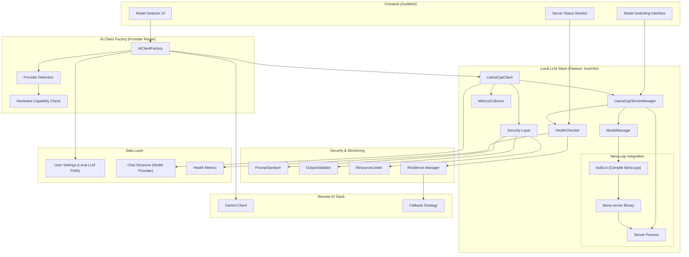
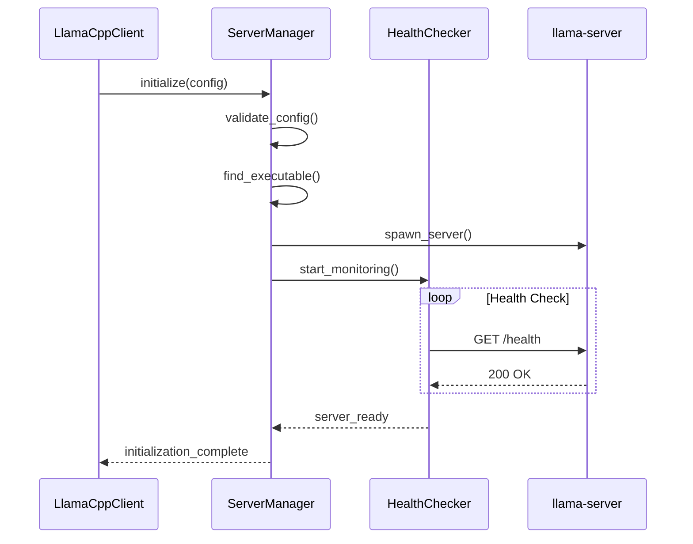
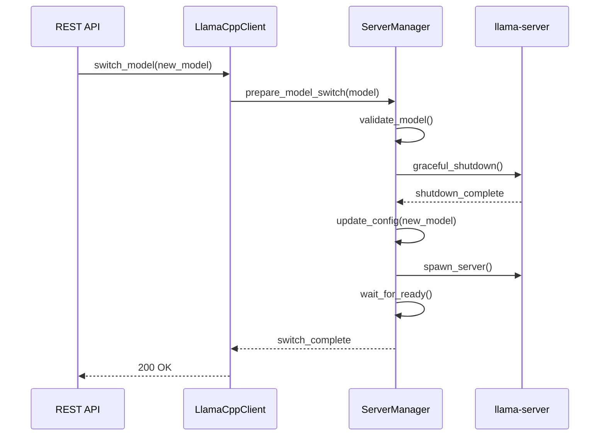

# Sanguine Scribe - Local LLM Architecture

## Overview

Sanguine Scribe implements a hybrid AI provider architecture that seamlessly combines local large language model (LLM) execution via llama.cpp with cloud-based AI services like Google Gemini. This architecture enables users to maintain data privacy and reduce API costs by running models locally while providing intelligent fallback to cloud services when local resources are insufficient or unavailable.

The local LLM integration follows OWASP security principles, implements proper resource isolation, and provides enterprise-grade reliability through sophisticated health monitoring and fallback mechanisms.

## Key Architectural Principles

1. **Hybrid-First Design**: Local and remote AI providers are treated as interchangeable backends behind a unified interface
2. **Security-First Implementation**: Follows OWASP Top 10 for LLM Applications (2025) guidelines
3. **Resource-Aware Operation**: Automatically detects hardware capabilities and optimizes configuration
4. **Graceful Degradation**: Intelligent fallback to remote APIs when local execution fails
5. **User-Controlled Privacy**: Users decide between local processing (private) and cloud processing (feature-rich)

## Architecture Diagram



## Core Components

### 1. AI Client Factory (`src/services/ai_client_factory.rs`)

The central router that determines which AI provider to use based on user preferences, model selection, and system capabilities.

**Responsibilities:**
- Provider selection logic (local vs. remote)
- Hardware capability detection
- User preference evaluation
- Graceful fallback coordination
- Client lifecycle management

**Key Methods:**
- `get_client_for_provider(provider, model_name)` - Direct provider routing
- `get_client_for_user(user_id)` - User preference-based routing
- `is_local_llm_available()` - Hardware/compilation check

### 2. LlamaCpp Client (`src/llm/llamacpp/client.rs`)

Primary interface for local LLM operations, implementing the `AiClient` trait for seamless integration with existing chat services.

**Responsibilities:**
- Server lifecycle management (start/stop/restart)
- Request routing to local llama-server
- Error handling and recovery
- Performance monitoring
- Security enforcement

**Integration Points:**
- Implements `AiClient` trait for compatibility
- Integrates with `LlamaCppServerManager` for server control
- Uses `PromptSanitizer` and `OutputValidator` for security
- Reports metrics via `MetricsCollector`

### 3. Server Manager (`src/llm/llamacpp/server.rs`)

Manages the lifecycle of the llama-server process, including startup, configuration, health monitoring, and graceful shutdown.

**Responsibilities:**
- Server process spawning and management
- Configuration generation and validation
- Health check coordination
- Resource cleanup
- Model hot-swapping support

**Server Lifecycle:**
1. **Startup**: Validate config → spawn process → wait for ready
2. **Runtime**: Health monitoring → request routing → performance tracking
3. **Model Switch**: Graceful shutdown → config update → restart → validation
4. **Shutdown**: Request drain → process termination → resource cleanup

### 4. Model Manager (`src/llm/llamacpp/model_manager.rs`)

Handles model discovery, validation, downloading, and caching for efficient model switching.

**Responsibilities:**
- Model file discovery and validation
- Automatic model downloading from Hugging Face
- Model metadata management
- Cache optimization
- Hardware requirement validation

**Model Management Flow:**
1. **Discovery**: Scan models directory → validate GGUF files → extract metadata
2. **Selection**: Check hardware requirements → validate compatibility → queue for loading
3. **Loading**: Download if needed → verify checksums → update server config
4. **Caching**: Maintain model metadata → optimize disk usage → track usage patterns

### 5. Security Layer

Implements defense-in-depth security following OWASP LLM Application Security Top 10 (2025).

#### Prompt Sanitizer (`src/llm/llamacpp/security.rs`)
- **LLM01 Prompt Injection**: Input validation and sanitization
- **LLM03 Training Data Poisoning**: Content filtering
- Pattern detection for injection attempts
- Context-aware sanitization

#### Output Validator (`src/llm/llamacpp/security.rs`)
- **LLM02 Insecure Output Handling**: Response validation
- **LLM06 Sensitive Information Disclosure**: PII detection and filtering
- Content policy enforcement
- Malicious output detection

#### Resource Limiter (`src/llm/llamacpp/security.rs`)
- **LLM04 Model Denial of Service**: Resource consumption limits
- **LLM09 Overreliance**: Usage quotas and warnings
- Memory and CPU monitoring
- Request rate limiting

### 6. Health Monitoring (`src/llm/llamacpp/health.rs`)

Continuous health assessment with proactive recovery mechanisms.

**Health Checks:**
- **Server Responsiveness**: HTTP endpoint availability
- **Resource Utilization**: Memory, CPU, GPU usage
- **Model Loading Status**: Successful model initialization
- **Request Processing**: Response time and error rates

**Recovery Actions:**
- Server restart on unresponsiveness
- Model reload on corruption detection
- Fallback activation on persistent failures
- Alert generation for manual intervention

## Security Model

### Threat Mitigation (OWASP LLM Top 10 2025)

| Threat | Mitigation Strategy | Implementation |
|--------|-------------------|----------------|
| **LLM01: Prompt Injection** | Input sanitization, context isolation | `PromptSanitizer` with pattern detection |
| **LLM02: Insecure Output Handling** | Output validation, encoding | `OutputValidator` with content filtering |
| **LLM03: Training Data Poisoning** | Model source validation | Checksum verification, trusted sources |
| **LLM04: Model Denial of Service** | Resource limits, rate limiting | `ResourceLimiter` with monitoring |
| **LLM05: Supply Chain Vulnerabilities** | Dependency scanning | Build-time validation, SBOM tracking |
| **LLM06: Sensitive Information Disclosure** | PII detection, output filtering | Pattern matching, data loss prevention |
| **LLM07: Insecure Plugin Design** | Controlled execution environment | Sandboxed server process |
| **LLM08: Excessive Agency** | User consent, action logging | Explicit model selection, audit trails |
| **LLM09: Overreliance** | Usage warnings, limitations | Model capability disclosure |
| **LLM10: Model Theft** | Access controls, monitoring | Local execution, network isolation |

### Isolation and Sandboxing

**Process Isolation:**
- llama-server runs as separate process
- Non-privileged user execution
- Resource limits via cgroups (Linux)
- Network access restrictions

**Data Protection:**
- Model files stored in protected directory
- Temporary files cleaned on shutdown
- Memory scrubbing on sensitive operations
- Audit logging for model access

## Server Lifecycle Management

### Startup Sequence



### Model Switching



### Error Recovery

**Automatic Recovery:**
1. **Health Check Failure**: Restart server process
2. **Model Load Error**: Attempt reload, fallback to previous model
3. **Resource Exhaustion**: Clear caches, restart with reduced settings
4. **Network Issues**: Retry with exponential backoff

**Fallback Triggers:**
- Persistent server startup failures
- Hardware insufficient for model requirements
- Multiple consecutive request failures
- User-defined reliability thresholds

## Model Management

### Supported Model Formats

**Primary Support:**
- **GGUF**: Native llama.cpp format with metadata
- **Quantized Models**: Q4_K_M, Q5_K_M, Q8_0 for efficiency
- **Architecture Support**: LLaMA, Mistral, CodeLlama, others

**Model Sources:**
- Local files in `models/` directory
- Hugging Face Hub (automatic download)
- User-uploaded models (with validation)

### Model Switching Strategy

**Hot Switching:**
1. **Validation Phase**: Check model compatibility and requirements
2. **Preparation Phase**: Download/verify model if needed
3. **Transition Phase**: Drain requests → stop current → start new
4. **Verification Phase**: Health check → performance validation

**Optimization Strategies:**
- **Model Caching**: Keep frequently-used models ready
- **Partial Loading**: Load models progressively during low usage
- **Hardware Adaptation**: Adjust GPU layers based on available VRAM

### Configuration Management

**Per-Model Settings:**
```json
{
  "context_size": 8192,
  "gpu_layers": 35,
  "threads": 8,
  "batch_size": 512,
  "temperature": 0.7,
  "top_k": 40,
  "top_p": 0.9
}
```

**Hardware-Adaptive Configuration:**
- GPU detection and optimal layer allocation
- CPU thread optimization based on available cores
- Memory management for large context windows
- Performance tuning based on workload patterns

## API Design

### REST Endpoints

**Model Management:**
```
GET    /api/llm/models                 # List available models
POST   /api/llm/models/switch          # Switch active model
GET    /api/llm/models/current         # Get current model info
POST   /api/llm/models/download        # Download model from HF
DELETE /api/llm/models/{model}         # Remove model
```

**Server Control:**
```
GET    /api/llm/server/status          # Server health and stats
POST   /api/llm/server/restart         # Restart server
POST   /api/llm/server/shutdown        # Graceful shutdown
GET    /api/llm/server/metrics         # Performance metrics
```

**Configuration:**
```
GET    /api/llm/config                 # Get current config
PUT    /api/llm/config                 # Update configuration
GET    /api/llm/hardware               # Hardware capabilities
POST   /api/llm/config/optimize        # Auto-optimize settings
```

### WebSocket Events

**Real-time Updates:**
- `server.status.changed` - Server state transitions
- `model.loading.progress` - Model download/loading progress
- `health.alert` - Health check warnings
- `performance.metrics` - Real-time performance data

## Integration with Existing Architecture

### Database Schema Extensions

**User Settings (`user_settings` table):**
- `local_llm_enabled` - User preference for local execution
- `preferred_local_model` - Default model selection
- `local_model_preferences` - JSONB configuration overrides

**Chat Sessions (`chat_sessions` table):**
- `model_provider` - Track which provider was used ("local" or "gemini")
- Model switching preserves chat history and context

### Encryption Integration

**Data at Rest:**
- Model preferences encrypted with user DEK
- Chat history remains encrypted regardless of provider
- Local model cache respects user data isolation

**Data in Transit:**
- Local communication over localhost (no encryption needed)
- Model downloads via HTTPS with checksum verification
- Fallback to remote APIs uses existing TLS infrastructure

### Frontend Integration

**Model Selector UI:**
```typescript
interface ModelProvider {
  id: 'local' | 'gemini';
  name: string;
  models: ModelInfo[];
  available: boolean;
  status: 'healthy' | 'degraded' | 'offline';
}
```

**Real-time Status:**
- Server health indicators
- Model loading progress bars  
- Hardware utilization displays
- Fallback notifications

## Performance Considerations

### Hardware Optimization

**GPU Acceleration:**
- Automatic CUDA/Metal/OpenCL detection
- Dynamic GPU layer allocation based on VRAM
- Mixed precision inference for performance
- Multi-GPU support for large models

**Memory Management:**
- Context window optimization
- KV cache management
- Model weight quantization
- Garbage collection tuning

**CPU Optimization:**
- NUMA-aware thread allocation
- SIMD instruction utilization
- Batch processing optimization
- Parallel sequence generation

### Scalability Patterns

**Single-User Optimization:**
- Model preloading for instant responses
- Request batching for efficiency
- Context reuse across conversations
- Adaptive resource allocation

**Future Multi-User Support:**
- Model sharing across sessions
- Request queuing and prioritization
- Resource isolation between users
- Load balancing strategies

## Monitoring and Observability

### Metrics Collection

**Performance Metrics:**
- Tokens per second generation rate
- Memory utilization (RAM/VRAM)
- CPU usage and thermal metrics
- Request latency and queue depth

**Business Metrics:**
- Local vs. remote request ratio
- Model usage distribution
- Fallback trigger frequency
- User satisfaction indicators

**Infrastructure Metrics:**
- Server uptime and availability
- Model loading and switching times
- Error rates and recovery times
- Resource consumption trends

### Alerting and Diagnostics

**Automated Alerts:**
- Server health degradation
- Resource exhaustion warnings
- Model corruption detection
- Performance regression alerts

**Diagnostic Tools:**
- Real-time performance dashboards
- Model benchmark comparisons
- Hardware utilization graphs
- Request trace analysis

## Deployment Considerations

### System Requirements

**Minimum Requirements:**
- 8GB RAM for small models (7B parameters)
- 4GB GPU VRAM for accelerated inference
- 50GB disk space for model storage
- Modern x86_64 or ARM64 processor

**Recommended Configuration:**
- 32GB RAM for large models (70B parameters)
- 24GB GPU VRAM for optimal performance
- 500GB NVMe storage for model cache
- High-core-count CPU for CPU-only inference

### Build and Packaging

**Feature Compilation:**
- `--features local-llm` enables local LLM support
- Automatic llama.cpp compilation via `build.rs`
- Hardware-specific optimizations detected at build time
- Optional CUDA/Metal/OpenCL support

**Model Distribution:**
- Default model (gpt-oss-20b-Q4_K_M) included for testing
- Production deployments can pre-package common models
- Automatic model downloading for missing models
- Model sharing strategies for enterprise deployments

### Docker Deployment

**Container Considerations:**
- GPU passthrough for CUDA acceleration
- Volume mounts for model persistence
- Resource limits and reservations
- Security context restrictions

**Example Configuration:**
```dockerfile
# Enable CUDA support
FROM nvidia/cuda:12.1-devel-ubuntu22.04

# Install dependencies
RUN apt-get update && apt-get install -y \
    cmake build-essential git \
    && rm -rf /var/lib/apt/lists/*

# Build with local-llm feature
RUN cargo build --release --features local-llm

# Set resource limits
ENV LLAMA_CUDA_LAYERS=35
ENV LLAMA_CONTEXT_SIZE=8192
ENV LLAMA_THREADS=8
```

## Future Enhancements

### Planned Features

**Advanced Model Management:**
- Model fine-tuning integration
- LoRA adapter support
- Model versioning and rollback
- A/B testing framework

**Enterprise Features:**
- Multi-tenant model isolation
- Centralized model repository
- Usage analytics and billing
- Compliance reporting tools

**Performance Optimizations:**
- Speculative decoding
- Model parallelism across GPUs
- Quantization optimization
- Cache warming strategies

### Roadmap Integration

**Character-Focused Optimizations:**
- Character-specific model fine-tuning
- Personality consistency metrics
- Character voice preservation
- Relationship state tracking

**Game Integration Preparation:**
- Real-time inference optimization
- Game state integration hooks
- Multiplayer character consistency
- Performance monitoring for game loops

## Conclusion

The Local LLM Architecture provides Sanguine Scribe with a robust, secure, and performant foundation for hybrid AI operations. By combining local privacy with cloud capabilities, users get the best of both worlds: complete data control when needed, and advanced features when desired.

The architecture's focus on security, observability, and graceful degradation ensures enterprise-ready reliability while maintaining the simplicity needed for individual users. The modular design allows for future enhancements without breaking existing functionality, supporting Sanguine Scribe's evolution from a character AI platform to a comprehensive interactive AI ecosystem.