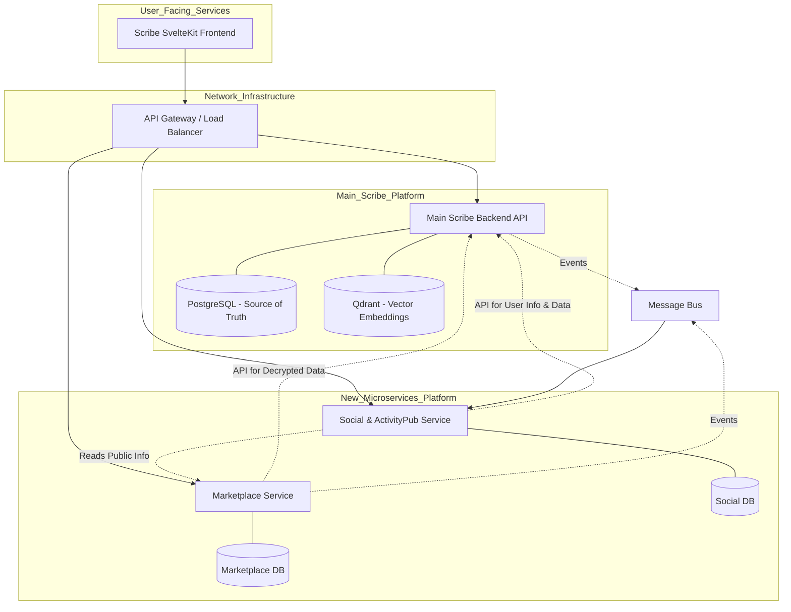

# Scribe Expansion - Microservice Architecture Plan

This document outlines the proposed microservice-based architecture to extend the Scribe platform with a Character/Lorebook Marketplace and Social/ActivityPub features. This plan complements the existing `docs/HOSTING_PLAN.MD`.

## 1. Guiding Principles

*   **Decoupling:** New services (Marketplace, Social) will be independently deployable, scalable, and maintainable.
*   **Single Source of Truth:** The core Scribe application's PostgreSQL database remains the source of truth for all user data, characters, lorebooks, and their encrypted content.
*   **Security First:** User data encryption keys (DEKs) are managed exclusively by the core Scribe application. Microservices will *never* directly access or manage DEKs. All decryption of sensitive content for public display will be performed by the core Scribe API on behalf of the user.
*   **API-Driven Interactions:** Communication between the frontend, microservices, and the core Scribe application will be primarily API-driven.
*   **User Control:** Users explicitly control what they share via `sharing_visibility` (Characters) and `is_public` (Lorebooks) flags.

## 2. High-Level Architecture Overview

## 3. Service Definitions & Responsibilities

### 3.1. Core Scribe Backend (Existing)

*   **Responsibilities:**
    *   User authentication and session management.
    *   Management of user DEKs and all encryption/decryption operations.
    *   CRUD operations for users, characters, lorebooks, chat sessions, messages.
    *   Enforcing sharing/visibility rules based on flags (`sharing_visibility`, `is_public`, chat `visibility`).
    *   Exposing secure APIs for microservices to fetch *publicly permissible, decrypted data*.
    *   Potentially publishing events (e.g., via SNS/SQS) when items are made public or updated.

### 3.2. Marketplace Service (New)

*   **Purpose:** Enables users to discover, browse, and (potentially) acquire shared Characters and Lorebooks. Handles monetization aspects.
*   **Responsibilities:**
    *   **Ingesting Public Listings:** Periodically polls or (preferably) subscribes to events from the Core Scribe App to discover newly shared/updated public Characters and Lorebooks. Stores *publicly viewable metadata* in its own `MarketplaceDB`.
    *   **Serving Marketplace UI Data:** Provides APIs for the frontend to display listings, search, filter, and sort items.
    *   **Displaying Item Details:** When a user views a specific item, the Marketplace Service calls the Core Scribe App API to fetch the *decrypted, shareable fields*. It does **not** store this decrypted sensitive data long-term.
    *   **User Interactions:** Manages ratings, reviews, download counts, etc.
    *   **Monetization Logic:** Integrates with payment gateways (e.g., Stripe as per `HOSTING_PLAN.MD`).
*   **Database (`MarketplaceDB`):** Stores marketplace-specific data. Could be PostgreSQL.

### 3.3. Social & ActivityPub Service (New)

*   **Purpose:** Enables social interactions around shared Scribe content and federates these activities using ActivityPub.
*   **Responsibilities:**
    *   **Activity Generation:** For shares, likes, comments on items. Fetches necessary (decrypted) metadata from Core Scribe App (via API) or public info from Marketplace Service to construct ActivityPub objects.
    *   **ActivityPub Federation:** Implements server-to-server (S2S) ActivityPub protocol.
    *   **User Feed Generation.**
    *   **Comment/Like Management:** Stores comments and likes in its `SocialDB`.
    *   **User Profiles (Social Aspect):** Manages social profiles, followers, etc.
*   **Database (`SocialDB`):** Stores social graph data, activities. Could be PostgreSQL or a graph database.

## 4. Key Interaction Patterns & Data Flows

### 4.1. Sharing an Item to Marketplace
1.  User updates item's sharing flag via Frontend -> Core Scribe API.
2.  Core Scribe App updates `CoreDB`.
3.  **Event-Driven (Preferred):** Core Scribe App publishes an event (e.g., `ItemPublished`) to a Message Bus (e.g., AWS SNS topic -> SQS queue).
4.  Marketplace Service consumes event, calls Core Scribe API for public metadata, and stores it in `MarketplaceDB`.
5.  **Polling (Alternative):** Marketplace Service periodically calls Core Scribe API for new/updated public items.

### 4.2. Viewing an Item in Marketplace
1.  Frontend requests item list from Marketplace Service.
2.  Marketplace Service serves public metadata from `MarketplaceDB`.
3.  For item details, Frontend requests from Marketplace Service.
4.  Marketplace Service calls Core Scribe API (e.g., `GET /api/characters/{id}/decrypted_shared_view`).
5.  Core Scribe API uses item owner's DEK to decrypt shareable fields and returns them.
6.  Marketplace Service forwards details to Frontend.

### 4.3. Posting a Shared Item to Social Feed (ActivityPub)
1.  User initiates "Share to Feed" via Frontend -> Social Service.
2.  Social Service calls Core Scribe API (or Marketplace Service for basic public info + Core Scribe API for sensitive details) to get a public, decrypted representation.
3.  Social Service constructs and delivers ActivityPub activity.
4.  Social Service stores activity reference in `SocialDB`.

## 5. Authentication and Authorization

*   **User Authentication:** Centralized in Core Scribe App (session-based, potentially JWTs for inter-service calls).
*   **Frontend to Microservices:** Authenticated via tokens validated by API Gateway or microservices (introspecting or calling Core Scribe auth).
*   **Microservice to Core Scribe API:**
    *   **Propagate User Context:** For user-specific decryption, microservices propagate the end-user's token. Core Scribe App uses this to access the item owner's DEK.
    *   **Service Accounts:** For generic tasks (e.g., polling public metadata), microservices might use restricted service account tokens.
*   **Authorization:** Core Scribe App enforces ownership and sharing rules. Microservices manage their domain-specific authorization.

## 6. Technology Stack Considerations

*   **Core Scribe App:** Rust (existing).
*   **New Microservices:** Rust recommended for consistency. Other languages (Go, Python, Node.js) are options if specific library support (e.g., ActivityPub) is stronger.
*   **Databases:** PostgreSQL for `MarketplaceDB` and `SocialDB` is a safe default, aligning with `CoreDB`.
*   **Message Bus (Event-Driven):** AWS SNS + SQS recommended for integration with the AWS hosting plan.

## 7. Deployment & Hosting Integration

*   New microservices will be containerized (Docker) and deployed as AWS Fargate tasks within ECS, similar to the Core Scribe Backend, as outlined in `docs/HOSTING_PLAN.MD`.
*   They will be placed in private subnets and accessed via the existing Application Load Balancer (ALB) with new routing rules.
*   Databases for microservices will likely be new Amazon RDS PostgreSQL instances.
*   CI/CD will follow the GitHub Actions pattern described in `docs/HOSTING_PLAN.MD`.

## 8. AWS Credit Utilization

*   Start with minimal Fargate task sizes, RDS instances (`t4g.micro` or `t3.micro`), and ElastiCache nodes.
*   Utilize AWS Cost Explorer and Budgets for monitoring.
*   Leverage AWS Free Tiers where applicable.
*   Optimize NAT Gateway usage and data transfer.
*   Right-size resources based on observed load.
*   Consider Spot Instances for non-critical, fault-tolerant Fargate tasks in later phases.

## 9. Next Steps & Open Questions from Planning

*   Define precise API contracts (endpoints, request/response schemas) between:
    *   Frontend <-> Marketplace Service
    *   Frontend <-> Social Service
    *   Marketplace Service <-> Core Scribe App
    *   Social Service <-> Core Scribe App
*   Detail the specific fields for "public metadata" vs. "decrypted shared view" for Characters and Lorebooks.
*   Finalize the authentication/authorization mechanism for microservice-to-CoreApp API calls (e.g., token propagation details, service account scopes).
*   Define the ActivityPub object structures for shared Scribe content.
*   Elaborate on the monetization strategy for the marketplace to define necessary data and flows.
*   Consider data consistency strategies (e.g., eventual consistency, retry mechanisms for event processing) between `CoreDB` and the microservice-specific databases (`MarketplaceDB`, `SocialDB`).
*   Plan for rate limiting, security hardening, and detailed monitoring/alerting for the new microservices.