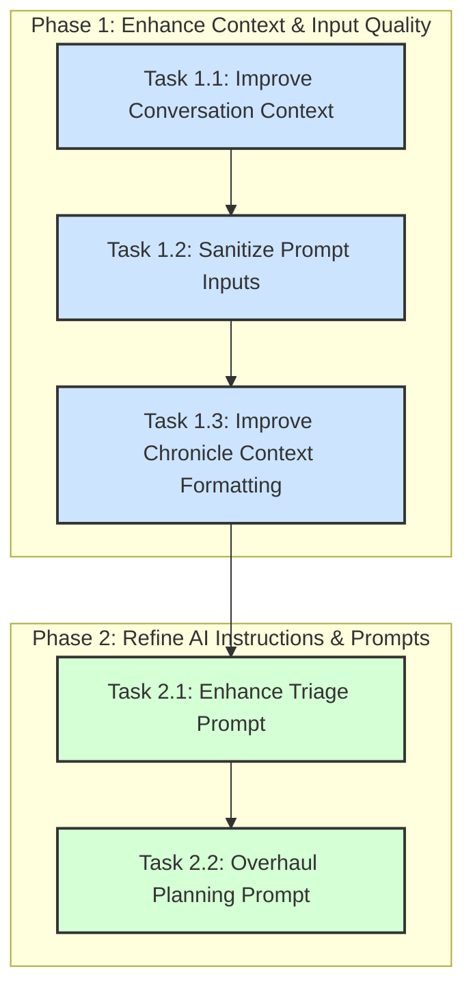

# Plan: Improving Narrative Event Generation

## 1. Overview

The current Agentic Narrative Workflow is too aggressive, producing a high volume of low-granularity events. This leads to narrative noise and inhibits the system's ability to perform meaningful, long-term reasoning. This plan outlines a series of targeted improvements to the workflow, focusing on enhancing the quality of contextual data provided to the AI and refining its instructions.

The goal is to produce fewer, higher-quality, and more contextually-aware chronicle events that accurately reflect the principles of the *Ars Fabula* system.

## 2. Two-Phase Implementation Strategy

The improvements will be implemented in two distinct phases: first, we will fix the quality of the data the AI receives; second, we will improve the AI's instructions based on that higher-quality data.

---

## 3. Phase 1: Enhance Context & Input Quality

This phase focuses on fixing the data the AI receives, which is the foundation for its decision-making. All changes in this phase will be made within `backend/src/services/agentic/agent_runner.rs`.

### Task 1.1: Improve Conversation Context

*   **File:** `backend/src/services/agentic/agent_runner.rs`
*   **Function:** `build_conversation_text`
*   **Problem:** The function currently has a hardcoded limit of the last 10 messages, providing insufficient conversational context for the AI.
*   **Solution:** Modify the `take(10)` limit. The new logic will retrieve messages up to a specific token count (e.g., 2000 tokens), providing a more flexible and contextually rich window of the recent conversation.

### Task 1.2: Sanitize Prompt Inputs

*   **File:** `backend/src/services/agentic/agent_runner.rs`
*   **Function:** `build_conversation_text`
*   **Problem:** HTML entities like `'` in the source text are passed directly into the prompt, which can confuse the AI.
*   **Solution:** Add a sanitization step to clean the message content before it's added to the prompt. This will include replacing common HTML entities with their correct characters.

### Task 1.3: Improve Chronicle Context Formatting

*   **File:** `backend/src/services/agentic/agent_runner.rs`
*   **Function:** `get_recent_chronicle_context`
*   **Problem:** The existing chronicle context is formatted as a dense list of summaries, obscuring the rich structure of past events.
*   **Solution:** Change the prompt formatting from a simple summary (`[TYPE] Summary`) to a more structured and readable block that better represents the event's key data points. This will give the AI a clearer picture of what each past event represents, improving its ability to reason about causality and deduplication.

---

## 4. Phase 2: Refine AI Instructions & Prompts

With high-quality input established, this phase focuses on giving the AI clearer instructions to improve its reasoning and planning capabilities. All changes in this phase will also be made within `backend/src/services/agentic/agent_runner.rs`.

### Task 2.1: Enhance the Triage Prompt

*   **File:** `backend/src/services/agentic/agent_runner.rs`
*   **Function:** `perform_triage`
*   **Problem:** The triage step flags minor emotional reactions or direct follow-ups as new, significant events.
*   **Solution:** Add a "Coalescing Rule" to the prompt. This will instruct the AI to check if new information is simply an emotional reaction or a minor detail related to a very recent event. If so, it should recommend **not** creating a new event, directly targeting the "Sol felt satisfied" problem.

### Task 2.2: Overhaul the Planning Prompt

*   **File:** `backend/src/services/agentic/agent_runner.rs`
*   **Function:** `generate_action_plan`
*   **Problem:** The planning prompt lacks clear, comprehensive examples and explicit instructions, leading to inconsistent and poorly-structured event generation.
*   **Solution:**
    1.  **Add High-Quality Examples:** Replace the brief, one-line examples with 2-3 complete, high-quality JSON examples for the `create_chronicle_event` tool. These examples will showcase best practices for filling out `actors`, `causality`, and `valence`.
    2.  **Clarify "WHAT, WHEN, WHERE":** Add explicit instructions on how to determine the `action` (WHAT), `timestamp_iso8601` (WHEN), and `context_data` (WHERE) from the provided text.
    3.  **Strengthen Deduplication Rules:** Add a rule that explicitly tells the AI: "If the `conversation_text` is a direct continuation of a `RECENT CHRONICLE EVENT`, you should strongly consider that this is not a new event. Do not create a new event unless a significant state change has occurred."
