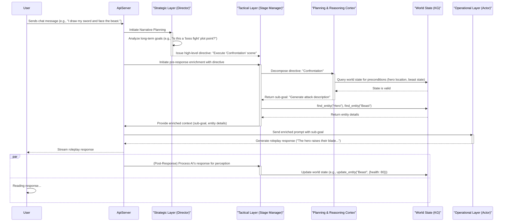

# Sanguine Scribe: A Hierarchical World Model Architecture

**Version:** 4.1 (Proposed Architecture with Gap Analysis)  
**Last Updated:** 2025-07-11  
**Status:** Design Phase → Implementation Ready

## Executive Summary

Sanguine Scribe is architected as a **world simulator** - a foundation for persistent, intelligent narrative ecosystems. This document outlines a paradigm shift from a reactive enrichment pipeline to a proactive, **Hierarchical Agent Framework**.

**Vision:** We will evolve the system from a reactive "story generator" to a proactive "world simulator." This is achieved through a **Hierarchical Agent Framework** composed of three distinct layers:
*   **The Strategic Layer ("Director"):** A new, high-level agent for long-term narrative planning.
*   **The Tactical Layer ("Stage Manager"):** The evolution of the `PreResponseAgent`, responsible for decomposing strategic goals into verifiable steps using a formal planner.
*   **The Operational Layer ("Actor"):** The existing `RoleplayAI`, which executes the final, concrete generative task.

This ensures every AI response is deeply informed by a dynamic, living world that operates on principles of causal reasoning, transforming Sanguine Scribe into a true digital consciousness substrate.

## 🔍 **Current Implementation Status & Viability Assessment**

**Architecture Viability: HIGH (8.5/10)** - The existing codebase provides an excellent foundation for implementing the Hierarchical Agent Framework.

### **✅ Strong Existing Foundations**
- **Robust ECS Architecture**: Sophisticated entity-component system with `SpatialComponent` hierarchies, `HealthComponent`, `InventoryComponent`, and `RelationshipsComponent`
- **Advanced Entity Resolution**: Multi-stage `EntityResolutionTool` with AI-powered narrative context extraction and semantic entity matching
- **Comprehensive Security**: Excellent per-user encryption architecture with `SessionDek`, proper access controls, and OWASP compliance
- **World State Management**: Chronicle-to-ECS translation, world model snapshots, and causal relationship tracking
- **Agent Infrastructure**: `NarrativeAgentRunner`, `AgenticOrchestrator`, and flexible `ScribeTool` registry system

### **🔴 Critical Implementation Gaps**
- **Missing Agent Hierarchy**: No `StrategicAgent`, `TacticalAgent`, or formal agent communication protocol
- **No Formal Planning Engine**: Current LLM-based planning lacks symbolic reasoning and formal verification
- **Missing Pre-Response Integration**: Current agents operate post-chat; no pre-response enrichment pipeline
- **Incomplete Agent Security**: Security controls need extension to hierarchical agent framework
- **🚨 Widespread Architectural Inconsistency**: 8+ services bypass Flash abstraction layer with hardcoded AI calls and system prompts

### **📊 Implementation Readiness by Component**
- **Strategic Layer ("Director")**: 10% - Narrative planning concepts exist but no implementation
- **Tactical Layer ("Stage Manager")**: 25% - Agent orchestration patterns exist but need hierarchy integration and Flash refactoring
- **Operational Layer ("Actor")**: 90% - `RoleplayAI` exists and functions well
- **Planning & Reasoning Cortex**: 5% - Query planning exists but no formal PDDL/HTN integration
- **Security Framework**: 85% - Excellent foundation needs agent-specific extensions
- **🔴 AI Integration Architecture**: 40% - Sophisticated AI logic exists across 8+ services but requires comprehensive Flash integration refactoring

## Core Architecture: The Hierarchical Agent Framework

The new architecture introduces a three-stage hierarchical process that governs the core roleplay AI, ensuring the world is alive, consistent, and narratively coherent.

### 1. The Strategic Layer (The "Director")
A new, high-level agent responsible for long-term narrative arcs and plot management. It operates on the longest timescale, thinking in terms of chapters and acts. It determines "what the story is about" and issues abstract directives to the Tactical Layer.

### 2. The Tactical Layer (The "Stage Manager")
This is the evolution of the existing agent orchestration patterns (`NarrativeAgentRunner` and `AgenticOrchestrator`) into a formal hierarchical agent system. It acts as the bridge between abstract strategy and concrete execution.

**Current State:** The existing `NarrativeAgentRunner` provides some tactical capabilities but lacks formal planning integration and hierarchical communication. The `AgenticOrchestrator` demonstrates orchestration patterns that can be evolved into the Tactical Layer.

## Multi-Scale Spatial Architecture

The Living World supports roleplay scenarios spanning from intimate personal interactions to cosmic-scale adventures through a sophisticated hierarchical spatial model:

### **Spatial Scale Architecture**

**Cosmic Scale**: `Universe → Galaxy → System → World/Moon → Continent → Region`
- **Example**: Star Wars universe with galactic travel, planetary exploration, and local adventures

**Planetary Scale**: `World → Continent → Country → City → District → Building → Room`  
- **Example**: Modern Earth with realistic geographic and political boundaries

**Intimate Scale**: `Building → Floor → Room → Area → Furniture → Container`
- **Example**: Detailed indoor environments for personal interactions

### **Scale-Aware Entity Management**

**Salience-Based Optimization**: Entities are managed with different detail levels based on player focus:
- **Core**: Always tracked with full detail (Player Character, major NPCs, key locations)
- **Secondary**: Tracked when relevant (supporting characters, important items, notable locations)
- **Flavor**: Generated on-demand (background details, atmospheric elements)

**Dynamic Scale Transitions**: Players can seamlessly transition between scales:
- **Galactic God**: Views entire star systems as single entities, zooms in for planetary detail
- **Bounty Hunter**: Travels between planets, explores cities, investigates buildings
- **Office Worker**: Navigates building floors, interacts with room contents, examines desk items

### **Movement & Constraints**

**Scale-Appropriate Movement**: The system validates movement based on entity capabilities:
- **Mortals**: Walk between rooms, drive between cities, need transportation between planets
- **Spaceships**: Travel between systems, land on planets, cannot enter small buildings
- **Gods**: Can traverse any scale but may need to focus attention to see detail

**Hierarchical Queries**: Agents can query spatial relationships at appropriate scales:
- "What's in this room?" (immediate children)
- "What buildings are in this city?" (scale-filtered)
- "What systems are in this galaxy?" (deep hierarchy)

### **Tactical Layer Integration**

*   **Responsibility:** To receive abstract directives from the Director, use the **Planning & Reasoning Cortex** to decompose them into a sequence of concrete, verifiable sub-goals, and manage the world state's integrity.
*   **Workflow:**
    1.  Receives a high-level directive (e.g., "Execute 'Confrontation' scene").
    2.  Invokes the `PlanningCortex` to generate a valid plan.
    3.  Takes the *first* step of the plan as the current sub-goal.
    4.  Uses its toolkit (`find_entity`, etc.) to gather necessary data.
    5.  Packages the sub-goal and retrieved data into the `EnrichedContext` for the Operational Layer.
*   **Perception (Post-Response):** It also incorporates the role of the `PostResponseAgent`, parsing the AI's output to update the world state, ensuring the loop is closed for the next turn.

### 3. The Operational Layer (The "Actor")
This is the `RoleplayAI`. It is the execution layer, responsible for taking a single, concrete, short-term sub-goal from the Tactical Layer and performing the final action of generation (e.g., writing the prose for the "attack description").

### 4. The Planning & Reasoning Cortex
This is a new, formal component that provides the logical reasoning for the Tactical Layer.

**Current State:** The system has sophisticated `QueryStrategyPlanner` and action planning capabilities but lacks formal planning language integration. This provides a foundation for the formal planning engine.

*   **Responsibility:** To provide a formal guarantee of plot coherence and causal consistency.
*   **Implementation:** Uses a formal planning language (e.g., PDDL/HTN) and a solver. It takes the current world state and a goal from the Tactical Layer and produces a provably correct sequence of actions. This acts as a **"symbolic firewall,"** preventing the generative layers from producing logically inconsistent or impossible narrative events.
*   **Migration Path:** The existing query planning infrastructure can be evolved to support formal planning, leveraging the current world state representation and reasoning capabilities.

## Security & Encryption by Design

This architecture upholds and enhances the project's security posture, adhering to the principles in `ENCRYPTION_ARCHITECTURE.md` and `OWASP-TOP-10.md`.

*   **Encryption (A02: Cryptographic Failures):** All components, including the new `StrategicAgent` and `PlanningCortex`, are bound by the existing per-user encryption architecture. The planner will operate on a user's world state by receiving the decrypted `SessionDek` for that specific request. **At no point will any agent have direct access to the key cache or stored encrypted data.** All data created or modified will be passed through the existing encryption service before persistence.
*   **Access Control (A01: Broken Access Control):** The entire hierarchy operates within the user's authenticated session. The `TacticalAgent` and its tools will enforce ownership, ensuring a user can only command the planner to operate on entities they own.
*   **Secure Design (A04: Insecure Design):** This hierarchical design is inherently more secure. By separating concerns, we limit the scope of each component. The `RoleplayAI` (Actor) cannot directly manipulate the world state; it can only execute tasks validated by the `TacticalAgent`'s planning cortex.
*   **Logging & Monitoring (A09: Security Logging and Monitoring Failures):** All significant decisions, including directives from the Strategic Layer, plans generated by the Cortex, and actions executed by the Tactical Layer, will be logged with sufficient detail for security auditing.

## How This Solves the Critical Gaps

This new architecture directly addresses the previously identified "Living World Blockers" with greater robustness:

*   **🔴 Entity Resolution is Fundamentally Broken -> ✅ SOLVED:** The Tactical Layer's formal planning process makes entity resolution a prerequisite for any action, ensuring it is handled correctly and consistently.
*   **🔴 Component Data is Effectively Useless -> ✅ SOLVED:** The planner's preconditions and effects directly operate on component data, making it the central driver of world state changes.
*   **🔴 No Spatial or Relational Context -> ✅ SOLVED:** The planner can reason about hierarchical spatial relationships (`ParentLink`) and entity relationships as part of its core logic.
*   **🔴 Chronicle Events Don't Drive World State -> ✅ SOLVED:** The Tactical Layer now directly drives the world state based on the output of a verifiable plan.
*   **🔴 AI Prompts Are Shallow and Context-Blind -> ✅ SOLVED:** The `prompt_builder` now receives a payload containing a specific, actionable sub-goal derived from a coherent plan, making the Roleplay AI exceptionally context-aware and directed.

## Conclusion

This V4 architecture moves Sanguine Scribe from a system that *remembers* to a system that *reasons*. By structuring the system into a formal hierarchy grounded in a plannable world model, we ensure that the world is always alive, consistent, and intelligent.

## 🎯 **Core Design Philosophy: Prompt Orchestration Engine**

Sanguine Scribe is fundamentally a **Prompt Orchestration Engine** - a sophisticated system designed to craft the perfect `EnrichedContext` payload for Gemini 2.5 Flash/Flash-Lite. This represents a state-of-the-art neuro-symbolic architecture where:

- **Symbolic Layer** (Rust ECS + PDDL): Provides logical consistency, causal reasoning, and world state management
- **Neural Layer** (Gemini): Provides creativity, prose generation, and narrative flexibility
- **Orchestration Layer** (Hierarchical Agents): Bridges symbolic and neural through intelligent prompt construction

### **The "Symbolic Firewall" Principle**

The PDDL Planning Cortex acts as a **"symbolic firewall"** that prevents the generative model from producing logically impossible or narratively inconsistent outputs. The LLM receives prompts that already contain the next valid step from a pre-vetted plan, ensuring:

- **Causal Consistency**: Every action follows logical preconditions
- **Narrative Coherence**: Events build upon established world state
- **Performance Optimization**: Only relevant context reaches the LLM
- **Cost Efficiency**: Precise prompts reduce token usage and API costs

This is the definitive path to creating a true world simulator that leverages the best of both deterministic logic and generative AI.

## 🚀 **Implementation Readiness & Next Steps**

**Overall Assessment: READY FOR IMPLEMENTATION**

The comprehensive gap analysis reveals that Sanguine Scribe has an **excellent foundation** for implementing the Hierarchical Agent Framework. The existing sophisticated ECS architecture, robust security framework, and comprehensive world modeling capabilities provide strong building blocks for the proposed system.

### **Implementation Strategy**

1. **Phase 1: Foundation Hardening (4-6 weeks)** - Critical Flash integration refactoring and ECS enhancement
2. **Phase 2: Proof of Concept (4-6 weeks)** - Implement basic hierarchical agents without formal planning
3. **Phase 3: Formal Planning Integration (6-8 weeks)** - Add symbolic reasoning capabilities
4. **Phase 4: Full Hierarchy (8-10 weeks)** - Complete hierarchical communication and autonomous planning
5. **Phase 5: System Hardening (2-3 weeks)** - Security validation and performance optimization

### **Key Success Factors**

- **Leverage Existing Infrastructure**: Build upon the robust ECS, security, and agent orchestration systems
- **Incremental Implementation**: Migrate existing functionality while adding new capabilities
- **Comprehensive Testing**: Utilize the excellent existing test infrastructure for validation
- **Security First**: Extend the strong security architecture to new agent components

### **Risk Mitigation**

- **Formal Planning Complexity**: Start with simple PDDL before complex HTN integration
- **Performance Concerns**: Implement caching and optimization from the beginning
- **AI Model Limitations**: Design fallback mechanisms for strategic planning failures
- **🔴 Widespread Architectural Inconsistency**: **CRITICAL** - Refactor 8+ services with hardcoded AI calls to use Flash/Flash-Lite before migration to maintain proper AI abstraction patterns

The architecture is **viable, well-founded, and ready for systematic implementation**. The existing codebase provides an exceptional foundation that positions Sanguine Scribe to become a true world simulator with autonomous, intelligent narrative capabilities.