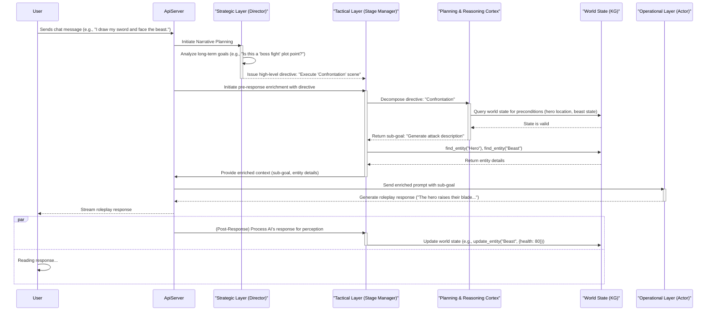

# Sanguine Scribe: A Hierarchical World Model Architecture

**Version:** 4.1 (Proposed Architecture with Gap Analysis)  
**Last Updated:** 2025-07-11  
**Status:** Design Phase → Implementation Ready

## Executive Summary

Sanguine Scribe is architected as a **world simulator** - a foundation for persistent, intelligent narrative ecosystems. This document outlines a paradigm shift from a reactive enrichment pipeline to a proactive, **Hierarchical Agent Framework**.

**Vision:** We will evolve the system from a reactive "story generator" to a proactive "world simulator." This is achieved through a **Hierarchical Agent Framework** composed of three distinct layers:
*   **The Strategic Layer ("Director"):** A new, high-level agent for long-term narrative planning.
*   **The Tactical Layer ("Stage Manager"):** The evolution of the `PreResponseAgent`, responsible for decomposing strategic goals into verifiable steps by generating a plan with an LLM and validating it against the world state.
*   **The Operational Layer ("Actor"):** The existing `RoleplayAI`, which executes the final, concrete generative task.

This ensures every AI response is deeply informed by a dynamic, living world that operates on principles of causal reasoning, transforming Sanguine Scribe into a true digital consciousness substrate.

## 🔍 **Current Implementation Status & Viability Assessment**

**Architecture Viability: HIGH (8.5/10)** - The existing codebase provides an excellent foundation for implementing the Hierarchical Agent Framework.

### **✅ Strong Existing Foundations**
- **Robust ECS Architecture**: Sophisticated entity-component system with `SpatialComponent` hierarchies, `HealthComponent`, `InventoryComponent`, and `RelationshipsComponent`
- **Advanced Entity Resolution**: Multi-stage `EntityResolutionTool` with AI-powered narrative context extraction and semantic entity matching
- **Comprehensive Security**: Excellent per-user encryption architecture with `SessionDek`, proper access controls, and OWASP compliance
- **World State Management**: Chronicle-to-ECS translation, world model snapshots, and causal relationship tracking
- **Agent Infrastructure**: `NarrativeAgentRunner`, `AgenticOrchestrator`, and flexible `ScribeTool` registry system

### **🔴 Critical Implementation Gaps**
- **Missing Agent Hierarchy**: No `StrategicAgent`, `TacticalAgent`, or formal agent communication protocol
- **No Validated Planning Loop**: The system lacks a dedicated planning-and-validation loop; agentic actions are generated without being explicitly validated against ECS ground truth before execution.
- **Missing Pre-Response Integration**: Current agents operate post-chat; no pre-response enrichment pipeline
- **Incomplete Agent Security**: Security controls need extension to hierarchical agent framework
- **🚨 Widespread Architectural Inconsistency**: 8+ services bypass Flash abstraction layer with hardcoded AI calls and system prompts

### **📊 Implementation Readiness by Component**
- **Strategic Layer ("Director")**: 10% - Narrative planning concepts exist but no implementation
- **Tactical Layer ("Stage Manager")**: 25% - Agent orchestration patterns exist but need hierarchy integration and Flash refactoring
- **Operational Layer ("Actor")**: 90% - `RoleplayAI` exists and functions well
- **Planning & Reasoning Cortex**: 5% - Query planning infrastructure exists, but the LLM-based planning service and the critical `PlanValidator` service are not implemented.
- **Security Framework**: 85% - Excellent foundation needs agent-specific extensions
- **🔴 AI Integration Architecture**: 40% - Sophisticated AI logic exists across 8+ services but requires comprehensive Flash integration refactoring

## Core Architecture: The Hierarchical Agent Framework

The new architecture introduces a three-stage hierarchical process that governs the core roleplay AI, ensuring the world is alive, consistent, and narratively coherent.



### 1. The Strategic Layer (The "Director")
A new, high-level agent responsible for long-term narrative arcs and plot management. It operates on the longest timescale, thinking in terms of chapters and acts. It determines "what the story is about" and issues abstract directives to the Tactical Layer.

### 2. The Tactical Layer (The "Stage Manager")
This is the evolution of the existing agent orchestration patterns (`NarrativeAgentRunner` and `AgenticOrchestrator`) into a formal hierarchical agent system. It acts as the bridge between abstract strategy and concrete execution.

**Current State:** The existing `NarrativeAgentRunner` provides some tactical capabilities but lacks formal planning integration and hierarchical communication. The `AgenticOrchestrator` demonstrates orchestration patterns that can be evolved into the Tactical Layer.

## Multi-Scale Spatial Architecture

The Living World supports roleplay scenarios spanning from intimate personal interactions to cosmic-scale adventures through a sophisticated hierarchical spatial model:

### **Spatial Scale Architecture**

**Cosmic Scale**: `Universe → Galaxy → System → World/Moon → Continent → Region`
- **Example**: Star Wars universe with galactic travel, planetary exploration, and local adventures

**Planetary Scale**: `World → Continent → Country → City → District → Building → Room`  
- **Example**: Modern Earth with realistic geographic and political boundaries

**Intimate Scale**: `Building → Floor → Room → Area → Furniture → Container`
- **Example**: Detailed indoor environments for personal interactions

### **Scale-Aware Entity Management**

**Salience-Based Optimization**: Entities are managed with different detail levels based on player focus:
- **Core**: Always tracked with full detail (Player Character, major NPCs, key locations)
- **Secondary**: Tracked when relevant (supporting characters, important items, notable locations)
- **Flavor**: Generated on-demand (background details, atmospheric elements)

**Dynamic Scale Transitions**: Players can seamlessly transition between scales:
- **Galactic God**: Views entire star systems as single entities, zooms in for planetary detail
- **Bounty Hunter**: Travels between planets, explores cities, investigates buildings
- **Office Worker**: Navigates building floors, interacts with room contents, examines desk items

### **Movement & Constraints**

**Scale-Appropriate Movement**: The system validates movement based on entity capabilities:
- **Mortals**: Walk between rooms, drive between cities, need transportation between planets
- **Spaceships**: Travel between systems, land on planets, cannot enter small buildings
- **Gods**: Can traverse any scale but may need to focus attention to see detail

**Hierarchical Queries**: Agents can query spatial relationships at appropriate scales:
- "What's in this room?" (immediate children)
- "What buildings are in this city?" (scale-filtered)
- "What systems are in this galaxy?" (deep hierarchy)

### **Tactical Layer Integration**

*   **Responsibility:** To receive abstract directives from the Director, use the **Planning & Reasoning Cortex** to decompose them into a sequence of concrete, *validated* sub-goals, and manage the world state's integrity.
*   **Workflow:**
    1.  Receives a high-level directive (e.g., "Execute 'Confrontation' scene").
    2.  Invokes the `PlanningCortex` to generate a *proposed* plan (a structured JSON object from an LLM).
    3.  The `PlanningCortex` then uses its **Symbolic Firewall** (`PlanValidator` service) to verify the entire proposed plan against the current ECS world state.
    4.  If the plan is valid, the `TacticalAgent` takes the *first* step as the current sub-goal.
    5.  Uses its toolkit (`find_entity`, etc.) to gather necessary data for the sub-goal.
    6.  Packages the sub-goal and retrieved data into the `EnrichedContext` for the Operational Layer.
*   **Perception (Post-Response):** It also incorporates the role of the `PostResponseAgent`, parsing the AI's output to update the world state, ensuring the loop is closed for the next turn.

### **✅ Dynamic Hierarchy Promotion (IMPLEMENTED)**

**Current State:** ✅ **COMPLETE** - Agent-callable hierarchy promotion tools are fully implemented and integrated into the agentic system.

**Implementation Details:**
- **`PromoteEntityHierarchyTool`**: Allows AI agents to expand spatial hierarchies when scope increases (e.g., traveling from planet to planet requires creating a solar system)
- **`GetEntityHierarchyTool`**: Enables agents to query complete hierarchy paths from root to entity
- **JSON Interface**: Full schema specification for agent interaction with hierarchy management
- **Security**: Proper user ownership validation and SessionDek integration
- **Integration**: Tools registered in `AgenticNarrativeFactory` and available to all agents

**Use Cases:**
- **Interplanetary Travel**: When player travels from Tatooine to Coruscant, system automatically creates "Tatooine System" and "Republic Core" as intermediate hierarchy levels
- **Scale Transitions**: Office worker character suddenly gains cosmic powers - system dynamically restructures hierarchy to accommodate new scope
- **Galactic Campaigns**: God-level players operating across multiple star systems with automatic hierarchy management

**Agent Interface Example:**
```json
{
  "tool": "promote_entity_hierarchy",
  "params": {
    "user_id": "user-uuid",
    "entity_id": "tatooine-uuid", 
    "new_parent_name": "Tatooine System",
    "new_parent_scale": "Cosmic",
    "new_parent_position": {
      "position_type": "absolute",
      "coordinates": {"x": 0, "y": 0, "z": 0}
    },
    "relationship_type": "orbits"
  }
}
```

This implementation enables **fully dynamic spatial hierarchies** that automatically adapt to narrative scope changes, supporting seamless transitions between intimate character interactions and cosmic-scale adventures.

### 3. The Operational Layer (The "Actor")
This is the `RoleplayAI`. It is the execution layer, responsible for taking a single, concrete, short-term sub-goal from the Tactical Layer and performing the final action of generation (e.g., writing the prose for the "attack description").

### 4. The Planning & Reasoning Cortex (LLM-as-a-Planner)
This component provides the logical reasoning for the Tactical Layer by using an LLM to generate plans, which are then rigorously validated. It is not a formal solver, but a pragmatic, AI-driven planning system with a critical validation layer.

**Current State:** The system has a `QueryStrategyPlanner` and AI service infrastructure, which provides a foundation for this new model.

*   **Responsibility:** To provide a guarantee of causal consistency by ensuring all AI-generated plans are valid within the rules of the world state (ECS) before execution.
*   **Implementation:** This is a two-part system:
    1.  **The Planner (`PlanningService`):** An AI-driven service that takes a narrative goal and the relevant world state, and uses an LLM (via a structured prompt and an `Action Schema`) to generate a proposed plan as a JSON object.
    2.  **The Validator (`PlanValidatorService`):** This is the **"Symbolic Firewall."** It takes the LLM's proposed JSON plan and meticulously checks every step against the ground truth of the ECS. It verifies actions, parameters, and preconditions, rejecting any plan that is not 100% consistent with the world's rules.
*   **Workflow:** The `TacticalAgent` calls the `PlanningService` to get a creative plan, but **no action is taken** until the `PlanValidatorService` has confirmed the entire plan is logically sound.

## Security & Encryption by Design

This architecture upholds and enhances the project's security posture, adhering to the principles in `ENCRYPTION_ARCHITECTURE.md` and `OWASP-TOP-10.md`.

*   **Encryption (A02: Cryptographic Failures):** All components, including the new `StrategicAgent` and `PlanningCortex`, are bound by the existing per-user encryption architecture. The planner will operate on a user's world state by receiving the decrypted `SessionDek` for that specific request. **At no point will any agent have direct access to the key cache or stored encrypted data.** All data created or modified will be passed through the existing encryption service before persistence.
*   **Access Control (A01: Broken Access Control):** The entire hierarchy operates within the user's authenticated session. The `TacticalAgent` and its tools will enforce ownership, ensuring a user can only command the planner to operate on entities they own.
*   **Secure Design (A04: Insecure Design):** This hierarchical design is inherently more secure. By separating concerns, we limit the scope of each component. The `RoleplayAI` (Actor) cannot directly manipulate the world state; it can only execute tasks validated by the `TacticalAgent`'s planning cortex.
*   **Logging & Monitoring (A09: Security Logging and Monitoring Failures):** All significant decisions, including directives from the Strategic Layer, plans generated by the Cortex, and actions executed by the Tactical Layer, will be logged with sufficient detail for security auditing.

## How This Solves the Critical Gaps

This new architecture directly addresses the previously identified "Living World Blockers" with greater robustness:

*   **🔴 Entity Resolution is Fundamentally Broken -> ✅ SOLVED:** The Tactical Layer's validated planning process makes entity resolution a prerequisite for any action, ensuring it is handled correctly and consistently.
*   **🔴 Component Data is Effectively Useless -> ✅ SOLVED:** The plan validator's preconditions and effects directly operate on component data, making it the central driver of world state changes.
*   **🔴 No Spatial or Relational Context -> ✅ SOLVED:** The planning and validation process can reason about hierarchical spatial relationships (`ParentLink`) and entity relationships as part of its core logic.
*   **🔴 Chronicle Events Don't Drive World State -> ✅ SOLVED:** The Tactical Layer now directly drives the world state based on the output of a verifiable plan.
*   **🔴 AI Prompts Are Shallow and Context-Blind -> ✅ SOLVED:** The `prompt_builder` now receives a payload containing a specific, actionable sub-goal derived from a coherent plan, making the Roleplay AI exceptionally context-aware and directed.

## Conclusion

This V4 architecture moves Sanguine Scribe from a system that *remembers* to a system that *reasons*. By structuring the system into a formal hierarchy grounded in a plannable world model, we ensure that the world is always alive, consistent, and intelligent.

## 🎯 **Core Design Philosophy: Prompt Orchestration Engine**

Sanguine Scribe is fundamentally a **Prompt Orchestration Engine** - a sophisticated system designed to craft the perfect `EnrichedContext` payload for Gemini 2.5 Flash/Flash-Lite. This represents a state-of-the-art neuro-symbolic architecture where:

- **Symbolic Layer** (Rust ECS + `PlanValidatorService`): Provides logical consistency, causal reasoning, and world state management.
- **Neural Layer** (Gemini via `PlanningService`): Provides creative plan generation, prose generation, and narrative flexibility.
- **Orchestration Layer** (Hierarchical Agents): Bridges symbolic and neural through a validated, intelligent prompt construction pipeline.

### **The "Symbolic Firewall" Principle**

The `PlanValidatorService` acts as a **"symbolic firewall"** that prevents the generative model from producing logically impossible or narratively inconsistent outputs. The LLM's creative plan is fully vetted *before* any part of it is used to build the final prompt for the `RoleplayAI`, ensuring:

- **Causal Consistency**: Every action follows logical preconditions
- **Narrative Coherence**: Events build upon established world state
- **Performance Optimization**: Only relevant context reaches the LLM
- **Cost Efficiency**: Precise prompts reduce token usage and API costs

This is the definitive path to creating a true world simulator that leverages the best of both deterministic logic and generative AI.

### **🔧 ECS State Reconciliation & Intelligent Plan Repair**

**Problem Identified:** The current Plan Validator acts as a "rigid firewall" that blindly rejects plans based on ECS state, but in narrative contexts there are legitimate cases where the ECS has fallen behind the narrative rather than the plan being invalid.

**Solution:** **Task 3.5** implements an intelligent reconciliation system that can distinguish between genuine plan invalidity and ECS inconsistency, automatically repairing the latter while maintaining safety through validation.

#### **Real-World Scenarios**

```typescript
// Scenario 1: Missing Movement Update
User: "Sol walks into the cantina and orders a drink"
ECS State: Sol.parent_link = "Chamber" (outdated)
Plan: add_item_to_inventory(Sol, "Drink") 
Current Result: ❌ INVALID - Sol not in cantina
Intelligent Result: ✅ REPAIRABLE - Generate repair: move_entity(Sol, "Cantina") + original plan

// Scenario 2: Missing Relationship
User: "Sol greets his old friend Borga warmly"  
ECS State: No relationship between Sol and Borga
Plan: update_relationship(Sol, Borga, trust=0.8)
Current Result: ❌ INVALID - No existing relationship
Intelligent Result: ✅ REPAIRABLE - Generate repair: create_relationship(Sol, Borga, "friend", 0.6) + update

// Scenario 3: Missing Component Evolution  
User: "Sol's reputation as a skilled pilot spreads"
ECS State: Sol has no Reputation component
Plan: update_component(Sol, "Reputation", pilot_skill=0.9)
Current Result: ❌ INVALID - Component doesn't exist
Intelligent Result: ✅ REPAIRABLE - Generate repair: add_component(Sol, "Reputation", {}) + update
```

#### **Enhanced Validation Architecture**

```rust
pub enum PlanValidationResult {
    Valid(ValidPlan),
    Invalid(InvalidPlan),
    RepairableInvalid(RepairableInvalidPlan), // 🆕 NEW
}

pub struct RepairableInvalidPlan {
    pub original_plan: Plan,
    pub repair_actions: Vec<PlannedAction>,  // Actions to fix ECS
    pub combined_plan: Plan,                 // Repair + Original
    pub inconsistency_analysis: InconsistencyAnalysis,
    pub confidence_score: f32,               // How sure we are ECS is wrong
}

pub struct InconsistencyAnalysis {
    pub inconsistency_type: InconsistencyType,
    pub narrative_evidence: Vec<String>,     // Chat excerpts supporting repair
    pub ecs_state_summary: String,          // Current state that seems wrong
    pub repair_reasoning: String,           // Why this repair makes sense
}

pub enum InconsistencyType {
    MissingMovement,      // Entity should be elsewhere
    MissingComponent,     // Component should exist but doesn't  
    MissingRelationship,  // Relationship implied but not recorded
    OutdatedState,        // ECS state is stale/outdated
    TemporalMismatch,     // Time-based inconsistency
}
```

#### **Intelligent Validation Flow**

```rust
impl PlanValidatorService {
    pub async fn validate_plan_with_repair(
        &self, 
        plan: &Plan, 
        user_id: Uuid,
        recent_context: &[ChatMessage] // 🆕 NEW - For inconsistency analysis
    ) -> Result<PlanValidationResult, AppError> {
        
        // 1. Standard validation first
        let validation_result = self.validate_plan(plan, user_id).await?;
        
        match validation_result {
            PlanValidationResult::Valid(valid) => Ok(PlanValidationResult::Valid(valid)),
            PlanValidationResult::Invalid(invalid) => {
                
                // 2. 🆕 NEW - Analyze if ECS might be inconsistent
                let inconsistency = self.analyze_ecs_inconsistency(
                    plan, 
                    &invalid.failures, 
                    user_id,
                    recent_context
                ).await?;
                
                if let Some(analysis) = inconsistency {
                    if analysis.confidence_score > 0.7 { // High confidence ECS is wrong
                        
                        // 3. 🆕 NEW - Generate repair plan
                        let repair_plan = self.generate_repair_plan(
                            &analysis, 
                            user_id
                        ).await?;
                        
                        // 4. 🆕 NEW - Validate combined plan
                        let combined = self.combine_plans(&repair_plan, plan);
                        let combined_validation = self.validate_plan(&combined, user_id).await?;
                        
                        match combined_validation {
                            PlanValidationResult::Valid(_) => {
                                Ok(PlanValidationResult::RepairableInvalid(RepairableInvalidPlan {
                                    original_plan: plan.clone(),
                                    repair_actions: repair_plan.actions,
                                    combined_plan: combined,
                                    inconsistency_analysis: analysis,
                                    confidence_score: analysis.confidence_score,
                                }))
                            }
                            _ => Ok(PlanValidationResult::Invalid(invalid)) // Repair didn't work
                        }
                    } else {
                        Ok(PlanValidationResult::Invalid(invalid)) // Low confidence, probably invalid plan
                    }
                } else {
                    Ok(PlanValidationResult::Invalid(invalid)) // No inconsistency detected
                }
            }
        }
    }
}
```

#### **Flash-Powered Inconsistency Detection**

```rust
impl EcsConsistencyAnalyzer {
    pub async fn analyze_inconsistency(
        &self,
        plan: &Plan,
        failures: &[ValidationFailure], 
        user_id: Uuid,
        recent_context: &[ChatMessage]
    ) -> Result<Option<InconsistencyAnalysis>, AppError> {
        
        let prompt = format!(r#"
Analyze if the following plan validation failures might be due to ECS inconsistency 
rather than an invalid plan:

RECENT CONVERSATION:
{}

PLAN GOAL: {}
VALIDATION FAILURES: {}
CURRENT ECS STATE: {}

QUESTION: Based on the conversation context, do any of these failures suggest 
the ECS state is outdated/incomplete rather than the plan being invalid?

For each failure, rate confidence (0.0-1.0) that it's an ECS inconsistency and 
provide specific evidence from the conversation.
"#, 
            self.format_context(recent_context),
            plan.goal,
            self.format_failures(failures),
            self.get_relevant_ecs_state(plan, user_id).await?
        );
        
        let analysis = self.flash_client.analyze(&prompt).await?;
        
        // Parse Flash response into InconsistencyAnalysis
        self.parse_inconsistency_analysis(analysis).await
    }
}
```

#### **Benefits of State Reconciliation**

1. **🎯 Intelligent vs Rigid**: Distinguishes between genuine plan invalidity and ECS inconsistency
2. **🔄 Self-Healing**: Automatically repairs common ECS/narrative mismatches  
3. **📊 Confidence-Based**: Only repairs when highly confident ECS is wrong
4. **🛡️ Safety**: Still validates repair plans to prevent new inconsistencies
5. **📝 Transparency**: Logs all repairs for user awareness and debugging
6. **⚡ Performance**: Only triggers on validation failures, minimal overhead

#### **Integration Example**

```rust
// In TacticalAgent or similar
let validation_result = plan_validator.validate_plan_with_repair(
    &plan, 
    user_id, 
    &recent_chat_messages
).await?;

match validation_result {
    PlanValidationResult::Valid(plan) => {
        // Execute normally
        execute_plan(plan).await
    }
    PlanValidationResult::RepairableInvalid(repairable) => {
        // Log repair for transparency
        info!("🔧 Repairing ECS inconsistency: {}", repairable.inconsistency_analysis.repair_reasoning);
        
        // Execute repair + original plan
        execute_plan(repairable.combined_plan).await
    }
    PlanValidationResult::Invalid(invalid) => {
        // Genuinely invalid plan
        return Err(PlanningError::InvalidPlan(invalid.failures));
    }
}
```

This transforms the "rigid firewall" into an **"intelligent state reconciliation system"** that maintains the safety of symbolic validation while adding the flexibility to handle real-world narrative inconsistencies.

## 🚀 **Implementation Readiness & Next Steps**

**Overall Assessment: READY FOR IMPLEMENTATION**

The comprehensive gap analysis reveals that Sanguine Scribe has an **excellent foundation** for implementing the Hierarchical Agent Framework. The existing sophisticated ECS architecture, robust security framework, and comprehensive world modeling capabilities provide strong building blocks for the proposed system.

### **Implementation Strategy**

1. **Phase 1: Foundation Hardening** - Critical Flash integration refactoring and ECS enhancement
2. **Phase 2: Proof of Concept** - Implement basic hierarchical agents without a planning loop.
3. **Phase 3: LLM-based Planning Integration** - Add the AI planning and validation services.
4. **Phase 4: Full Hierarchy** - Complete hierarchical communication and autonomous planning
5. **Phase 5: System Hardening** - Security validation and performance optimization

### **Key Success Factors**

- **Leverage Existing Infrastructure**: Build upon the robust ECS, security, and agent orchestration systems
- **Incremental Implementation**: Migrate existing functionality while adding new capabilities
- **Comprehensive Testing**: Utilize the excellent existing test infrastructure for validation
- **Security First**: Extend the strong security architecture to new agent components

### **Risk Mitigation**

- **Planning & Validation Complexity**: Implement the `PlanValidator` with comprehensive test coverage for all action types and edge cases.
- **Performance Concerns**: Implement caching and optimization from the beginning
- **AI Model Limitations**: Design fallback mechanisms for strategic planning failures
- **🔴 Widespread Architectural Inconsistency**: **CRITICAL** - Refactor 8+ services with hardcoded AI calls to use Flash/Flash-Lite before migration to maintain proper AI abstraction patterns

The architecture is **viable, well-founded, and ready for systematic implementation**. The existing codebase provides an exceptional foundation that positions Sanguine Scribe to become a true world simulator with autonomous, intelligent narrative capabilities.