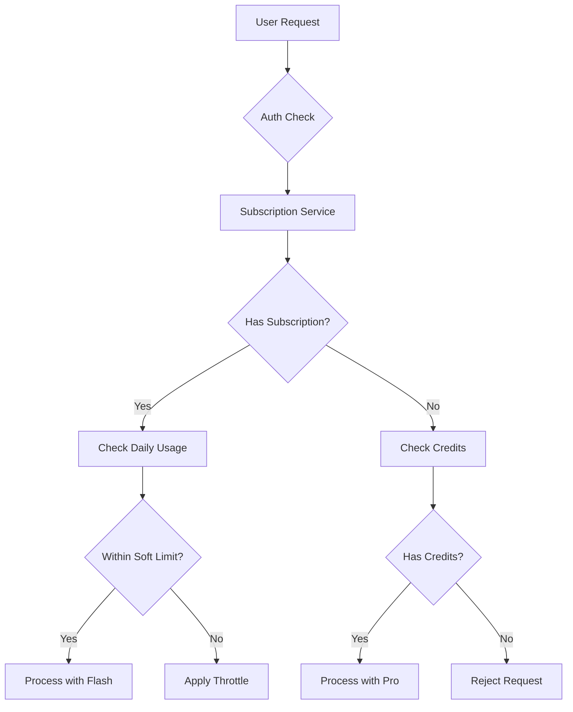

# Subscription and Credit System Architecture

## Executive Summary

Sanguine Scribe implements a hybrid subscription + credit model that provides generous daily usage limits for subscribers while enabling pay-per-use access to premium AI models. This architecture balances user experience, unit economics, and system sustainability.

## Table of Contents

1. [System Overview](#system-overview)
2. [Business Model](#business-model)
3. [Technical Architecture](#technical-architecture)
4. [Security Considerations](#security-considerations)
5. [Configuration Management](#configuration-management)
6. [Database Schema](#database-schema)
7. [API Specifications](#api-specifications)
8. [Usage Tracking & Soft Limits](#usage-tracking--soft-limits)
9. [Testing Strategy](#testing-strategy)
10. [Migration Path](#migration-path)
11. [Monitoring & Analytics](#monitoring--analytics)

## System Overview

The subscription system operates on three core principles:

1. **Generous Daily Usage**: Subscribers receive high daily message limits (100-200) that feel essentially unlimited
2. **Credit-Based Premium Access**: Credits unlock access to advanced models (Gemini 2.5 Pro) for enhanced quality
3. **Soft Limit Protection**: Progressive throttling prevents abuse without hard stops for paying users

### Key Components



## Business Model

### Subscription Tiers

| Tier | Price/Month | Daily Soft Limit | Included Credits | Context Limit | Models |
|------|-------------|------------------|------------------|---------------|--------|
| **Free** | $0 | 20 (hard) | 25 (one-time) | 32k | Flash-Lite |
| **Basic** | $10 | 100 | 250/month | 64k | Flash, Flash-Lite |
| **Premium** | $25 | 200 | 800/month | 200k | Flash, Flash-Lite + 10% credit discount |

### Credit Pricing

- **Direct Purchase**: $5 = 250 credits, scaling with volume bonuses
- **Usage Costs**:
  - Flash: 0 credits (covered by subscription)
  - Pro: 50 credits per message (any context size)
- **No Expiration**: Credits never expire, even after subscription cancellation

### Unit Economics

At current Gemini pricing ($0.30/$2.50 per M tokens for Flash):

**Basic Tier ($10/month)**:
- Assumes 30 msgs/day average usage
- API Cost: ~$2.52/month
- Profit Margin: ~65% after fees

**Premium Tier ($25/month)**:
- Assumes 50 msgs/day average usage
- API Cost: ~$4.20/month
- Profit Margin: ~76% after fees

## Technical Architecture

### Service Layer Design

```rust
// Core service interfaces
trait CreditService {
    async fn get_balance(user_id: Uuid) -> Result<i32>;
    async fn deduct_credits(user_id: Uuid, amount: i32) -> Result<()>;
    async fn add_credits(user_id: Uuid, amount: i32, source: &str) -> Result<()>;
}

trait UsageTrackingService {
    async fn check_daily_usage(user_id: Uuid) -> Result<DailyUsage>;
    async fn apply_soft_limit(usage: &DailyUsage) -> SoftLimitAction;
    async fn record_usage(user_id: Uuid, tokens: usize) -> Result<()>;
}

trait SubscriptionService {
    async fn get_current_tier(user_id: Uuid) -> Result<SubscriptionTier>;
    async fn allocate_monthly_credits(user_id: Uuid) -> Result<()>;
}
```

### State Management

The system maintains several key states:

1. **Subscription State**: Active tier, renewal date, cancellation status
2. **Credit Balance**: Current balance, transaction history
3. **Usage Metrics**: Daily/monthly message counts, token consumption
4. **Soft Limit State**: Current throttle level, last reset time

## Security Considerations

### OWASP Top 10 Compliance

#### A01:2021 - Broken Access Control
- **Mitigation**: Role-based access with per-tier limits
- **Implementation**: Middleware validates subscription tier before model access
- **Audit**: All credit transactions logged with user context

#### A02:2021 - Cryptographic Failures
- **Mitigation**: Encrypt sensitive payment data with user DEK
- **Implementation**: Credit balance stored in plaintext (not sensitive), transaction metadata encrypted
- **Key Management**: Follow existing `ENCRYPTION_ARCHITECTURE.md`

#### A03:2021 - Injection
- **Mitigation**: Parameterized queries for all database operations
- **Implementation**: Use Diesel ORM with compile-time query validation
- **Validation**: Input sanitization for credit amounts and transaction descriptions

#### A07:2021 - Identification and Authentication Failures
- **Mitigation**: Session validation on all payment endpoints
- **Implementation**: Reuse existing `axum-login` session management
- **2FA**: Consider requiring 2FA for credit purchases >$50

#### A08:2021 - Software and Data Integrity Failures
- **Mitigation**: Webhook signature validation for Paddle events
- **Implementation**: HMAC verification before processing payments
- **Idempotency**: Transaction IDs prevent duplicate credit allocation

#### A09:2021 - Security Logging and Monitoring Failures
- **Mitigation**: Comprehensive audit trail for financial transactions
- **Implementation**:
  ```rust
  #[derive(Debug)]
  struct CreditAuditLog {
      user_id: Uuid,
      action: CreditAction,
      amount: i32,
      balance_before: i32,
      balance_after: i32,
      source: String,
      ip_address: Option<IpAddr>,
      timestamp: DateTime<Utc>,
  }
  ```

### Additional Security Measures

1. **Rate Limiting**: Max 5 credit purchases per hour per user
2. **Fraud Detection**: Alert on unusual purchase patterns
3. **CSRF Protection**: Token validation on state-changing operations
4. **PCI Compliance**: No credit card data stored locally (Paddle handles)

## Configuration Management

### Tier Configuration (`config/subscription_tiers.json`)

```json
{
  "version": "1.0.0",
  "tiers": {
    "free": {
      "display_name": "Free",
      "price_monthly": 0,
      "price_yearly": 0,
      "limits": {
        "daily_messages": 20,
        "daily_limit_type": "hard",
        "context_tokens": 32768,
        "chronicles_enabled": false,
        "lorebooks_enabled": false
      },
      "credits": {
        "included_monthly": 0,
        "welcome_bonus": 25
      },
      "models": ["gemini-2.5-flash-lite"]
    },
    "basic": {
      "display_name": "Basic",
      "price_monthly": 10.00,
      "price_yearly": 96.00,
      "paddle_price_id": "pri_basic_monthly",
      "limits": {
        "daily_messages": 100,
        "daily_limit_type": "soft",
        "context_tokens": 65536,
        "chronicles_enabled": true,
        "lorebooks_enabled": true,
        "max_characters": 10,
        "max_lorebooks": 5
      },
      "credits": {
        "included_monthly": 250,
        "rollover_max": 500
      },
      "models": ["gemini-2.5-flash", "gemini-2.5-flash-lite"]
    },
    "premium": {
      "display_name": "Premium",
      "price_monthly": 25.00,
      "price_yearly": 240.00,
      "paddle_price_id": "pri_premium_monthly",
      "limits": {
        "daily_messages": 200,
        "daily_limit_type": "soft",
        "context_tokens": 200000,
        "chronicles_enabled": true,
        "lorebooks_enabled": true,
        "max_characters": -1,
        "max_lorebooks": -1
      },
      "credits": {
        "included_monthly": 800,
        "rollover_max": 2000,
        "purchase_discount": 0.10
      },
      "models": ["gemini-2.5-flash", "gemini-2.5-flash-lite"],
      "features": ["api_access", "priority_queue", "beta_features"]
    }
  },
  "credit_pricing": {
    "packages": [
      {"credits": 250, "price": 5.00, "bonus": 0},
      {"credits": 550, "price": 10.00, "bonus": 0.10},
      {"credits": 1500, "price": 25.00, "bonus": 0.20},
      {"credits": 3500, "price": 50.00, "bonus": 0.40}
    ],
    "model_costs": {
      "gemini-2.5-flash": 0,
      "gemini-2.5-flash-lite": 0,
      "gemini-2.5-pro": 50,
      "claude-3.5-sonnet": 75
    }
  },
  "soft_limits": {
    "basic": {
      "thresholds": [
        {"after_message": 100, "delay_ms": 2000},
        {"after_message": 150, "delay_ms": 5000, "fallback_model": "gemini-2.5-flash-lite"}
      ]
    },
    "premium": {
      "thresholds": [
        {"after_message": 200, "delay_ms": 1000},
        {"after_message": 300, "delay_ms": 3000}
      ]
    }
  }
}
```

### Environment Variables

```env
# Subscription System Configuration
SUBSCRIPTION_CONFIG_PATH=./config/subscription_tiers.json
SUBSCRIPTION_ENABLE_SOFT_LIMITS=true
SUBSCRIPTION_GRACE_PERIOD_DAYS=3

# Credit System Configuration
CREDIT_EXPIRY_DAYS=0  # 0 = never expire
CREDIT_MIN_PURCHASE=250
CREDIT_MAX_BALANCE=100000

# Usage Tracking
USAGE_TRACKING_ENABLED=true
USAGE_RESET_TIME_UTC=00:00
USAGE_RETENTION_DAYS=90

# Feature Flags
FEATURE_CREDITS_ENABLED=true
FEATURE_SOFT_LIMITS_ENABLED=true
FEATURE_SUBSCRIPTION_UPGRADES=true
```

## Database Schema

### New Tables

```sql
-- User credit balances
CREATE TABLE user_credits (
    user_id UUID PRIMARY KEY REFERENCES users(id),
    balance INTEGER NOT NULL DEFAULT 0 CHECK (balance >= 0),
    lifetime_earned INTEGER NOT NULL DEFAULT 0,
    lifetime_spent INTEGER NOT NULL DEFAULT 0,
    last_monthly_grant TIMESTAMP WITH TIME ZONE,
    created_at TIMESTAMP WITH TIME ZONE DEFAULT NOW(),
    updated_at TIMESTAMP WITH TIME ZONE DEFAULT NOW()
);

-- Credit transaction history
CREATE TABLE credit_transactions (
    id UUID PRIMARY KEY DEFAULT gen_random_uuid(),
    user_id UUID REFERENCES users(id) NOT NULL,
    amount INTEGER NOT NULL, -- positive for credits, negative for debits
    balance_after INTEGER NOT NULL,
    transaction_type VARCHAR(50) NOT NULL, -- 'purchase', 'monthly_grant', 'usage', 'refund', 'adjustment'
    description TEXT NOT NULL,
    metadata_encrypted BYTEA, -- Encrypted JSON with details
    metadata_nonce BYTEA,
    reference_id VARCHAR(255), -- External reference (e.g., Paddle transaction)
    created_at TIMESTAMP WITH TIME ZONE DEFAULT NOW()
);

-- Credit packages for purchase
CREATE TABLE credit_packages (
    id UUID PRIMARY KEY DEFAULT gen_random_uuid(),
    name VARCHAR(100) NOT NULL,
    credits INTEGER NOT NULL,
    price_cents INTEGER NOT NULL,
    paddle_price_id VARCHAR(255),
    active BOOLEAN DEFAULT true,
    created_at TIMESTAMP WITH TIME ZONE DEFAULT NOW()
);

-- Daily usage tracking for soft limits
CREATE TABLE daily_usage_tracking (
    id UUID PRIMARY KEY DEFAULT gen_random_uuid(),
    user_id UUID REFERENCES users(id) NOT NULL,
    date DATE NOT NULL,
    message_count INTEGER NOT NULL DEFAULT 0,
    token_count BIGINT NOT NULL DEFAULT 0,
    model_breakdown JSONB, -- {"flash": 45, "pro": 5}
    soft_limit_triggered_at INTEGER, -- Message number when throttling started
    created_at TIMESTAMP WITH TIME ZONE DEFAULT NOW(),
    updated_at TIMESTAMP WITH TIME ZONE DEFAULT NOW(),
    UNIQUE(user_id, date)
);

-- Indexes for performance
CREATE INDEX idx_credit_transactions_user_id ON credit_transactions(user_id);
CREATE INDEX idx_credit_transactions_created_at ON credit_transactions(created_at);
CREATE INDEX idx_credit_transactions_type ON credit_transactions(transaction_type);
CREATE INDEX idx_daily_usage_user_date ON daily_usage_tracking(user_id, date);
```

### Schema Modifications

```sql
-- Extend existing subscriptions table
ALTER TABLE subscriptions
ADD COLUMN credits_allocated_this_period BOOLEAN DEFAULT false,
ADD COLUMN soft_limit_override INTEGER; -- Admin can set custom limits

-- Add to users table for quick lookups
ALTER TABLE users
ADD COLUMN cached_credit_balance INTEGER DEFAULT 0,
ADD COLUMN cached_subscription_tier VARCHAR(50);
```

## API Specifications

### Subscription Endpoints

#### GET /api/subscription/plans
Returns available subscription plans with pricing and features.

**Response:**
```json
{
  "plans": [
    {
      "id": "basic",
      "name": "Basic",
      "price_monthly": 10.00,
      "price_yearly": 96.00,
      "features": {
        "daily_messages": 100,
        "context_limit": 65536,
        "included_credits": 250,
        "models": ["gemini-2.5-flash"]
      }
    }
  ]
}
```

#### GET /api/subscription/current
Returns current user's subscription details.

**Response:**
```json
{
  "tier": "basic",
  "status": "active",
  "current_period_end": "2025-10-01T00:00:00Z",
  "cancel_at_period_end": false,
  "usage_today": {
    "messages": 42,
    "soft_limit": 100,
    "throttle_active": false
  }
}
```

### Credit Endpoints

#### GET /api/credits/balance
Returns current credit balance and recent transactions.

**Response:**
```json
{
  "balance": 750,
  "pending": 0,
  "recent_transactions": [
    {
      "id": "txn_123",
      "amount": 250,
      "type": "monthly_grant",
      "description": "Monthly credit allocation",
      "created_at": "2025-09-01T00:00:00Z"
    }
  ]
}
```

#### POST /api/credits/purchase
Initiates credit package purchase.

**Request:**
```json
{
  "package_id": "pkg_550_credits",
  "payment_method": "paddle"
}
```

**Response:**
```json
{
  "checkout_url": "https://checkout.paddle.com/...",
  "transaction_id": "txn_pending_123"
}
```

#### POST /api/credits/spend (Internal)
Deducts credits for premium model usage.

**Request:**
```json
{
  "amount": 50,
  "model": "gemini-2.5-pro",
  "session_id": "sess_123",
  "message_id": "msg_456"
}
```

### Usage Endpoints

#### GET /api/usage/current
Returns current period usage statistics.

**Response:**
```json
{
  "period": "daily",
  "date": "2025-09-18",
  "messages_sent": 42,
  "tokens_consumed": 125000,
  "soft_limit": 100,
  "throttle_status": {
    "active": false,
    "delay_ms": 0,
    "next_threshold": 100
  }
}
```

## Usage Tracking & Soft Limits

### Implementation Strategy

```rust
#[derive(Debug)]
pub struct SoftLimitConfig {
    pub tier: SubscriptionTier,
    pub thresholds: Vec<SoftLimitThreshold>,
}

#[derive(Debug)]
pub struct SoftLimitThreshold {
    pub after_messages: u32,
    pub delay_ms: u32,
    pub fallback_model: Option<String>,
}

impl UsageTrackingService {
    pub async fn check_and_apply_soft_limit(
        &self,
        user_id: Uuid,
    ) -> Result<SoftLimitAction, AppError> {
        let usage = self.get_daily_usage(user_id).await?;
        let tier = self.subscription_service.get_tier(user_id).await?;
        let config = self.get_soft_limit_config(&tier);

        for threshold in config.thresholds {
            if usage.message_count >= threshold.after_messages {
                return Ok(SoftLimitAction {
                    delay_ms: threshold.delay_ms,
                    fallback_model: threshold.fallback_model,
                    warning_message: Some(format!(
                        "You've sent {} messages today. Responses may be slower.",
                        usage.message_count
                    )),
                });
            }
        }

        Ok(SoftLimitAction::none())
    }
}
```

### Daily Reset Logic

```rust
// Runs at midnight UTC via cron job
pub async fn reset_daily_usage() -> Result<(), AppError> {
    let today = Utc::now().date_naive();

    // Archive yesterday's usage
    sqlx::query!(
        "INSERT INTO usage_history
         SELECT * FROM daily_usage_tracking
         WHERE date < $1",
        today
    ).execute(&pool).await?;

    // Reset counters
    sqlx::query!(
        "UPDATE daily_usage_tracking
         SET message_count = 0, token_count = 0
         WHERE date < $1",
        today
    ).execute(&pool).await?;

    Ok(())
}
```

## Testing Strategy

### Unit Tests

```rust
#[cfg(test)]
mod credit_service_tests {
    use super::*;

    #[tokio::test]
    async fn test_credit_deduction() {
        let service = CreditService::new_mock();
        let user_id = Uuid::new_v4();

        // Setup: User has 100 credits
        service.set_balance(user_id, 100).await.unwrap();

        // Action: Deduct 50 credits
        service.deduct_credits(user_id, 50).await.unwrap();

        // Assert: Balance is 50
        assert_eq!(service.get_balance(user_id).await.unwrap(), 50);
    }

    #[tokio::test]
    async fn test_insufficient_credits() {
        let service = CreditService::new_mock();
        let user_id = Uuid::new_v4();

        service.set_balance(user_id, 10).await.unwrap();

        let result = service.deduct_credits(user_id, 50).await;
        assert!(matches!(result, Err(AppError::InsufficientCredits)));
    }
}
```

### Integration Tests

```rust
#[tokio::test]
async fn test_subscription_credit_allocation() {
    let app = spawn_app().await;
    let user = create_test_user(&app).await;

    // Subscribe to Basic tier
    let subscription = create_subscription(&app, &user, "basic").await;

    // Trigger monthly credit allocation
    process_subscription_renewal(&app, &subscription).await;

    // Verify credits were allocated
    let balance = get_credit_balance(&app, &user).await;
    assert_eq!(balance, 250); // Basic tier gets 250 credits
}

#[tokio::test]
async fn test_soft_limit_throttling() {
    let app = spawn_app().await;
    let user = create_basic_subscriber(&app).await;

    // Send 100 messages (at soft limit)
    for _ in 0..100 {
        send_message(&app, &user).await;
    }

    // 101st message should be throttled
    let start = Instant::now();
    send_message(&app, &user).await;
    let elapsed = start.elapsed();

    assert!(elapsed >= Duration::from_secs(2)); // 2-second delay
}
```

### API Tests

```rust
#[tokio::test]
async fn test_credit_purchase_flow() {
    let app = spawn_app().await;
    let user = create_test_user(&app).await;

    // Initiate purchase
    let response = app.client
        .post("/api/credits/purchase")
        .json(&json!({
            "package_id": "pkg_550_credits"
        }))
        .send()
        .await
        .expect("Failed to send request");

    assert_eq!(response.status(), StatusCode::OK);

    let body: serde_json::Value = response.json().await.unwrap();
    assert!(body["checkout_url"].as_str().is_some());

    // Simulate webhook from Paddle
    let webhook = create_paddle_webhook("transaction.completed", &body["transaction_id"]);
    process_webhook(&app, webhook).await;

    // Verify credits were added
    let balance = get_credit_balance(&app, &user).await;
    assert_eq!(balance, 550);
}
```

## Migration Path

### Phase 1: Foundation (Week 1)
1. Deploy database migrations
2. Implement CreditService with basic operations
3. Add configuration loading from JSON
4. Deploy to staging for testing

### Phase 2: Integration (Week 2)
1. Integrate credits with existing SubscriptionService
2. Implement soft limit tracking
3. Add credit allocation on subscription renewal
4. Test with internal team

### Phase 3: API & Frontend (Week 3)
1. Implement all API endpoints
2. Add frontend UI for credit balance
3. Create purchase flow integration
4. Beta test with selected users

### Phase 4: Launch (Week 4)
1. Migrate existing subscribers (grant bonus credits)
2. Enable credit purchases
3. Monitor metrics and adjust
4. Full production rollout

### Rollback Plan

```sql
-- Emergency rollback procedure
BEGIN;

-- Disable credit requirements
UPDATE feature_flags SET enabled = false WHERE name = 'credits_enabled';

-- Grant unlimited credits to active users (temporary)
UPDATE user_credits SET balance = 999999 WHERE user_id IN (
    SELECT user_id FROM subscriptions WHERE status = 'active'
);

-- Log the incident
INSERT INTO system_events (event_type, description)
VALUES ('credit_system_rollback', 'Emergency rollback initiated');

COMMIT;
```

## Monitoring & Analytics

### Key Metrics

```sql
-- Daily Active Users by Tier
SELECT
    s.plan_type,
    COUNT(DISTINCT d.user_id) as active_users,
    AVG(d.message_count) as avg_messages,
    MAX(d.message_count) as max_messages
FROM daily_usage_tracking d
JOIN subscriptions s ON d.user_id = s.user_id
WHERE d.date = CURRENT_DATE
GROUP BY s.plan_type;

-- Credit Usage Patterns
SELECT
    DATE_TRUNC('day', created_at) as day,
    SUM(CASE WHEN amount > 0 THEN amount ELSE 0 END) as credits_earned,
    SUM(CASE WHEN amount < 0 THEN ABS(amount) ELSE 0 END) as credits_spent,
    COUNT(DISTINCT user_id) as unique_users
FROM credit_transactions
WHERE created_at >= NOW() - INTERVAL '30 days'
GROUP BY day;

-- Soft Limit Impact
SELECT
    plan_type,
    COUNT(*) as users_throttled,
    AVG(message_count) as avg_messages_at_throttle
FROM daily_usage_tracking d
JOIN subscriptions s ON d.user_id = s.user_id
WHERE soft_limit_triggered_at IS NOT NULL
    AND date >= CURRENT_DATE - 7
GROUP BY plan_type;
```

### Alerts

1. **Credit Balance Anomalies**: Alert if user balance goes negative
2. **Excessive Usage**: Alert if user exceeds 2x soft limit
3. **Purchase Failures**: Alert on repeated failed transactions
4. **System Health**: Monitor credit allocation job success rate

### Dashboard Requirements

- Real-time subscription tier distribution
- Daily/monthly credit consumption trends
- Soft limit trigger frequency by tier
- Revenue metrics (MRR, credit purchases, churn)
- User journey funnel (free → basic → premium)

## Security Audit Checklist

- [ ] All credit transactions logged with full audit trail
- [ ] Webhook signatures validated before processing
- [ ] Rate limiting on purchase endpoints
- [ ] CSRF tokens on state-changing operations
- [ ] Encrypted storage of sensitive transaction metadata
- [ ] Regular security scans of payment flow
- [ ] PCI compliance verification (via Paddle)
- [ ] Fraud detection rules configured
- [ ] Backup and recovery procedures tested
- [ ] Incident response plan documented

## Appendix

### A. Error Codes

```rust
pub enum CreditError {
    InsufficientBalance = 4001,
    TransactionFailed = 4002,
    InvalidPackage = 4003,
    DuplicateTransaction = 4004,
    UserNotFound = 4005,
    SubscriptionInactive = 4006,
    RateLimitExceeded = 4007,
}
```

### B. Configuration Validation

```rust
#[derive(Debug, Deserialize)]
#[serde(deny_unknown_fields)]
pub struct TierConfig {
    #[serde(deserialize_with = "validate_price")]
    pub price_monthly: f64,

    #[serde(deserialize_with = "validate_limit")]
    pub daily_messages: u32,

    #[serde(deserialize_with = "validate_credits")]
    pub included_credits: u32,
}

fn validate_price<'de, D>(deserializer: D) -> Result<f64, D::Error>
where D: Deserializer<'de> {
    let price = f64::deserialize(deserializer)?;
    if price < 0.0 || price > 1000.0 {
        return Err(de::Error::custom("Price must be between 0 and 1000"));
    }
    Ok(price)
}
```

### C. Database Optimization

```sql
-- Materialized view for fast balance lookups
CREATE MATERIALIZED VIEW user_credit_summary AS
SELECT
    user_id,
    balance,
    lifetime_earned,
    lifetime_spent,
    last_transaction_at,
    (SELECT plan_type FROM subscriptions s WHERE s.user_id = c.user_id) as tier
FROM user_credits c;

CREATE UNIQUE INDEX ON user_credit_summary (user_id);

-- Refresh every 5 minutes
CREATE EXTENSION IF NOT EXISTS pg_cron;
SELECT cron.schedule('refresh-credit-summary', '*/5 * * * *',
    'REFRESH MATERIALIZED VIEW CONCURRENTLY user_credit_summary');
```

---

This architecture provides a robust, secure, and scalable foundation for the hybrid subscription + credit model while maintaining excellent user experience and sustainable unit economics.