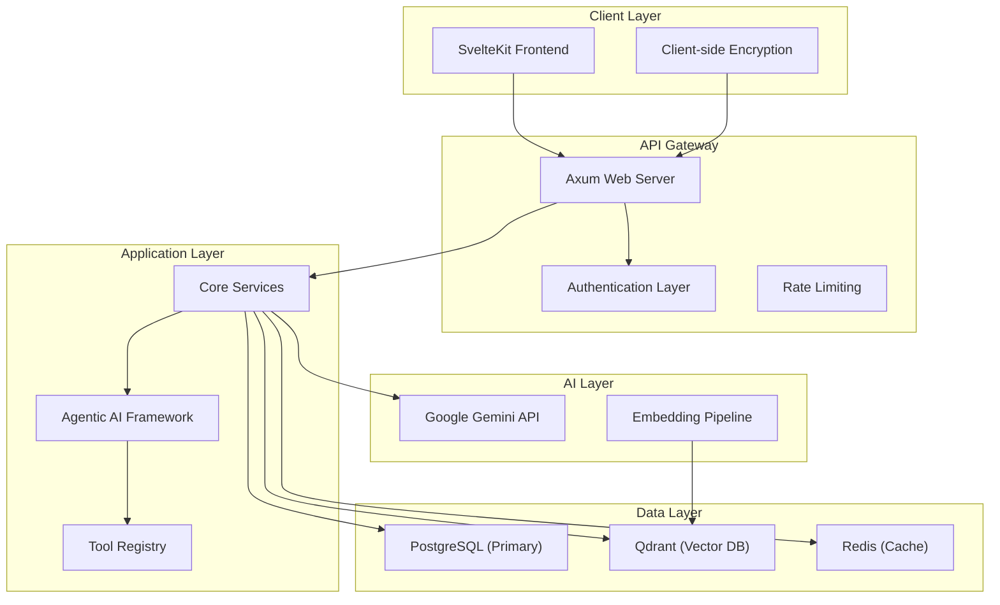

# Sanguine Scribe Technical Specification

**Version:** 2.0 (Consolidated)  
**Last Updated:** 2025-01-09  
**Status:** Production Implementation

## Overview

Sanguine Scribe is a privacy-first, AI-powered narrative roleplaying platform designed as a living world substrate. This document consolidates all technical architecture, implementation details, and specifications into a single authoritative source.

## System Architecture

### High-Level Architecture



### Core Components

#### 1. Frontend (SvelteKit)
- **Framework**: SvelteKit with TypeScript
- **UI Library**: shadcn-svelte components
- **Styling**: TailwindCSS with custom design system
- **State Management**: Svelte runes and stores
- **API Communication**: Fetch API with automatic cookie handling

#### 2. Backend (Rust + Axum)
- **Web Framework**: Axum with tower middleware
- **ORM**: Diesel with PostgreSQL
- **Authentication**: axum-login with custom session management
- **Encryption**: ChaCha20-Poly1305 with Argon2 key derivation
- **Concurrency**: Tokio async runtime

#### 3. Database Systems
- **PostgreSQL**: Primary relational database
- **Qdrant**: Vector database for semantic search
- **Redis**: Caching and session storage

#### 4. AI Integration
- **Primary LLM**: Google Gemini 2.5 Pro/Flash
- **Embeddings**: text-embedding-004 model
- **Framework**: Custom agentic AI with tool orchestration

## Data Models

### Core Entity Schema

```sql
-- Users with E2EE support
CREATE TABLE users (
    id UUID PRIMARY KEY DEFAULT gen_random_uuid(),
    username VARCHAR(255) UNIQUE NOT NULL,
    email VARCHAR(255) UNIQUE NOT NULL,
    password_hash VARCHAR(255) NOT NULL,
    salt BYTEA NOT NULL,
    encrypted_dek BYTEA NOT NULL,
    dek_nonce BYTEA NOT NULL,
    created_at TIMESTAMPTZ DEFAULT NOW(),
    updated_at TIMESTAMPTZ DEFAULT NOW(),
    is_email_verified BOOLEAN DEFAULT FALSE,
    account_status VARCHAR(50) DEFAULT 'active',
    role VARCHAR(50) DEFAULT 'user'
);

-- Chronicles (narrative sessions)
CREATE TABLE chronicles (
    id UUID PRIMARY KEY DEFAULT gen_random_uuid(),
    user_id UUID NOT NULL REFERENCES users(id) ON DELETE CASCADE,
    title TEXT NOT NULL,
    description TEXT,
    created_at TIMESTAMPTZ DEFAULT NOW(),
    updated_at TIMESTAMPTZ DEFAULT NOW()
);

-- Chronicle events (narrative memory)
CREATE TABLE chronicle_events (
    id UUID PRIMARY KEY DEFAULT gen_random_uuid(),
    user_id UUID NOT NULL REFERENCES users(id) ON DELETE CASCADE,
    chronicle_id UUID NOT NULL REFERENCES chronicles(id) ON DELETE CASCADE,
    event_type VARCHAR(100) NOT NULL,
    summary TEXT NOT NULL,
    event_data JSONB,
    timestamp_iso8601 TIMESTAMPTZ NOT NULL,
    source VARCHAR(50) NOT NULL,
    actors JSONB,
    caused_by_event_id UUID REFERENCES chronicle_events(id),
    causes_event_ids UUID[],
    created_at TIMESTAMPTZ DEFAULT NOW(),
    updated_at TIMESTAMPTZ DEFAULT NOW()
);

-- ECS Entities (world state)
CREATE TABLE ecs_entities (
    id UUID PRIMARY KEY DEFAULT gen_random_uuid(),
    user_id UUID NOT NULL REFERENCES users(id) ON DELETE CASCADE,
    archetype_signature TEXT NOT NULL,
    created_at TIMESTAMPTZ DEFAULT NOW(),
    updated_at TIMESTAMPTZ DEFAULT NOW()
);

-- ECS Components (entity properties)
CREATE TABLE ecs_components (
    id UUID PRIMARY KEY DEFAULT gen_random_uuid(),
    entity_id UUID NOT NULL REFERENCES ecs_entities(id) ON DELETE CASCADE,
    user_id UUID NOT NULL REFERENCES users(id) ON DELETE CASCADE,
    component_type TEXT NOT NULL,
    component_data JSONB NOT NULL,
    created_at TIMESTAMPTZ DEFAULT NOW(),
    updated_at TIMESTAMPTZ DEFAULT NOW(),
    UNIQUE(entity_id, component_type)
);

-- ECS Relationships (entity connections)
CREATE TABLE ecs_entity_relationships (
    id UUID PRIMARY KEY DEFAULT gen_random_uuid(),
    from_entity_id UUID NOT NULL REFERENCES ecs_entities(id) ON DELETE CASCADE,
    to_entity_id UUID NOT NULL REFERENCES ecs_entities(id) ON DELETE CASCADE,
    user_id UUID NOT NULL REFERENCES users(id) ON DELETE CASCADE,
    relationship_type TEXT NOT NULL,
    relationship_data JSONB NOT NULL,
    relationship_category TEXT, -- 'social', 'spatial', 'causal', 'ownership', 'temporal'
    strength DOUBLE PRECISION,
    causal_metadata JSONB,
    temporal_validity JSONB,
    created_at TIMESTAMPTZ DEFAULT NOW(),
    updated_at TIMESTAMPTZ DEFAULT NOW()
);

-- Lorebook (world knowledge)
CREATE TABLE lorebook_entries (
    id UUID PRIMARY KEY DEFAULT gen_random_uuid(),
    user_id UUID NOT NULL REFERENCES users(id) ON DELETE CASCADE,
    lorebook_id UUID NOT NULL REFERENCES lorebooks(id) ON DELETE CASCADE,
    title TEXT NOT NULL,
    content TEXT NOT NULL,
    keywords TEXT,
    enabled BOOLEAN DEFAULT TRUE,
    created_at TIMESTAMPTZ DEFAULT NOW(),
    updated_at TIMESTAMPTZ DEFAULT NOW()
);
```

### Component Types

#### Core Components
```rust
// Entity identity and naming
#[derive(Serialize, Deserialize)]
pub struct NameComponent {
    pub name: String,
    pub display_name: String,
    pub aliases: Vec<String>,
}

// Spatial position and containment
#[derive(Serialize, Deserialize)]
pub struct PositionComponent {
    pub x: f64,
    pub y: f64,
    pub z: f64,
    pub zone: String,
}

// Physical and mental health
#[derive(Serialize, Deserialize)]
pub struct HealthComponent {
    pub current: i32,
    pub max: i32,
    pub regeneration_rate: f32,
}

// Social relationships
#[derive(Serialize, Deserialize)]
pub struct RelationshipsComponent {
    pub relationships: Vec<Relationship>,
}

// Item ownership and carrying
#[derive(Serialize, Deserialize)]
pub struct InventoryComponent {
    pub items: Vec<InventoryItem>,
    pub capacity: usize,
}

// Spatial containment and hierarchy
#[derive(Serialize, Deserialize)]
pub struct SpatialComponent {
    pub spatial_type: SpatialType,
    pub constraints: SpatialConstraints,
    pub metadata: HashMap<String, JsonValue>,
}

// Temporal existence and state changes
#[derive(Serialize, Deserialize)]
pub struct TemporalComponent {
    pub created_at: GameTime,
    pub destroyed_at: Option<GameTime>,
    pub last_modified: GameTime,
    pub time_scale: f64,
}
```

## Core Services

### 1. Chronicle Service
**Purpose**: Manages narrative events and temporal memory
**Key Operations**:
- Create/update/delete chronicle events
- Query events by timeline, causality, or content
- Maintain causal chains between events
- Support for different modalities (actual, hypothetical, memory)

```rust
pub struct ChronicleService {
    pub async fn create_event(&self, request: CreateEventRequest) -> Result<ChronicleEvent>
    pub async fn get_events_by_timeline(&self, timeline: TimeRange) -> Result<Vec<ChronicleEvent>>
    pub async fn get_causal_chain(&self, event_id: Uuid) -> Result<Vec<ChronicleEvent>>
    pub async fn update_event_causality(&self, event_id: Uuid, causality: Causality) -> Result<()>
}
```

### 2. ECS Entity Manager
**Purpose**: Manages world state through entity-component-system
**Key Operations**:
- Create/update/delete entities and components
- Query entities by component criteria
- Manage spatial relationships and containment
- Cache frequently accessed entities

```rust
pub struct EcsEntityManager {
    pub async fn create_entity(&self, archetype: String, components: Vec<Component>) -> Result<Entity>
    pub async fn get_entity(&self, entity_id: Uuid) -> Result<Option<EntityQueryResult>>
    pub async fn query_entities(&self, criteria: Vec<ComponentQuery>) -> Result<Vec<EntityQueryResult>>
    pub async fn update_components(&self, updates: Vec<ComponentUpdate>) -> Result<()>
}
```

### 3. Agentic AI Service
**Purpose**: Autonomous AI agents with tool access
**Key Operations**:
- Process narrative events through 4-step workflow
- Execute tool plans with transaction safety
- Manage multi-model AI conversations
- Context-aware decision making

```rust
pub struct NarrativeIntelligenceService {
    pub async fn process_narrative_event(&self, event: NarrativeEvent) -> Result<ProcessingResult>
    pub async fn execute_tool_plan(&self, plan: ToolPlan) -> Result<ExecutionResult>
    pub async fn analyze_significance(&self, content: &str) -> Result<SignificanceResult>
}
```

### 4. Encryption Service
**Purpose**: End-to-end encryption with semantic search
**Key Operations**:
- Encrypt/decrypt user data with session DEKs
- Derive KEKs from user passwords
- Support searchable encryption for RAG
- Manage encryption key lifecycle

```rust
pub struct EncryptionService {
    pub async fn encrypt_data(&self, data: &[u8], dek: &SessionDek) -> Result<EncryptedData>
    pub async fn decrypt_data(&self, encrypted: &EncryptedData, dek: &SessionDek) -> Result<Vec<u8>>
    pub async fn derive_kek(&self, password: &str, salt: &[u8]) -> Result<Kek>
}
```

## API Endpoints

### Authentication
```
POST /api/auth/register     - User registration
POST /api/auth/login        - User authentication
POST /api/auth/logout       - Session termination
GET  /api/auth/verify_email - Email verification
```

### Chronicles
```
GET    /api/chronicles           - List user's chronicles
POST   /api/chronicles           - Create new chronicle
GET    /api/chronicles/:id       - Get chronicle details
PUT    /api/chronicles/:id       - Update chronicle
DELETE /api/chronicles/:id       - Delete chronicle
POST   /api/chronicles/:id/events - Create chronicle event
GET    /api/chronicles/:id/events - Get chronicle events
```

### Entities
```
GET    /api/entities             - Query entities
POST   /api/entities             - Create entity
GET    /api/entities/:id         - Get entity details
PUT    /api/entities/:id         - Update entity
DELETE /api/entities/:id         - Delete entity
POST   /api/entities/:id/components - Update components
GET    /api/entities/:id/relationships - Get relationships
```

### Agentic AI
```
POST /api/agentic/process        - Process narrative content
POST /api/agentic/tools/:name    - Execute specific tool
GET  /api/agentic/status         - Get processing status
```

## Security Architecture

### End-to-End Encryption
1. **Key Derivation**: Client derives KEK from password using Argon2
2. **DEK Management**: Server stores encrypted DEK, decrypts with KEK during session
3. **Data Encryption**: All sensitive data encrypted with ChaCha20-Poly1305
4. **Searchable Encryption**: Semantic search on encrypted content via embedding similarity

### Authentication & Authorization
1. **Session Management**: axum-login with database session store
2. **RBAC**: Role-based access control (user, admin roles)
3. **Account Security**: Account locking, email verification, password policies
4. **API Security**: Rate limiting, CORS, CSRF protection

### Privacy Compliance
1. **GDPR Compliance**: User data export/deletion, consent management
2. **Data Minimization**: Only collect necessary data
3. **Audit Logging**: Privacy-preserving audit trails
4. **Zero-Knowledge**: Server cannot decrypt user data without session

## Performance Specifications

### Response Time Targets
- **API Endpoints**: <100ms for cached queries, <500ms for complex operations
- **Entity Queries**: <50ms for single entity, <200ms for batch queries
- **AI Processing**: <2s for triage, <10s for full agentic workflow
- **Vector Search**: <100ms for semantic similarity queries

### Scalability Targets
- **Concurrent Users**: 1000+ simultaneous users
- **Data Volume**: 10TB+ user data with efficient querying
- **AI Throughput**: 100+ AI requests/second
- **Vector Storage**: 1M+ embeddings with sub-second search

### Caching Strategy
- **Redis**: Entity queries, session data, frequently accessed content
- **Application Cache**: Component definitions, tool schemas
- **CDN**: Static assets, public content
- **Database**: Query plan caching, index optimization

## Deployment Architecture

### Container Configuration
```yaml
services:
  backend:
    image: sanguine-scribe-backend
    ports: ["8080:8080"]
    environment:
      - DATABASE_URL=${DATABASE_URL}
      - REDIS_URL=${REDIS_URL}
      - GEMINI_API_KEY=${GEMINI_API_KEY}
    
  frontend:
    image: sanguine-scribe-frontend
    ports: ["3000:3000"]
    environment:
      - BACKEND_URL=http://backend:8080
    
  postgresql:
    image: postgres:16
    environment:
      - POSTGRES_DB=sanguine_scribe
      - POSTGRES_USER=${DB_USER}
      - POSTGRES_PASSWORD=${DB_PASSWORD}
    
  qdrant:
    image: qdrant/qdrant:latest
    ports: ["6333:6333"]
    
  redis:
    image: redis:7-alpine
    ports: ["6379:6379"]
```

### Infrastructure Requirements
- **CPU**: 4+ cores for backend, 2+ cores for frontend
- **Memory**: 8GB+ for backend, 4GB+ for frontend
- **Storage**: 100GB+ SSD for PostgreSQL, 50GB+ for Qdrant
- **Network**: 1Gbps+ bandwidth for AI API calls
- **Monitoring**: Prometheus, Grafana, structured logging

## Development Workflow

### Code Quality Standards
- **Language**: Rust 1.70+, TypeScript 5.0+
- **Testing**: >90% code coverage, integration tests
- **Documentation**: Rustdoc, TSDoc, architectural decision records
- **Formatting**: rustfmt, prettier, consistent style

### CI/CD Pipeline
1. **Code Quality**: Linting, formatting, type checking
2. **Testing**: Unit tests, integration tests, e2e tests
3. **Security**: Dependency scanning, SAST, secret detection
4. **Build**: Multi-stage Docker builds, optimization
5. **Deploy**: Blue-green deployment, health checks

### Monitoring & Observability
- **Metrics**: Prometheus with custom business metrics
- **Logging**: Structured logging with tracing correlation
- **Alerting**: Critical error alerts, performance degradation
- **Dashboards**: Real-time system health, user activity

---

This consolidated technical specification replaces the following fragmented documents:
- `ARCHITECTURE.md`
- `ecs_architecture_plan.md`
- `AGENTIC_NARRATIVE_LAYER.md`
- `ENCRYPTION_ARCHITECTURE.md`
- `AUTH_DESIGN.md`
- Various feature-specific implementation plans

All technical decisions and architectural patterns are now centralized in this single authoritative document.