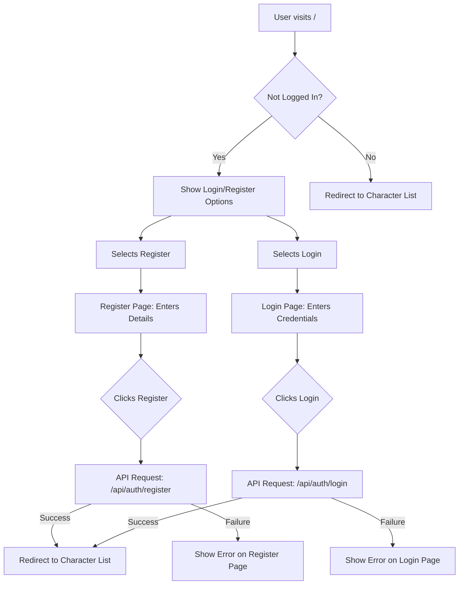
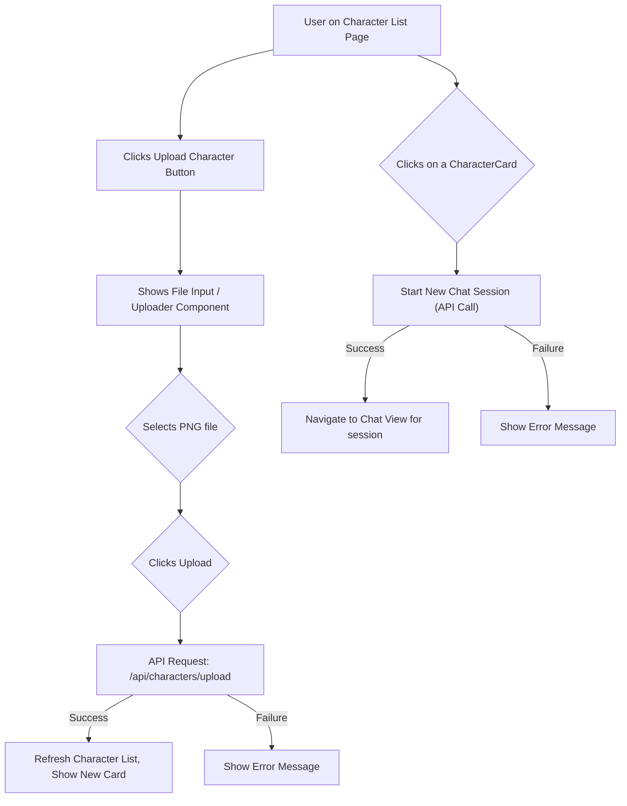
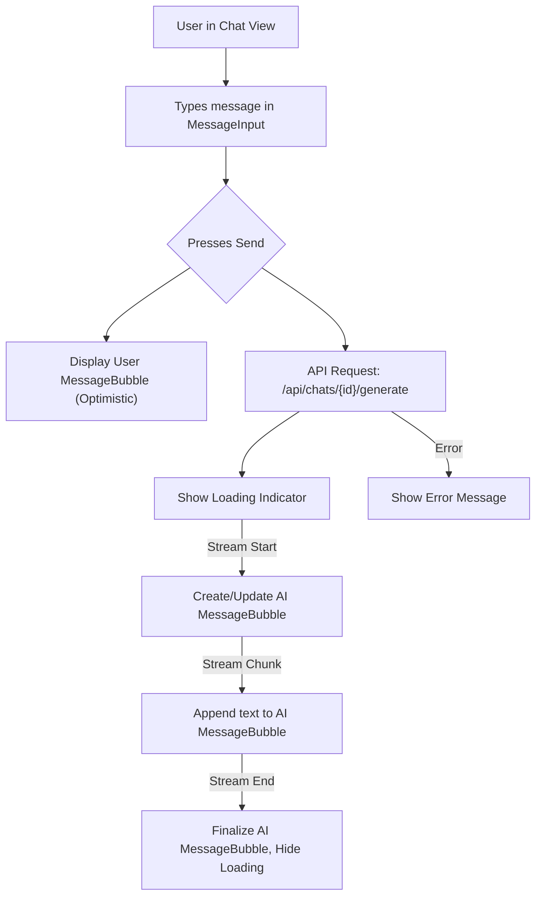
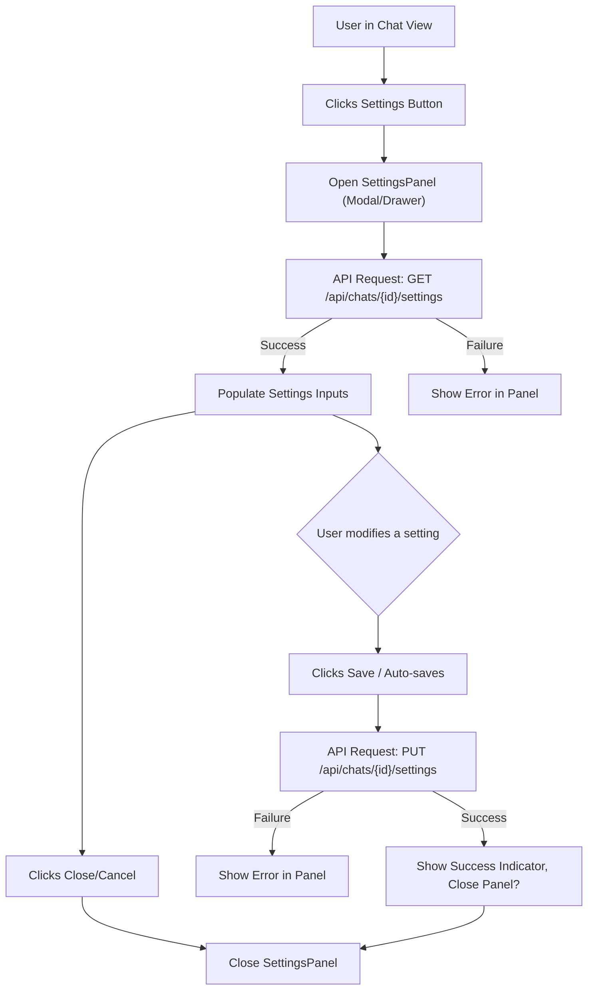

# Scribe - UI/UX Specification (MVP)

This document outlines the User Interface (UI) and User Experience (UX) design for the Scribe MVP. It follows the methodology described in Epic 5 of the `IMPLEMENTATION_PLAN.md`.

## 1. Overall Layout, Navigation & Theme (Task 5.1)

### 1.1 Main Application Layout (Task 5.1.1)

The application will use a standard two-column layout:

1.  **Sidebar (Left):**
    *   Collapsible (optional for MVP, but good for future).
    *   Contains primary navigation elements (e.g., Character List link, potentially list of recent chats).
    *   May contain global actions like "New Chat" or user profile/logout access.
    *   Width: Fixed width when expanded (e.g., `~250px-300px`), minimal width when collapsed (showing icons only).
2.  **Main Content Area (Right):**
    *   Takes the remaining horizontal space.
    *   Displays the currently active view based on navigation (e.g., Character List grid, Chat Window, Settings Page).

### 1.2 Primary Navigation (Task 5.1.2)

Navigation primarily occurs via the **Sidebar**.

*   **Core Links (Visible when logged in):**
    *   **Characters:** Navigates the Main Content Area to the Character List/Dashboard view (`/characters`). This is likely the default view after login.
    *   **Settings:** (Optional for MVP, could be integrated elsewhere) If present, navigates to a dedicated Settings page or opens a settings modal.
*   **Contextual Navigation:**
    *   **Chat Sessions:** Selecting a character from the Character List or potentially a list of recent chats in the sidebar will navigate the Main Content Area to the Chat View (`/chat/{sessionId}`). The sidebar might highlight the active chat session.
*   **Authentication Links:**
    *   **Logged Out:** The UI (potentially replacing the sidebar or in a header) will show links/buttons for "Login" (`/login`) and "Register" (`/register`).
    *   **Logged In:** A "Logout" button/link will be available, likely within the sidebar or a user profile dropdown.
*   **Initial View:**
    *   If logged in, the initial view should be the Character List (`/characters`).
    *   If logged out, the initial view should redirect to the Login page (`/login`).

### 1.3 Visual Theme (Task 5.1.3)

The theme will be configured using CSS variables, following the `shadcn-svelte` methodology, primarily defined in `src/app.pcss`. The Sanguine palette (Black, Maroon, Gold) will be integrated alongside neutrals for balance.

*   **Color Palette (HSL Format):**
    *   **Core Sanguine:**
        *   Maroon: `0 55% 35%` (Used for Primary/Destructive)
        *   Maroon Foreground: `0 0% 98%` (Light text/icons on Maroon)
        *   Gold: `40 80% 55%` (Used for Accent/Ring)
        *   Gold Foreground: `40 100% 15%` (Dark text/icons on Gold)
    *   **Neutrals (Based on Zinc):**
        *   `--neutral-50: 240 5.9% 90%`
        *   `--neutral-100: 240 6% 80%`
        *   `--neutral-200: 240 6% 70%`
        *   `--neutral-300: 240 5% 60%`
        *   `--neutral-400: 240 4.8% 50%`
        *   `--neutral-500: 240 5% 40%`
        *   `--neutral-600: 240 5% 30%`
        *   `--neutral-700: 240 6% 20%`
        *   `--neutral-800: 240 7% 10%`
        *   `--neutral-900: 240 8% 5%`
        *   `--neutral-950: 240 10% 3.9%`
    *   **`shadcn-svelte` Variable Mapping:**
        *   **Light Mode (`:root`)**
            *   `--background: 0 0% 100%;` /* White */
            *   `--foreground: var(--neutral-950);` /* Near Black */
            *   `--card: 0 0% 100%;`
            *   `--card-foreground: var(--neutral-950);`
            *   `--popover: 0 0% 100%;`
            *   `--popover-foreground: var(--neutral-950);`
            *   `--primary: 0 55% 35%;` /* Maroon */
            *   `--primary-foreground: 0 0% 98%;` /* Light */
            *   `--secondary: var(--neutral-100);` /* Light Gray */
            *   `--secondary-foreground: var(--neutral-800);` /* Dark Gray */
            *   `--muted: var(--neutral-100);`
            *   `--muted-foreground: var(--neutral-500);`
            *   `--accent: 40 80% 55%;` /* Gold */
            *   `--accent-foreground: 40 100% 15%;` /* Dark */
            *   `--destructive: 0 55% 35%;` /* Maroon */
            *   `--destructive-foreground: 0 0% 98%;` /* Light */
            *   `--border: var(--neutral-200);`
            *   `--input: var(--neutral-200);`
            *   `--ring: 40 80% 55%;` /* Gold */
        *   **Dark Mode (`.dark`)**
            *   `--background: var(--neutral-950);` /* Near Black */
            *   `--foreground: var(--neutral-50);` /* Light Gray */
            *   `--card: var(--neutral-900);`
            *   `--card-foreground: var(--neutral-50);`
            *   `--popover: var(--neutral-900);`
            *   `--popover-foreground: var(--neutral-50);`
            *   `--primary: 0 55% 35%;` /* Maroon */
            *   `--primary-foreground: 0 0% 98%;` /* Light */
            *   `--secondary: var(--neutral-800);`
            *   `--secondary-foreground: var(--neutral-50);`
            *   `--muted: var(--neutral-800);`
            *   `--muted-foreground: var(--neutral-400);`
            *   `--accent: 40 80% 55%;` /* Gold */
            *   `--accent-foreground: 40 100% 15%;` /* Dark */
            *   `--destructive: 0 55% 35%;` /* Maroon */
            *   `--destructive-foreground: 0 0% 98%;` /* Light */
            *   `--border: var(--neutral-800);`
            *   `--input: var(--neutral-800);`
            *   `--ring: 40 80% 55%;` /* Gold */
*   **Typography:**
    *   **Font Family:** Define primary sans-serif font stack in `tailwind.config.js`. Example: `Inter, ui-sans-serif, system-ui, -apple-system, BlinkMacSystemFont, "Segoe UI", Roboto, "Helvetica Neue", Arial, "Noto Sans", sans-serif, "Apple Color Emoji", "Segoe UI Emoji", "Segoe UI Symbol", "Noto Color Emoji"`
    *   **Base Font Size:** Typically `16px` (browser default), managed by Tailwind's relative units (`rem`).
    *   **Headings:** Utilize Tailwind's font size utilities (e.g., `text-lg`, `text-xl`, `text-2xl`) and weight utilities (e.g., `font-semibold`, `font-bold`). Define specific styles if needed.
*   **Spacing:**
    *   Adhere to Tailwind CSS's default spacing scale (multiples of `0.25rem`). Use utilities like `p-4`, `m-2`, `gap-4`, etc.
*   **Border Radius:**
    *   Define `--radius` CSS variable (e.g., `0.5rem`). `shadcn-svelte` components will use this variable.

## 2. Core UI Components (Task 5.2)

*(Document key custom components and significantly styled shadcn-svelte components)*

### 2.1 Button (`<Button />` from `shadcn-svelte`)

*   **Description:** Used for primary actions (Submit, Save, Upload), secondary actions (Cancel, Close), and potentially icon-only buttons (Settings, Logout).
*   **Variants:** Utilize standard `shadcn-svelte` variants (`default`, `destructive`, `outline`, `secondary`, `ghost`, `link`) as appropriate for the action's importance and context.
*   **States:** Standard `shadcn-svelte` visual states for default, hover, focus, active, and disabled will be used. Loading states might involve disabling the button and showing a spinner icon.
*   **Props:** Standard `shadcn-svelte` props apply. Key props include `variant`, `size`, `disabled`.

### 2.2 InputField (`<Input />` from `shadcn-svelte`)

*   **Description:** Standard text input field used in forms (Login, Register, Settings).
*   **States:** Standard `shadcn-svelte` visual states for default, hover, focus, disabled, and error (indicated by ring color, potentially `ring-destructive`).
*   **Props:** Standard `shadcn-svelte` props apply. Key props include `type` (text, password, email, number), `placeholder`, `disabled`, `value`. Input validation state will be managed externally and reflected visually (e.g., adding a specific class or relying on form library integration).

### 2.3 ChatBubble (`<ChatBubble />` - Custom Component)

*   **Description:** Represents a single message within the chat log. It visually distinguishes between messages sent by the user and messages received from the AI. It must smoothly render incoming text chunks for streaming AI responses.
*   **Appearance:**
    *   **User Messages:** Typically aligned to the right, potentially with a primary brand color background.
    *   **AI Messages:** Typically aligned to the left, potentially with a secondary or neutral background color.
    *   Content area should wrap text appropriately.
    *   May include sender avatar/icon (optional for MVP).
*   **States:**
    *   **Default:** Fully rendered message.
    *   **Streaming (AI only):** Text content updates dynamically as new chunks arrive. May display a subtle visual indicator (e.g., a blinking cursor or subtle animation) while streaming is active.
    *   **Error:** (Optional) Could have a distinct visual state if a message failed to send or generate completely.
*   **Props:**
    ```yaml
    - name: messageContent
      type: string
      description: The textual content of the message. For streaming messages, this prop will be updated reactively.
    - name: sender
      type: "'user' | 'ai'"
      required: true
      description: Determines the alignment and styling of the bubble.
    - name: isStreaming # Optional, could be inferred if messageContent updates frequently
      type: boolean
      default: false
      description: Explicitly indicates if the AI message is currently being streamed. Helps manage visual cues like loading indicators.
    - name: error # Optional
      type: string | null
      default: null
      description: If present, displays an error state/message associated with this bubble.
    # - name: timestamp # Optional for MVP
    #   type: Date | string
    #   description: Time the message was sent/received.
    # - name: avatarSrc # Optional for MVP
    #   type: string | null
    #   description: URL for the sender's avatar image.
    ```

### 2.4 CharacterCard (`<CharacterCard />` - Custom Component)

*   **Description:** A card element used to represent a single character in a list or grid format. Displays key information (avatar, name, short description) and acts as the entry point to start a chat session with that character. Likely uses `<Card />` from `shadcn-svelte` as its base.
*   **Appearance:**
    *   Contains an Avatar image (using `<Avatar />` from `shadcn-svelte`).
    *   Displays the character's `name` prominently.
    *   Shows a truncated version of the character's description or greeting (`descriptionSnippet`).
    *   The entire card should be clickable.
*   **States:**
    *   **Default:** Standard card appearance.
    *   **Hover:** Subtle visual feedback (e.g., slight scale increase, border highlight, or background change) to indicate interactivity.
    *   **Focus:** Visible focus ring when navigated via keyboard.
    *   **Selected (Optional):** If needed to show which character corresponds to the *current* chat session, a distinct visual style (e.g., border color) could be applied.
*   **Props:**
    ```yaml
    - name: character # Pass the whole character object or individual fields
      type: object # Or define specific fields below
      required: true
      description: Contains the data for the character to display.
      # Example sub-fields if passing an object:
      #   - id: string
      #   - name: string
      #   - description: string
      #   - greeting: string # Could be used for snippet
      #   - avatar_url: string # Path to fetch avatar
    - name: isSelected # Optional
      type: boolean
      default: false
      description: If true, applies the 'Selected' visual state.
    ```
*   **Interaction:** Clicking the card should trigger an action (likely via an event handler passed down or a store action) to start a chat session with the corresponding `character.id`.

### 2.5 Modal / Dialog / Drawer (`shadcn-svelte` Components)

*   **Description:** Used for displaying content that requires focused user interaction, such as the Settings Panel or potentially the Character Uploader. We will primarily use `Dialog` for centered modal content or `Drawer` for slide-over panels, depending on the specific context and amount of content.
*   **Components:** Leverage `<Dialog />` or `<Drawer />` components from `shadcn-svelte`.
*   **States:** Open, Closed. Managed via component props/state.
*   **Props:** Standard `shadcn-svelte` props for `Dialog` or `Drawer` apply (e.g., `open`, `onOpenChange`).

### 2.6 Settings Inputs (Collection of `shadcn-svelte` Components)

*   **Description:** This refers to the collection of input components used within the `SettingsPanel` to control various chat parameters. Specific `shadcn-svelte` components will be used for each setting type.
*   **Examples:**
    *   **System Prompt:** `<Textarea />`
    *   **Temperature:** `<Slider />` (range 0-1 or 0-2, step 0.1) or `<Input type="number" />` with validation.
    *   **Max Output Tokens:** `<Input type="number" />` with validation.
    *   **Penalties (Frequency/Presence/Repetition):** `<Slider />` (range -2 to 2 or 0 to 2, step 0.1) or `<Input type="number" />`.
    *   **Top K/P/A, Min P:** `<Input type="number" />` or `<Slider />` where applicable.
    *   **Seed:** `<Input type="number" />`.
    *   **Logit Bias:** Likely a more complex input, potentially `<Textarea />` for JSON input or a dedicated custom component (Post-MVP concern if too complex).
*   **Props:** Each underlying `shadcn-svelte` component (`Textarea`, `Slider`, `Input`) will use its standard props. Labels (`<Label />`) will be associated with each input.

## 3. User Flows (Task 5.3)

*(Use Mermaid diagrams)*

### 3.1 Registration & Login Flow



### 3.2 Character Upload & Selection Flow



### 3.3 Starting a New Chat Session

*(This flow is initiated by selecting a character as shown in Flow 3.2. No separate dedicated "Start Chat" screen is planned for MVP.)*

### 3.4 Sending/Receiving Messages within a Chat



### 3.5 Accessing and Modifying Chat Settings



## 4. Key Screens/Views (Task 5.4)

### 4.1 Login/Register Screen

*   **Layout:** Centered form on the page.
*   **Components:** `InputField` (for username/password), `Button` (for submit), Links (to switch between Login/Register).
*   **Interactions:** Form submission triggers API calls. Error messages displayed near fields or form.
*   **State Changes:** Button disabled during submission.

### 4.2 Dashboard/Character List Screen

*   **Layout:** Main content area displaying a grid or list of `CharacterCard`s. An "Upload Character" `Button` is present. Maybe a simple header.
*   **Components:** `CharacterCard` (repeated), `Button` (Upload).
*   **Interactions:** Clicking Upload opens uploader. Clicking a card navigates to chat.
*   **State Changes:** List updates after successful upload. Loading state while fetching initial list.

### 4.3 Chat View Screen

*   **Layout:** Main area for `MessageBubble` list, `MessageInput` fixed at the bottom. Optional header showing character name/avatar. Settings button.
*   **Components:** `MessageBubble` (repeated), `MessageInput`, `Button` (Settings).
*   **Interactions:** Typing and sending messages. Scrolling through history. Opening settings.
*   **State Changes:** Message list updates with new messages. Input disabled during generation. Loading indicators. Streaming text updates in AI bubbles.

### 4.4 Settings Panel Screen

*   **Layout:** Modal or SlideOver containing various `SettingsInput` controls. Save/Close buttons.
*   **Components:** `Modal`/`SlideOver`, `SettingsInput` (Sliders, Textarea, etc.), `Button` (Save, Close).
*   **Interactions:** Modifying input values. Saving changes triggers API call. Closing dismisses the panel.
*   **State Changes:** Loading state during fetch/save. Error messages displayed on failure.