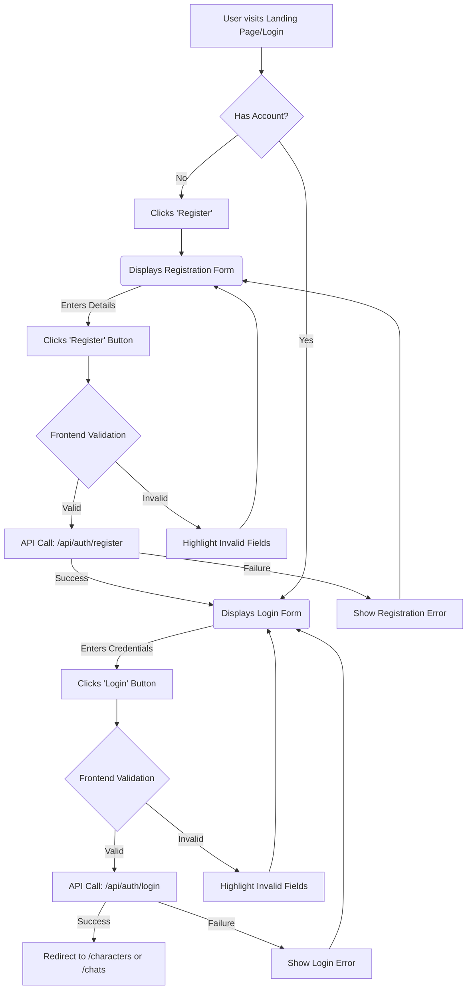
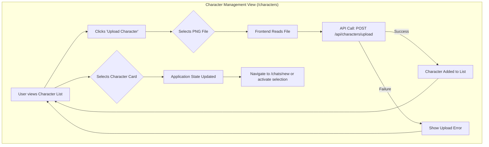
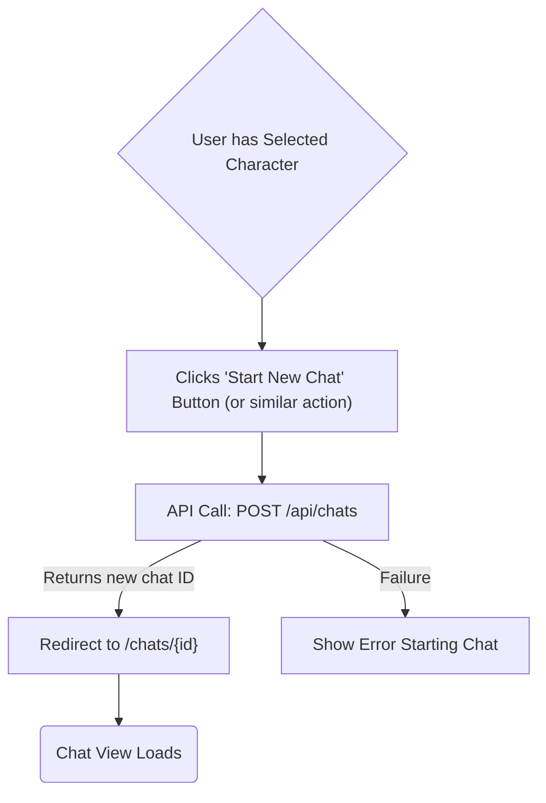
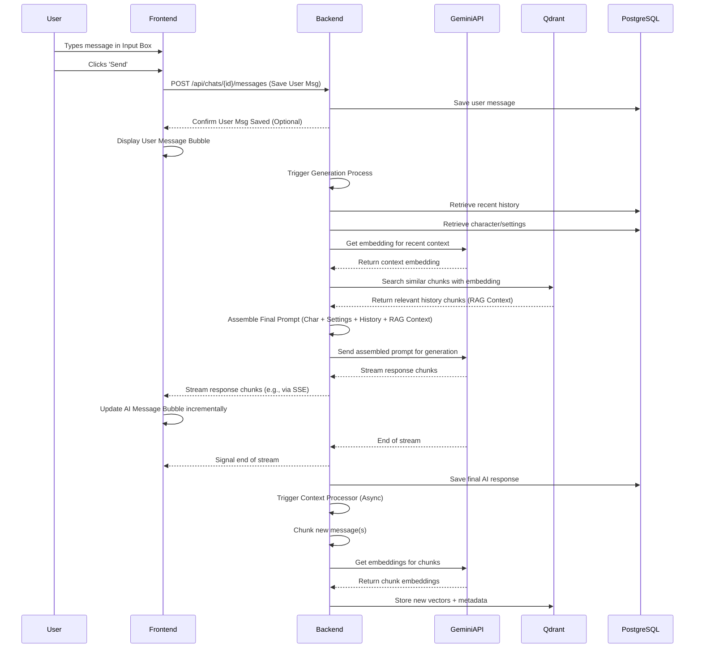
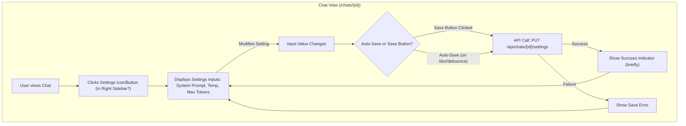

# Scribe - UI/UX Specification (MVP)

## 1. Introduction

This document outlines the planned User Experience (UX) and User Interface (UI) design for the Scribe MVP. It draws inspiration from existing platforms like SillyTavern (see provided reference images) but aims for a potentially streamlined, modern interface built with SvelteKit.

The goal is to create an intuitive, performant, and extensible UI that effectively supports the core features: chat interaction, V2 character card management, basic prompt settings, and interaction with the underlying RAG context system.

This document corresponds to **Epic 5** in the `IMPLEMENTATION_PLAN.md`. It will utilize Markdown descriptions, Mermaid diagrams, and potentially JSON/YAML definitions for components/themes as the design evolves.

## 2. Overall Layout, Navigation & Theme (Task 5.1)

### 2.1. Proposed Layout

Scribe will adopt a multi-panel layout, likely consisting of:

*   **Collapsible Left Sidebar:** Primary navigation between major sections (Chats, Characters, Settings). Provides a clean look when collapsed.
*   **Main Content Area:** Displays the currently active view based on sidebar selection (e.g., the Chat interface, the Character Management grid, the Settings forms).
*   **Contextual Right Sidebar (Possibly Optional/Collapsible):** Display relevant information or controls based on the main content area. For the MVP, this could show:
    *   Character details and basic settings when in the Chat View (similar to the right panel in SillyTavern Image 1).
    *   Generation parameters (Temperature, Max Tokens, System Prompt - see Epic 4) when in the Chat View (similar to the left panel in SillyTavern Image 1, potentially integrated into the right panel or a modal).

### 2.2. Navigation

The primary navigation (Left Sidebar) will include links to:

*   `Chats`: View list of past chat sessions / Start new chats.
*   `Characters`: Manage uploaded character cards (View list, Upload new).
*   `Settings`: Manage application settings (e.g., API Keys, user preferences).
*   `Logout`: End user session.

### 2.3. Theme

*   **Aesthetic:** Aim for a clean, modern look and feel, applying the "Sanguine" theme.
    *   **Primary Colors:** Black/Very Dark Grey background, Blood Red/Maroon primary elements, Gold accents.
    *   **Example Palette:**
        *   Background: `#1A1A1A` (Very Dark Grey/Near Black)
        *   Primary/Maroon: `#8B0000` (Dark Red)
        *   Accent/Gold: `#DAA520` (Goldenrod)
        *   Text (Primary on Dark): `#E0E0E0` (Light Grey)
        *   Text (Secondary/Muted): `#A0A0A0` (Medium Grey)
        *   Error: `#FF4C4C` (Bright Red)
    *   **Symbol:** The Scribe symbol (golden sceptre over maroon horned moon) could potentially be used as a favicon or subtle branding element, but detailed implementation is TBD.
*   **Typography:**
    *   **Primary Font:** A clean sans-serif like 'Inter', 'Lato', or 'Roboto'.
    *   **Headings:** Slightly bolder weight.
*   **Spacing:** Use consistent spacing units (e.g., multiples of 4px or using rem units).
*   **(Implementation Note:** Theme variables should be defined centrally, potentially using CSS custom properties or a Svelte store, to allow for easier adjustments or future theme switching.)

## 3. Key Screens/Views (Task 5.4)

*(Initial descriptions based on MVP requirements and SillyTavern inspiration)*

### 3.1. Login / Register View
*   Standard full-page forms for user authentication.
*   Inputs: Username/Email, Password, Confirm Password (for registration).
*   Actions: Submit, Link to toggle between Login and Register.

### 3.2. Character Management View (`/characters`)
*   **Layout:** Main content area displays a grid or list of uploaded character cards.
*   **Elements:**
    *   Each character represented by a `CharacterCard` component (showing avatar preview, name).
    *   Prominent "Upload Character" button/area (Task 1.3).
    *   Selection mechanism (clicking a card might navigate to a detail view or select it for chat).
    *   Search/Filter controls (Post-MVP?).
*   **(Inspired by Right Panel of SillyTavern Image 1)**

### 3.3. Chat View (`/chats/{id}`)
*   **Layout:** Main content area focused on the conversation. Contextual Right Sidebar shows character/settings.
*   **Elements:**
    *   **Chat History:** Central area displaying scrollable `MessageBubble` components for user and AI messages (Task 2.6).
    *   **Message Input:** Text area at the bottom with a Send button (Task 2.6).
    *   **Character Display:** Character Avatar and Name prominently displayed, perhaps at the top of the chat or in the right sidebar.
    *   **Settings Access:** Clear way to access/view chat-specific settings (System Prompt, Temp, Max Tokens - Task 4.3), likely in the Right Sidebar.
*   **(Inspired by Center/Left/Right Panels of SillyTavern Image 1)**

### 3.4. Settings View (`/settings`)
*   **Layout:** Form-based view in the main content area.
*   **Elements:**
    *   Section for API Key Management (initially Google Gemini - Input field, Save button, potentially masking). (Inspired by SillyTavern Image 2).
    *   User profile settings (e.g., change password - Post-MVP?).
    *   Application preferences (e.g., theme selection - Post-MVP?).

### 3.5. User Persona Management View (`/personas`)
*   **Layout:** Main content area for managing user-defined personas.
*   **Elements:**
    *   List/Grid view of existing user personas (similar structure to Character Management).
    *   "Create Persona" button.
    *   Form for creating/editing a persona:
        *   Persona Name input.
        *   Persona Description/Definition textarea (how the user should be portrayed).
    *   Mechanism to select the active persona for chats (perhaps a dropdown in the Chat View or global setting).
*   **(Inspired by SillyTavern Image 4)**

## 4. Core UI Components (Task 5.2)

This section details individual Svelte components. Theme colors (Maroon `#8B0000`, Gold `#DAA520`, Dark BG `#1A1A1A`, Light Text `#E0E0E0`) are referenced.

### 4.1. `Button`

*   **Description:** Standard interactive button.
*   **Visuals & States:**
    *   **Default:** Background (Maroon), Text (Light Text).
    *   **Hover:** Background lightens slightly or gets a subtle Gold border.
    *   **Active/Pressed:** Background darkens slightly.
    *   **Disabled:** Background (Greyed-out Maroon/Dark Grey), Text (Muted Grey). Non-interactive.
    *   **Loading:** Shows `Spinner` component inside, text might be hidden or replaced. Background (Maroon), Non-interactive.
*   **Props:**
    ```json
    {
      "props": [
        { "name": "variant", "type": "'primary' | 'secondary'", "default": "'primary'", "description": "Primary uses Maroon BG, Secondary might use Gold outline or subtle dark BG." },
        { "name": "size", "type": "'small' | 'medium' | 'large'", "default": "'medium'", "description": "Adjusts padding and font size." },
        { "name": "disabled", "type": "boolean", "default": "false" },
        { "name": "isLoading", "type": "boolean", "default": "false" },
        { "name": "onClick", "type": "() => void", "description": "Callback function for click event." }
      ]
    }
    ```

### 4.2. `InputField`

*   **Description:** Form input field for text, password, number.
*   **Visuals & States:**
    *   **Default:** Dark BG slightly lighter than main BG, Light Text, subtle border (Muted Grey or Maroon).
    *   **Focus:** Border highlights with Gold color.
    *   **Error:** Border becomes Error Red (`#FF4C4C`), optional error message text below.
    *   **Disabled:** Greyed-out appearance.
*   **Props:**
    ```json
    {
      "props": [
        { "name": "type", "type": "'text' | 'password' | 'number' | 'email'", "default": "'text'" },
        { "name": "value", "type": "string | number", "description": "Bound value using bind:value." },
        { "name": "placeholder", "type": "string", "default": "" },
        { "name": "label", "type": "string", "default": "", "description": "Optional label displayed above the field." },
        { "name": "disabled", "type": "boolean", "default": "false" },
        { "name": "error", "type": "string | null", "default": "null", "description": "Displays error state and message if not null." }
      ]
    }
    ```

### 4.3. `ChatBubble`

*   **Description:** Displays a single message in the chat history.
*   **Visuals:**
    *   **User Message:** Aligned to the right, background color (e.g., dark Maroon or dark Gold nuance).
    *   **AI Message:** Aligned to the left, background color (e.g., slightly lighter dark grey than main BG).
    *   Contains message text, potentially timestamp.
    *   Rounded corners.
*   **Props:**
    ```json
    {
      "props": [
        { "name": "sender", "type": "'user' | 'ai'", "required": true },
        { "name": "message", "type": "string", "required": true },
        { "name": "timestamp", "type": "string | Date", "optional": true }
      ]
    }
    ```

### 4.4. `CharacterCard`

*   **Description:** Represents a character in the management list/grid.
*   **Visuals:**
    *   Displays character avatar (fetched from card or placeholder).
    *   Displays character name.
    *   Card background (dark grey), subtle hover effect (e.g., Gold border).
    *   Clickable to select.
*   **Props:**
    ```json
    {
      "props": [
        { "name": "characterId", "type": "string | number", "required": true },
        { "name": "name", "type": "string", "required": true },
        { "name": "avatarUrl", "type": "string | null", "description": "URL to avatar image or null for placeholder." },
        { "name": "onClick", "type": "(id) => void", "description": "Callback when card is clicked." }
      ]
    }
    ```

*(Placeholders for other components like Slider, ToggleSwitch, Modal, SettingsInput, SidebarNavItem, Spinner remain. Further details can be added as needed.)*

## 5. User Flows (Task 5.3)

This section contains Mermaid diagrams illustrating key user interactions.

### 5.1. Registration & Login Flow



### 5.2. Character Upload & Selection Flow



### 5.3. Starting a New Chat Session



### 5.4. Sending/Receiving Messages Flow



### 5.5. Accessing & Modifying Chat Settings Flow



## 6. Memory / Context Visualization & Management (Potential Post-MVP aspects)

*Goal: Provide users insight into the RAG system's knowledge base for a given chat.* 

### 6.1. MVP Considerations
*   **Transparency:** At a minimum, the UI could indicate *when* RAG context is being retrieved and injected (e.g., a subtle indicator near the AI response or input bar).
*   **Debugging Info:** Perhaps a simple log view (accessible via dev tools or a specific debug mode) showing the text of retrieved chunks for troubleshooting.

### 6.2. Post-MVP / Advanced Ideas
*   **Dedicated Memory View:** A screen linked from a specific chat session.
    *   **Visualization:** Display retrieved memories (vector embeddings from Qdrant) related to the current chat context. This could be:
        *   A simple list of text chunks.
        *   A more visual map (e.g., timeline-based, graph-based showing clusters - technically challenging).
    *   **Interaction:**
        *   View metadata associated with each chunk (source message IDs, timestamp).
        *   Search/Filter memories.
        *   **Manual Control (Advanced):** Ability to 'pin' certain memories, explicitly 'forget' (delete) specific chunks, or manually add new facts/memories (requires backend support).
        *   **Threshold Control:** Sliders or inputs to adjust similarity search thresholds or the number (K) of chunks retrieved (requires backend support).
*   **(Inspired by the need for RAG transparency, less directly by SillyTavern images which focus more on static Lorebooks - Image 3)** 