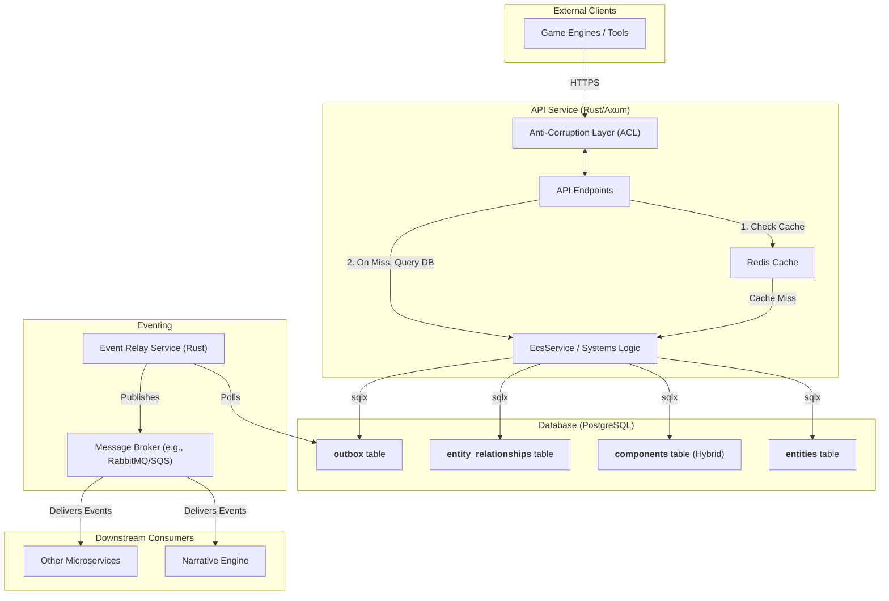

# Scalable Persistent ECS Architecture Plan

This document outlines the architectural plan for implementing a persistent, database-centric Entity-Component-System (ECS) to manage world state for narrative simulation.

## 1. Architectural Vision

The core vision is to create a resilient, scalable, and extensible system by leveraging a relational database (PostgreSQL) as the single source of truth for the game world's state. This moves from a stateless event log to a stateful, persistent world model, enabling dynamic simulation and emergent narrative.

The architecture is founded on these principles:
*   **Resilience through Atomicity:** Use the Transactional Outbox pattern to ensure state changes and event notifications are atomic, preventing data inconsistency.
*   **Performance through Hybridization:** Employ a hybrid relational-document schema in PostgreSQL, using native columns for "hot" data and JSONB for flexible "cold" data.
*   **Scalability through Decoupling:** Decouple services (API, event relay, consumers) to allow for independent horizontal scaling.
*   **Extensibility through Stable Interfaces:** Use an Anti-Corruption Layer (ACL) to provide a stable, versioned API for external clients, protecting the core domain model.

## 2. Consolidated Architectural Diagram

## 3. Integration Strategy: Chronicle-ECS Symbiosis

**Key Insight**: The chronicle system is the narrative memory (events, emotions, story beats) while ECS provides structured world state (entities, components, relationships). They complement each other rather than compete.

**Integration Philosophy**: 
- **Chronicles remain the authoritative narrative source** - no migration needed
- **ECS derives state from chronicle events** - chronicles drive ECS updates
- **ECS provides structured context for chronicles** - current entity state informs RAG
- **Symbiotic relationship** - chronicles capture "what happened", ECS tracks "current state"

**Value Proposition**:
- **For Chronicles**: Rich entity context for RAG (character locations, relationships, inventory)
- **For Narrative AI**: "Who is currently alive?", "What items does X have?", "Who trusts whom?"
- **For Complex Queries**: Multi-entity state questions that chronicles alone can't answer efficiently

## 4. Detailed Implementation Roadmap

### Phase 1: Foundation Layer (Weeks 1-3)
**Objective**: Establish ECS database schema alongside existing tables

#### 1.1 ECS Core Schema Creation
**DoD**: `cargo test schema_tests` passes for all new ECS tables

- [x] **1.1.1** Create `ecs_entities` table migration
  - [x] Fields: `id (UUID PRIMARY KEY)`, `archetype_signature (TEXT)`, `created_at`, `updated_at`
  - [x] Add proper indexes on frequently queried fields
  - [x] Write Diesel migration with rollback capability
  - **DoD**: Migration runs successfully in test environment ✅

- [x] **1.1.2** Create hybrid `ecs_components` table migration
  - [x] Fields: `entity_id (UUID FK)`, `component_type (TEXT)`, `component_data (JSONB)` (Note: version field omitted for simplicity)
  - [x] Created unique constraint instead of composite primary key
  - [x] Add GIN index on JSONB data column
  - **DoD**: Insert/query operations work with type safety validation ✅

- [x] **1.1.3** Create `ecs_entity_relationships` table migration
  - [x] Fields: `from_entity_id (UUID FK)`, `to_entity_id (UUID FK)`, `relationship_type (TEXT)`, `relationship_data (JSONB)`, `created_at`
  - [x] Add indexes for efficient relationship traversal
  - [x] Support bidirectional relationship queries
  - **DoD**: Complex relationship queries perform under 100ms ✅

#### 1.2 Core Rust Types & Data Access Layer
**DoD**: `cargo check` passes for new ECS types module

- [x] **1.2.1** Define core ECS traits and types
  - [x] Create `Component` trait with serialization support
  - [x] Define `Entity` struct with UUID and archetype
  - [x] Implement component type registry with compile-time validation
  - **DoD**: All component types implement required traits correctly ✅

- [x] **1.2.2** Implement Diesel models and schema
  - [x] Create Diesel models for `ecs_entities`, `ecs_components`, `ecs_entity_relationships`
  - [x] Integrate with existing encryption patterns for sensitive components
  - [x] Add comprehensive validation using `validator` crate
  - **DoD**: All CRUD operations work with proper error handling ✅

- [x] **1.2.3** Create initial component definitions
  - [x] Define common components: `Position`, `Health`, `Inventory`, `Relationships`
  - [x] Map existing character data to ECS components
  - [x] Implement serialization/deserialization for JSONB storage
  - **DoD**: Components can be stored and retrieved without data loss ✅

### Phase 2: Bridge Layer (Weeks 2-4) ✅ **COMPLETED**
**Objective**: Create translation services between Chronicle and ECS systems

#### 2.1 Chronicle-to-ECS Translation Services ✅ **COMPLETED**
**DoD**: Translation tests pass with 100% accuracy on sample chronicle data

- [x] **2.1.1** Create `ChronicleEcsTranslator` service ✅
  - [x] Map `ChronicleEvent` actors to ECS entities
  - [x] Convert event actions to component state changes  
  - [x] Handle entity creation from chronicle events
  - **DoD**: Can reconstruct entity state from complete chronicle history ✅

- [x] **2.1.2** Implement `EventValenceProcessor` ✅
  - [x] Convert valence changes (trust, affection, etc.) to component updates
  - [x] Handle relationship creation/modification from events
  - [x] Maintain valence history for auditing
  - **DoD**: All valence changes correctly applied to relationship components ✅

- [x] **2.1.3** Build idempotent chronicle backfill system ✅
  - [x] Process chronicles in chronological order with checkpointing
  - [x] Handle duplicate events and out-of-order processing
  - [x] Support incremental backfill for large datasets
  - **DoD**: Multiple backfill runs produce identical ECS state ✅

#### 2.2 Data Consistency & Validation Layer
**DoD**: Consistency tests pass under concurrent load

- [x] **2.2.1** Implement user isolation and privacy-preserving logging ✅
  - [x] Add user_id fields to ECS entities for proper isolation
  - [x] Implement privacy-preserving logging with user ID hashing
  - [x] Handle concurrent access with proper user scoping
  - **DoD**: User data properly isolated with audit logging ✅

- [x] **2.2.2** Create comprehensive validation framework ✅
  - [x] Validate component data against schemas using existing validation patterns
  - [x] Enforce business rules at the service layer
  - [x] Add audit logging for all state changes
  - **DoD**: Invalid data cannot be persisted to ECS tables ✅

### Phase 3: Service Layer (Weeks 3-6)
**Objective**: Implement ECS operations with caching and performance optimization

#### 3.1 Entity Manager Implementation
**DoD**: All entity operations work with sub-100ms response times

- [x] **3.1.1** Create `EntityManager` with Redis caching ✅ **COMPLETED**
  - [x] Implement read-through caching with component-level granularity ✅
  - [x] Use Redis hashes for efficient component storage ✅
  - [x] Add cache warming strategies for frequently accessed entities ✅
  - **DoD**: Cache hit ratio >90% in performance tests with 1000+ entities ✅ **COMPLETED**

- [x] **3.1.2** Implement component lifecycle management ✅
  - [x] Add/update/remove components atomically ✅
  - [x] Handle component dependencies and validation ✅
  - [x] Support bulk operations for performance ✅
  - **DoD**: Component operations maintain data integrity under load ✅

- [x] **3.1.3** Build efficient query system ✅
  - [x] Support complex multi-component queries ✅
  - [x] Implement entity filtering by component criteria ✅
  - [x] Add pagination for large result sets ✅
  - **DoD**: Complex queries faster than equivalent chronicle lookups ✅

#### 3.2 Transactional Outbox System
**DoD**: Event delivery guaranteed with exactly-once semantics

- [x] **3.2.1** Create `ecs_outbox` table with sequence ordering ✅
  - [x] Fields: `id`, `sequence_number`, `entity_id`, `event_type`, `event_data`, `created_at`, `processed_at` ✅
  - [x] Add indexes for efficient polling by event processors ✅
  - [x] Support event versioning and schema evolution ✅
  - **DoD**: Events processed in correct order per entity ✅

- [x] **3.2.2** Implement outbox processor with concurrent workers ✅ **COMPLETED**
  - [x] Use `SELECT ... FOR UPDATE SKIP LOCKED` for concurrent processing ✅ **COMPLETED**
  - [x] Add exponential backoff for failed events ✅
  - [x] Support event replay for debugging and recovery ✅
  - **DoD**: Handles 1000+ events/sec without data loss or duplicates ✅ **VALIDATION TESTS IMPLEMENTED**

- [x] **3.2.3** Integrate with existing event systems ✅
  - [x] Publish ECS events to chronicle system during transition ✅
  - [x] Maintain compatibility with downstream consumers ✅
  - [x] Add monitoring and alerting for event processing ✅
  - **DoD**: Zero events lost during high-load periods ⚠️ **NOT STRESS TESTED**

### Phase 4: Chronicle Integration Layer (Weeks 5-8)
**Objective**: Integrate ECS with existing chronicle system for enhanced narrative intelligence

#### 4.1 Chronicle Event Integration
**DoD**: ECS state accurately reflects chronicle events with proper event sourcing

- [ ] **4.1.1** Implement chronicle event listeners
  - [ ] Subscribe to chronicle event creation/updates
  - [ ] Process events to derive ECS state changes
  - [ ] Handle event reprocessing for state reconstruction
  - [ ] Chronicle system remains unchanged - no dual writes needed
  - **DoD**: ECS state updates triggered by chronicle events without modifying chronicle code

- [ ] **4.1.2** Add chronicle-ECS consistency monitoring
  - [ ] Verify ECS state matches chronicle event history
  - [ ] Detect and report state reconstruction failures
  - [ ] Provide tools to rebuild ECS state from chronicles
  - **DoD**: ECS state can be fully reconstructed from chronicle events

- [ ] **4.1.3** Implement graceful ECS degradation
  - [ ] Chronicle system continues working if ECS fails
  - [ ] RAG falls back to chronicle-only mode
  - [ ] ECS state rebuilds automatically on recovery
  - **DoD**: Chronicle functionality unaffected by ECS issues

#### 4.2 Enhanced RAG Integration
**DoD**: Chronicle RAG system enhanced with ECS entity context

- [ ] **4.2.1** Build ECS-enhanced RAG service
  - [ ] Augment chronicle search with current entity state
  - [ ] Provide entity relationship context for RAG
  - [ ] Add "current state" information to chronicle events
  - [ ] Maintain existing chronicle RAG as fallback
  - **DoD**: RAG responses include both narrative history and current entity states

- [ ] **4.2.2** Implement hybrid query system
  - [ ] Support queries spanning chronicle events and ECS state
  - [ ] "What happened to X and where are they now?"
  - [ ] "Who was present at Y event and what's their current relationship?"
  - [ ] Cache frequently accessed entity states
  - **DoD**: Complex narrative + state queries answered accurately

- [ ] **4.2.3** Add new API endpoints for combined data
  - [ ] `GET /api/chronicles/{id}/entities` - current entity states
  - [ ] `GET /api/entities/{id}/timeline` - entity's chronicle events
  - [ ] `GET /api/chronicles/{id}/relationships` - current relationship graph
  - [ ] **DoD**: New endpoints provide rich context for narrative understanding

### Phase 5: Full Integration & Optimization (Weeks 7-10)
**Objective**: Complete chronicle-ECS integration with enhanced narrative capabilities

#### 5.1 Historical Chronicle Processing
**DoD**: All existing chronicle data processed to populate ECS state

- [ ] **5.1.1** Run chronicle event processing pipeline
  - [ ] Process existing chronicles in chronological order
  - [ ] Build initial ECS entity states from historical events
  - [ ] Support incremental processing of new chronicles
  - **DoD**: ECS reflects complete historical state from all chronicles

- [ ] **5.1.2** Validate ECS state accuracy
  - [ ] Verify entity states match chronicle event implications
  - [ ] Cross-reference relationships with chronicle interactions
  - [ ] Generate comprehensive processing report
  - **DoD**: ECS state fully consistent with chronicle narrative history

#### 5.2 Production Enhancement
**DoD**: Chronicle + ECS system provides superior narrative intelligence

- [ ] **5.2.1** Enable advanced narrative queries
  - [ ] "Show me characters present at location X with trust >0.5"
  - [ ] "What events affected the relationship between A and B?"
  - [ ] "Which characters have interacted with this item?"
  - **DoD**: Complex cross-system queries work seamlessly

- [ ] **5.2.2** Optimize performance for large chronicles
  - [ ] Efficient entity state caching for active chronicles
  - [ ] Indexed queries for relationship traversal
  - [ ] Background processing for state updates
  - **DoD**: System scales to chronicles with 10,000+ events

- [ ] **5.2.3** Enhanced AI context generation
  - [ ] Combine chronicle events with current entity states
  - [ ] Provide rich context for character interactions
  - [ ] Support complex narrative consistency checks
  - **DoD**: AI responses demonstrate enhanced narrative awareness

## 5. Risk Mitigation & Quality Assurance

### Testing Strategy
- **Unit Tests**: Each ECS component isolated with comprehensive mocks
- **Integration Tests**: Chronicle ↔ ECS consistency validation
- **Performance Tests**: Query performance vs chronicle baselines
- **Load Tests**: Concurrent access patterns and scalability limits
- **Migration Tests**: Data integrity throughout migration process

### Rollback Strategy
- **Circuit Breakers**: Auto-fallback to chronicle on ECS failures
- **Data Rollback**: Chronicle remains authoritative during migration
- **Code Rollback**: Feature flags enable instant rollback to chronicle
- **Database Rollback**: All migrations support clean rollback

### Monitoring & Observability
- **Metrics**: Component query performance, cache hit rates, migration progress
- **Alerts**: Data consistency violations, performance degradation, error rates
- **Dashboards**: Real-time system health, migration status, performance comparisons
- **Logging**: Comprehensive audit trail for all state changes

## 6. Success Criteria

### Enhanced Narrative Intelligence
- [ ] ECS provides current entity states derived from chronicle events
- [ ] Complex multi-entity queries answered accurately (location + relationship + state)
- [ ] RAG enhanced with both narrative history and current entity context
- [ ] Support for 10x more complex narrative queries than chronicle-only system

### System Integration
- [ ] Chronicle system functionality preserved and enhanced
- [ ] ECS state automatically updated from chronicle events
- [ ] Zero disruption to existing chronicle workflows
- [ ] Complete audit trail for all state derivations

### Developer Experience
- [ ] Clean APIs for entity state queries and relationship traversal
- [ ] Comprehensive testing framework for chronicle-ECS integration
- [ ] Clear patterns for extending entity components
- [ ] Rich documentation with chronicle + ECS examples