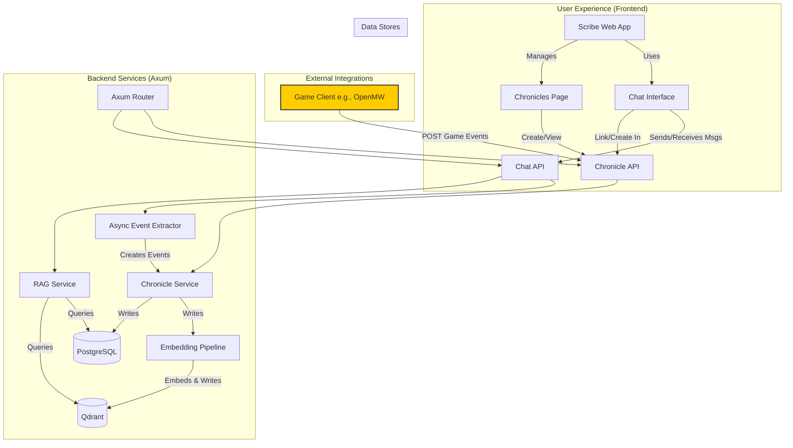

# Scribe Chronicle: Feature Specification & Implementation Plan
# Version 2.0

## 1. Introduction & Project Goal

### 1.1. The Problem: Limited AI Memory & Disconnected Context

Currently, the Scribe AI's ability to recall past events is limited to its immediate chat history (the context window). This prevents long-term narrative consistency. Furthermore, context is siloed within individual chat sessions. Events from one chat or an external source (like a game) are completely unknown to others, preventing the creation of a unified, persistent story world.

### 1.2. The Solution: The Chronicle as a "Story Hub"

The Chronicle is a new feature designed to give the Scribe AI a persistent, unified, long-term memory. It functions as a central **Story Hub**—an intelligent, time-ordered journal that can be linked to multiple chat sessions and can ingest events from external sources.

By creating this structured, cross-session memory, the AI can reference key past events long after they have fallen out of any single chat's history. This ensures the narrative remains consistent, characters "remember" interactions across different scenes (chats), and the story's world feels stable and coherent, whether the user is writing a story, roleplaying, or playing an integrated game.

### 1.3. Key Terminology

*   **Chronicle:** A container for a single, continuous story or campaign. It holds all associated events and chat sessions.
*   **Event:** A single, discrete "memory" within a Chronicle. Events can be generated automatically from chat, added manually by the user, or pushed from an external game client.
*   **LLM (Large Language Model):** The underlying AI engine that generates text and understands language (e.g., Gemini).
*   **RAG (Retrieval-Augmented Generation):** The core technique used to retrieve relevant Chronicle Events and inject them into the LLM's context before it generates a response.
*   **Vector Database (Qdrant):** A specialized database that stores text as numerical "vectors," enabling fast and accurate semantic search to find conceptually similar events.

## 2. System Architecture & High-Level Flow

The Chronicle system integrates deeply into the existing Scribe architecture, touching everything from the frontend UI to the backend services and external clients.

### 2.1. End-to-End Flow Example

1.  **Setup:** A user creates a "Dragon's Fall" Chronicle and links two chats to it: "Tavern Introduction" and "Cave Exploration."
2.  **External Event:** The user, playing an integrated game, completes a quest. The game client calls the Scribe API (`POST /api/chronicles/{id}/events`), creating a `GAME_API` event: "Player defeated the goblin shaman."
3.  **RAG in Action:** In the "Cave Exploration" chat, the user asks, "What was that shaman's name again?" The `RAGService` queries the "Dragon's Fall" chronicle, finds the `GAME_API` event, and injects it into the prompt. The AI correctly answers, "You defeated the goblin shaman, but his name was never mentioned."
4.  **AI-Driven Event Extraction:** The conversation continues, and the AI reveals a major plot twist. After the message is sent, the `AsyncExtractor` service processes the conversation and creates a new `AI_EXTRACTED` event: "The cave's treasure was revealed to be a dragon's egg."
5.  **Unified Memory:** This new event is now part of the "Dragon's Fall" chronicle, available to all linked chats and future queries within that story.

## 3. User Experience (UI) & API Design

### 3.1. Frontend UI Flow

To support the Story Hub concept, the UI will be updated as follows:

*   **"Chronicles" Page:** A new top-level navigation item will lead to a page listing all user-created Chronicles.
*   **Chronicle Management:** From this page, users can create, edit, or delete Chronicles. Each Chronicle will be displayed as a card showing its name, description, and icons for the chat sessions and external games linked to it.
*   **Chronicle Detail View:** Clicking a Chronicle card opens a detailed view with two tabs:
    *   **Chats:** A list of all `ScribeChatSession`s linked to this chronicle.
    *   **Events:** A filterable, time-ordered log of all `GameEvent`s. Users can filter by `event_type` (e.g., "PlotTwist", "QuestStatusChanged") and `source` (`AI_EXTRACTED`, `USER_ADDED`, `GAME_API`). A manual "Add Event" button will also be present here.
*   **Chat Integration:**
    *   **Creation:** The "New Chat" modal will feature an optional "Add to Chronicle" dropdown, listing existing Chronicles or allowing the creation of a new one.
    *   **Linking:** The settings panel for any existing chat will allow it to be linked to a Chronicle at any time.

### 3.2. Backend API Endpoints

The following endpoints will be created to support the UI and external integrations.

*   **Chronicle Management:**
    *   `GET /api/chronicles`: Get all chronicles for the authenticated user.
    *   `POST /api/chronicles`: Create a new chronicle.
    *   `GET /api/chronicles/{id}`: Get a single chronicle with its associated chats and events.
    *   `PUT /api/chronicles/{id}`: Update a chronicle's name or description.
    *   `DELETE /api/chronicles/{id}`: Delete a chronicle and its associated events.
*   **Chat & Event Linking:**
    *   `PUT /api/chat_sessions/{id}`: Update a chat session, including linking/unlinking it via `player_chronicle_id`.
    *   `POST /api/chronicles/{id}/events`: **The key endpoint for external clients and manual additions.** Allows an authenticated client (or the frontend) to post a structured `GameEvent`. Authentication will be handled via API keys generated per-user or per-chronicle.

## 4. Phased Implementation Plan

### Phase 1: Foundational Infrastructure & Core Functionality

**Goal:** Establish the database schema, core services, and the essential UI/API for creating and managing Chronicles and linking them to chats.

1.  **Database Schema (Diesel Migration):**
    *   Create `player_chronicles` and `game_events` tables as defined previously.
    *   The `game_events` table is key to the system's flexibility, with its `event_type`, `summary`, `source`, and `event_data (JSONB)` columns.
    *   Add a nullable `player_chronicle_id` foreign key to the `chat_sessions` table.
2.  **Backend Models & Services:**
    *   Create `models/chronicle.rs` and `models/game_event.rs`.
    *   Create `services/chronicle.rs` to handle all database CRUD logic.
3.  **API Implementation (`routes/chronicles.rs`):**
    *   Implement all the Chronicle Management and Linking endpoints defined in section 3.2.
4.  **Frontend UI Implementation:**
    *   Build the "Chronicles" page and the detailed view (without event filtering initially).
    *   Update the "New Chat" modal and Chat Settings panel to support linking.
5.  **Basic RAG Integration:**
    *   Update the `PromptBuilder` to accept and inject chronicle events into a new `<long_term_memory>` prompt section.
    *   Update the `RAGService` to perform a basic semantic search for events within the active chat's linked chronicle.

### Phase 2: Intelligent Event Extraction & Advanced RAG

**Goal:** Implement the AI-powered services that automatically create events and the advanced RAG pipeline that uses them intelligently.

*   **Asynchronous Event Extractor:** Implement the dual-LLM architecture to analyze conversations and automatically create `AI_EXTRACTED` events using function-calling.
*   **Advanced RAG Pipeline:**
    *   **Query Transformation (HyDE):** Use the LLM to generate a hypothetical answer to the user's query and search for events similar to that answer.
    *   **Hybrid Search & Re-ranking (MMR):** Combine vector and keyword search, then re-rank results to prioritize relevance and diversity, avoiding repetitive context.
    *   **Strategic Prompt Injection:** Place the most relevant event at the end of the context section to combat the "lost in the middle" problem.
*   **Frontend Enhancements:** Add filtering and searching to the Chronicle Events tab.

### Phase 3: External Integration & Self-Correction (Post-MVP)

**Goal:** Expand the Chronicle system to be more robust and fully integrate with external game clients.

*   **Game-Driven Event API Hardening:** Finalize the authentication scheme (e.g., API keys) for the `POST /api/chronicles/{id}/events` endpoint. Provide documentation for third-party developers.
*   **Corrective RAG (CRAG):** Introduce a confidence score for retrieved events. If relevance is low, the system will explicitly state that the chronicle has no memory of the topic, rather than feeding the AI irrelevant information.
*   **Semantic Chunking & Small-to-Big Retrieval:** Implement the advanced ingestion pipeline described in the original plan to improve search precision and contextual depth for long event summaries.

## 5. Long-Term Vision: The Future is a Knowledge Graph

Beyond this implementation, the ultimate evolution of the Chronicle system is to move from a simple log of events to a fully interconnected Knowledge Graph.

*   **Concept (GraphRAG):** We will process the chronicles and lorebooks to extract key entities (characters, locations, items) and the relationships between them. This creates a rich, queryable graph of the entire story world.
*   **Benefit:** This will allow the AI to answer incredibly complex, multi-step questions by traversing the graph (e.g., "Which characters were present at the location where the Sunstone was first discovered, and what relationship did they have to the Abyssal Heart?"). This represents the pinnacle of contextual understanding and narrative intelligence.