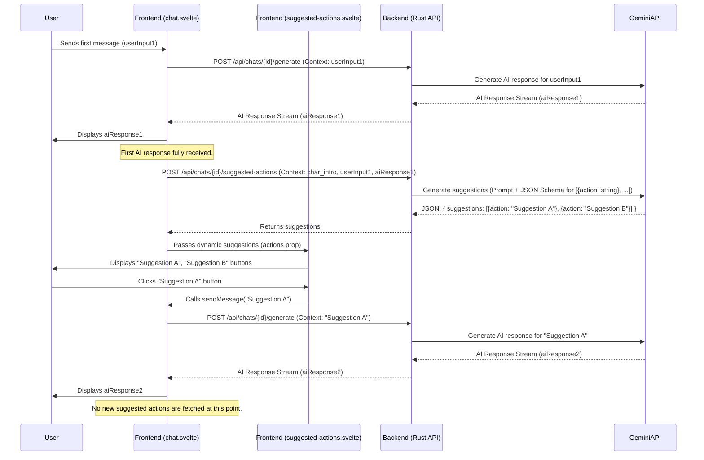

# Feature: Contextual Suggested Actions via Gemini

**Version:** 1.0
**Date:** 2025-05-08

## 1. Overview

This document outlines the plan to replace static suggested actions with dynamically generated, contextually relevant suggestions after the AI's first response in a chat session. This will be achieved by leveraging the `gemini-2.5-flash-preview` model through a new backend endpoint. The goal is to provide users with more pertinent and helpful next steps in their conversation.

## 2. Goals

*   Enhance user experience by providing relevant follow-up actions.
*   Dynamically generate 2-4 short suggested actions based on conversation context.
*   Integrate seamlessly with the existing chat interface.
*   Ensure API keys and sensitive operations are handled securely on the backend.

## 3. Key Changes

The implementation involves modifications to both the backend (Rust) and frontend (Svelte) components:

1.  **Backend (Rust):**
    *   Create a new API endpoint dedicated to generating suggested actions.
    *   Integrate with the Gemini API, providing the necessary conversation context (character's first message, user's first message, AI's first response) and a JSON schema to structure Gemini's output.
2.  **Frontend (Svelte):**
    *   Modify the main chat component ([`chat.svelte`](frontend/src/lib/components/chat.svelte:1)) to:
        *   Call the new backend endpoint after the AI's first response in a session.
        *   Manage the state of the dynamically fetched suggestions.
        *   Ensure suggestions are fetched only once per session after the first AI reply.
    *   Update the existing suggested actions component ([`suggested-actions.svelte`](frontend/src/lib/components/suggested-actions.svelte:1)) to:
        *   Accept and display these dynamic suggestions.
        *   Handle user interaction (sending the selected suggestion as a new message).

## 4. Detailed Plan

### Phase 1: Backend Implementation (Rust)

#### 4.1.1. Define Data Structures

Location: e.g., [`backend/src/models/chat.rs`](backend/src/models/chats.rs)

*   **Request Body for the new endpoint:**
    ```rust
    // In backend/src/models/chats.rs or a similar appropriate module
    use serde::{Deserialize, Serialize};

    #[derive(Serialize, Deserialize, Debug, Clone)]
    pub struct SuggestedActionsRequest {
        pub character_first_message: String,
        pub user_first_message: String,
        pub ai_first_response: String,
    }

    #[derive(Serialize, Deserialize, Debug, Clone)]
    pub struct SuggestedActionItem {
        pub action: String, // The suggested action text
    }

    #[derive(Serialize, Deserialize, Debug, Clone)]
    pub struct SuggestedActionsResponse {
        pub suggestions: Vec<SuggestedActionItem>,
    }
    ```

*   **Gemini JSON Schema Definition:**
    The schema will instruct Gemini to return an array of 2-4 objects, each containing a single `action` string property.
    ```json
    {
      "type": "ARRAY",
      "items": {
        "type": "OBJECT",
        "properties": {
          "action": {
            "type": "STRING",
            "description": "A short, actionable suggestion for the user's next turn."
          }
        },
        "required": ["action"]
      },
      "minItems": 2,
      "maxItems": 4
    }
    ```

#### 4.1.2. Create New Axum Handler

Location: e.g., [`backend/src/routes/chat.rs`](backend/src/routes/chat.rs)

*   **Endpoint:** `POST /api/chats/:chat_id/suggested-actions`
*   **Function Signature (example):**
    ```rust
    // In backend/src/routes/chat.rs
    // async fn generate_suggested_actions(
    //     State(app_state): State<AppState>,
    //     Path(chat_id): Path<String>, // Or Uuid if using Uuid for chat_id
    //     Json(payload): Json<SuggestedActionsRequest>,
    // ) -> Result<Json<SuggestedActionsResponse>, AppError>
    ```

#### 4.1.3. Implement Handler Logic

*   Construct a detailed prompt for `gemini-2.5-flash-preview`, incorporating the `character_first_message`, `user_first_message`, and `ai_first_response` from the request payload.
    *   **Example Prompt Snippet:**
        ```text
        Given the following start of a conversation:
        Character Introduction: "{character_first_message}"
        User's First Message: "{user_first_message}"
        AI's First Response: "{ai_first_response}"

        Generate 2-4 short, contextually relevant follow-up actions or questions that the user might want to take next.
        Each action should be a concise sentence suitable for display in a small button.
        Return the suggestions as a JSON array of objects, where each object has a single key "action" with a string value, conforming to the provided schema.
        The actions should be creative and directly related to the immediate context of the conversation.
        ```
*   Utilize the `gemini_client` from `AppState` to call the `generate_content` method.
    *   Set `response_mime_type` to `"application/json"`.
    *   Provide the `response_schema` (as defined in 4.1.1).
    *   Specify the model: `gemini-2.5-flash-preview`.
*   Deserialize the Gemini JSON response text into `Vec<SuggestedActionItem>`.
*   Return `Json(SuggestedActionsResponse { suggestions })`.
*   Implement comprehensive error handling for API calls and parsing.

#### 4.1.4. Update Routing

Location: e.g., in `backend/src/main.rs` or the chat-specific router module.

*   Register the new `/api/chats/:chat_id/suggested-actions` route and associate it with the `generate_suggested_actions` handler.

### Phase 2: Frontend Implementation (Svelte)

#### 4.2.1. Modify [`chat.svelte`](frontend/src/lib/components/chat.svelte:1)

*   **State Management:**
    ```typescript
    // In frontend/src/lib/components/chat.svelte
    let dynamicSuggestedActions = $state<Array<{ action: string }>>([]);
    let suggestionsFetchedForSession = $state(false); // Tracks if suggestions have been fetched for the current session's first AI reply
    ```
*   **Fetch Logic:**
    *   Implement an `async function fetchSuggestedActions()` that is called *after* the first AI response is fully received and processed successfully in a chat session.
    *   This function will make a `POST` request to the new `/api/chats/:chat_id/suggested-actions` backend endpoint.
    *   The request body will include `character_first_message` (from `currentCharacter.first_mes`), `user_first_message` (content of the first user message in `messages`), and `ai_first_response` (content of the first assistant message in `messages`).
    *   On successful fetch, update `dynamicSuggestedActions` and set `suggestionsFetchedForSession = true`.
    *   Handle potential errors gracefully (e.g., display a toast notification).
    *   Ensure `suggestionsFetchedForSession` and `dynamicSuggestedActions` are reset when the chat session changes (e.g., using an `$effect` block that watches `currentChat.id`).
*   **Conditional Rendering:**
    Pass `dynamicSuggestedActions` to the [`suggested-actions.svelte`](frontend/src/lib/components/suggested-actions.svelte:1) component. The component should only be rendered if `dynamicSuggestedActions.length > 0`.
    ```html
    <!-- In frontend/src/lib/components/chat.svelte template -->
    {#if dynamicSuggestedActions.length > 0 && !isLoading}
        <SuggestedActions {user} {sendMessage} actions={dynamicSuggestedActions} />
    {/if}
    ```
    The placement should be after the main messages area, visible after the first AI response.

#### 4.2.2. Modify [`suggested-actions.svelte`](frontend/src/lib/components/suggested-actions.svelte:1)

*   **Props Update:**
    ```typescript
    // In frontend/src/lib/components/suggested-actions.svelte
    let {
        user,
        sendMessage,
        actions // New prop
    }: {
        user: User | undefined;
        sendMessage: (content: string) => Promise<void>;
        actions: Array<{ action: string }>; // Expecting array of {action: string}
    } = $props();

    // Remove the old static 'suggestedActions' array.
    ```
*   **Template Update:**
    *   Iterate over the `actions` prop using an `{#each}` block.
    *   Each item will be a button displaying `suggestedItem.action`.
    *   The `onclick` handler for each button will call the passed `sendMessage(suggestedItem.action)`.
    *   Adjust the grid layout classes to appropriately display 2-4 items. The current `class={i > 1 ? 'hidden sm:block' : 'block'}` (which shows first two always, next two on `sm+` screens) might be a good starting point.
    ```html
    <!-- In frontend/src/lib/components/suggested-actions.svelte template -->
    <div class="grid w-full gap-2 sm:grid-cols-2">
        {#each actions as suggestedItem, i (suggestedItem.action)}
            <div
                in:fly|global={{ opacity: 0, y: 20, delay: 50 * i, duration: 400 }}
                class={actions.length <= 2 || i < 2 ? 'block' : (actions.length === 3 && i === 2 ? 'block sm:col-span-2' : 'hidden sm:block')}
                // Class may need refinement for optimal display of 2, 3, or 4 items.
                // A simpler alternative: class={i > 1 && actions.length > 2 ? 'hidden sm:block' : 'block'}
            >
                <Button
                    variant="ghost"
                    onclick={async () => {
                        await sendMessage(suggestedItem.action);
                        // Optionally, clear dynamicSuggestedActions here or let chat.svelte handle it
                    }}
                    class="h-auto w-full flex-1 items-start justify-start gap-1 rounded-xl border px-4 py-3.5 text-left text-sm"
                >
                    <span class="font-medium">{suggestedItem.action}</span>
                </Button>
            </div>
        {/each}
    </div>
    ```

### Phase 3: Testing and Refinement

1.  **Backend Unit/Integration Tests:**
    *   Verify the new endpoint functions correctly with mock Gemini client responses.
    *   Test schema validation and error handling scenarios.
2.  **Frontend Manual Testing:**
    *   Confirm suggestions appear only after the first AI response in a session.
    *   Ensure clicking a suggestion sends the correct message.
    *   Verify suggestions are not re-fetched on subsequent messages within the same session.
    *   Confirm suggestions are cleared/reset when a new chat session begins.
    *   Test the UI layout and responsiveness with 2, 3, and 4 suggestions.
3.  **Prompt Engineering:**
    *   Iteratively refine the Gemini prompt to ensure the generated suggestions are high-quality, contextually relevant, concise, and diverse.

## 5. Data Flow Diagram



## 6. Future Considerations

*   Allowing users to explicitly request new suggestions.
*   Configuring the number of suggestions.
*   Using different prompts or models for suggestions based on context or character.


## 7. Debugging Plan for `canFetchSuggestions` (2025-08-05)

**Problem:** The `$derived` variable `canFetchSuggestions` in `frontend/src/lib/components/chat.svelte` is evaluating to a function reference instead of a boolean, causing the "Get Suggestions" button to be incorrectly disabled.

**Plan:**

1.  **Refactor `canFetchSuggestions` Logic**:
    *   Modify the logic inside the function passed to the `$derived` rune for `canFetchSuggestions` in `frontend/src/lib/components/chat.svelte` (lines 75-90) to be more explicit and sequential.
    *   **Proposed Code:**
        ```typescript
        // In frontend/src/lib/components/chat.svelte
        let canFetchSuggestions = $derived(() => {
          if (!currentChat) {
            return false;
          }
          // currentChat is guaranteed to be defined past this point.
          const firstMessageIdPattern = `first-message-${currentChat.id ?? 'initial'}`;

          if (!currentCharacter?.first_mes) {
            return false;
          }

          const userMessage = messages.find(m => m.message_type === 'User');
          if (!userMessage) {
            return false;
          }

          // Now that currentChat and userMessage are confirmed, use them directly.
          const aiResponseAfterUser = messages.find(m =>
            m.message_type === 'Assistant' &&
            m.id !== firstMessageIdPattern && // Check against the character's initial greeting
            new Date(m.created_at) > new Date(userMessage.created_at) // Ensure AI message is after user's
          );

          return !!aiResponseAfterUser; // Explicitly return a boolean
        });
        ```

2.  **Observe Linter Error for `on:click`**:
    *   After applying the fix to `canFetchSuggestions`, check if the Svelte linter error on the button's `on:click` handler (`frontend/src/lib/components/chat.svelte` line 441) resolves.

3.  **Automatic `fetchSuggestedActions` Call Confirmation**:
    *   This was re-confirmed as already completed. No further action is needed here.

**Mermaid Diagram for `canFetchSuggestions` Logic:**
```mermaid
graph TD
    A[Start $derived canFetchSuggestions evaluation] --> B{Is `currentChat` defined?};
    B -- No --> F[Return `false`];
    B -- Yes --> C{Is `currentCharacter.first_mes` defined?};
    C -- No --> F;
    C -- Yes --> D{Is there at least one 'User' message in `messages`?};
    D -- No --> F;
    D -- Yes --> E{Is there an 'Assistant' message (not the initial greeting) created *after* the first 'User' message?};
    E -- No --> F;
    E -- Yes --> G[Return `true`];
    F --> Z[End evaluation];
    G --> Z;