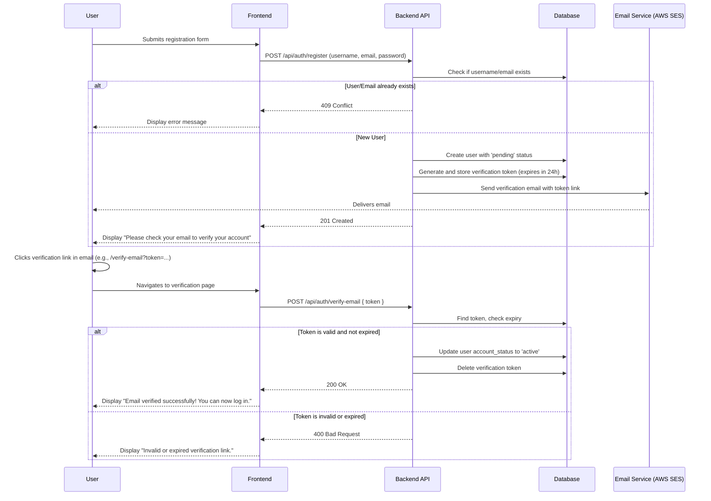

# Plan: Implementing User Email Verification (with Environment-Specific Behavior)

This plan outlines the necessary changes to the backend and database to introduce a mandatory email verification step for new users, including rate limiting and a streamlined process for local development.

## 1. High-Level Process Flow

The following diagram illustrates the user registration and email verification process from start to finish.

## 2. Detailed Implementation Steps

### Task 1: Database Schema Changes

1.  **Update `AccountStatus` Enum**: Add a `pending` state to the `account_status` enum.
2.  **Create `email_verification_tokens` Table**: This table will store the tokens sent to users.
    *   `id` (UUID, Primary Key)
    *   `user_id` (UUID, Foreign Key to `users.id`)
    *   `token` (TEXT, Indexed)
    *   `expires_at` (TIMESTAMPTZ)
    *   `created_at` (TIMESTAMPTZ)

### Task 2: Backend API Implementation

1.  **Update `AccountStatus` Enum in Rust**: The `AccountStatus` enum in `backend/src/models/users.rs` will be updated to include `Pending`.
2.  **Modify `create_user` Function**: The `create_user` function in `backend/src/auth/mod.rs` will be updated to:
    *   Set the new user's `account_status` to `Pending`.
    *   Generate a secure, random verification token.
    *   Store the token and its 24-hour expiry in the new `email_verification_tokens` table.
    *   Trigger the email service to send the verification email.
3.  **Update `verify_credentials` Function**: The login logic in `backend/src/auth/mod.rs` will be modified to reject login attempts from users with a `Pending` account status.
4.  **Create New `verify-email` Endpoint**: A new public endpoint (e.g., `POST /api/auth/verify-email`) will be created. This endpoint will:
    *   Accept the verification token.
    *   Find the token in the database.
    *   Check if the token is expired.
    *   If valid, update the corresponding user's `account_status` to `Active` and delete the token.

### Task 3: Rate Limiting Implementation

1.  **Add `tower-governor` Crate**: We will add the `tower-governor` crate to the backend's dependencies to handle rate limiting.
2.  **Configure Rate Limiting Middleware**: A new middleware layer will be created to apply rate limiting rules.
    *   **Strategy**: We will use a simple in-memory store for the initial implementation, which is sufficient for a single-node deployment. The configuration will be designed to easily switch to a Redis-backed store when we move to a multi-node setup in Phase 2, leveraging the existing ElastiCache for Redis from the hosting plan.
    *   **Rules**:
        *   `POST /api/auth/register`: Limit to 5 requests per minute per IP address.
        *   `POST /api/auth/verify-email`: Limit to 10 requests per minute per IP address.

### Task 4: Email Service Integration (with Environment-Specific Logic)

1.  **Environment Configuration**: The application will use an environment variable (e.g., `APP_ENV`) to distinguish between `development` and `production` environments.
2.  **Email Service Trait**: An `EmailService` trait will be defined to abstract the email sending functionality.
3.  **Production Email Service (`SesEmailService`)**: This implementation will use the AWS SDK for Rust to send emails via AWS SES. It will only be active when `APP_ENV` is set to `production`.
4.  **Development Email Service (`LoggingEmailService`)**: For local development (`APP_ENV=development`), this implementation will not send a real email. Instead, it will **log the verification link directly to the console**. This allows you to test the full verification flow without needing to set up an email service locally.

### Task 5: Frontend Updates

1.  **Post-Registration UI**: After a successful registration, the UI will inform the user that a verification email has been sent and they need to check their inbox.
2.  **Verification Page**: A new page will be created to handle the verification link. It will take the token from the URL, send it to the backend, and display a success or failure message to the user.

### 3. Security Considerations

*   **Token Security**: Verification tokens will be generated using a cryptographically secure random number generator.
*   **Token Expiration**: Tokens will have a 24-hour lifetime to limit their validity.
*   **Single Use**: Tokens will be deleted immediately after use to prevent replay attacks.
*   **Rate Limiting**: Endpoints are protected against brute-force and denial-of-service attacks.