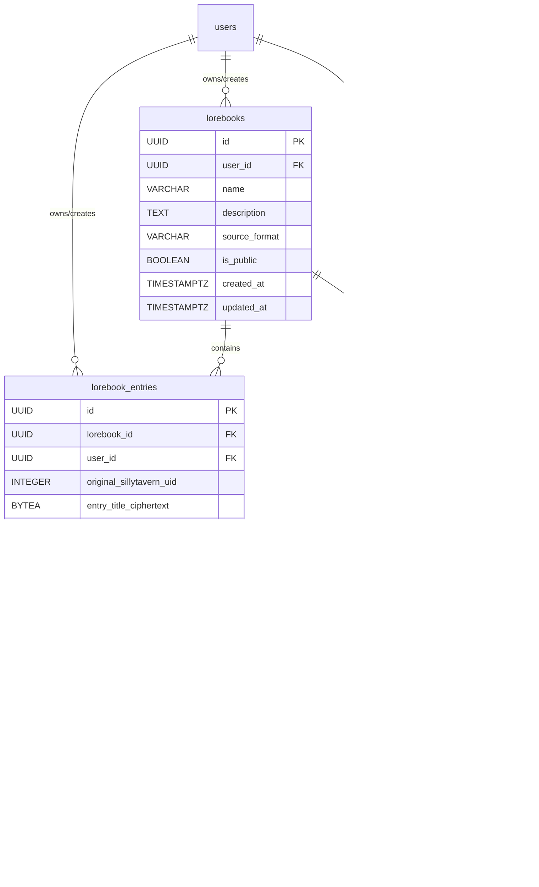

# Scribe Lorebook System: Design & Implementation Plan

This document outlines the design and implementation plan for a sophisticated lorebook system within Scribe, enabling users to import SillyTavern lorebooks and leverage advanced vector search for contextual information retrieval.

## 1. Core Goals

*   Enable users to import existing SillyTavern lorebooks.
*   Implement a lorebook system where entries are primarily retrieved based on semantic relevance using advanced vector search techniques.
*   Provide mechanisms for users to manage their lorebooks and control their application within chat sessions, with future support for sharing.
*   Ensure all lorebook data stored on the server is encrypted at rest using user-specific keys, consistent with Scribe's existing encryption architecture.
*   Design for scalability, multi-tenancy, and future on-device support.

## 2. Data Model & Storage (PostgreSQL)

The PostgreSQL schema will store the original lorebook structure and metadata. The vector database (Qdrant) will store embeddings and searchable payloads derived from these entries.

*   **`lorebooks` Table:**
    *   `id`: Primary Key (UUID)
    *   `user_id`: Foreign Key to `users.id` (creator/owner)
    *   `name`: VARCHAR
    *   `description`: TEXT (optional)
    *   `source_format`: VARCHAR (e.g., "sillytavern_v1", "scribe_v1")
    *   `is_public`: BOOLEAN (default: false) - for future platform sharing
    *   `created_at`, `updated_at`: TIMESTAMPTZ

*   **`lorebook_entries` Table:** (Stores the full, original entry content)
    *   `id`: Primary Key (UUID)
    *   `lorebook_id`: Foreign Key to `lorebooks.id`
    *   `user_id`: Foreign Key to `users.id`
    *   `original_sillytavern_uid`: INTEGER (nullable)
    *   `entry_title_ciphertext`: BYTEA (encrypted title/name of the entry)
    *   `entry_title_nonce`: BYTEA
    *   `keys_text_ciphertext`: BYTEA (encrypted, concatenated `key` and `keysecondary` from SillyTavern)
    *   `keys_text_nonce`: BYTEA
    *   `content_ciphertext`: BYTEA (encrypted full content of the lorebook entry)
    *   `content_nonce`: BYTEA
    *   `comment_ciphertext`: BYTEA (optional, encrypted original SillyTavern comment or Scribe user comment)
    *   `comment_nonce`: BYTEA (optional)
    *   `is_enabled`: BOOLEAN (default: true)
    *   `is_constant`: BOOLEAN (default: false)
    *   `insertion_order`: INTEGER (default: 100)
    *   `placement_hint`: VARCHAR (e.g., "before_prompt", "after_prompt", "authors_note")
    *   `sillytavern_metadata_ciphertext`: BYTEA (optional, encrypted JSON blob of other SillyTavern fields)
    *   `sillytavern_metadata_nonce`: BYTEA (optional)
    *   `created_at`, `updated_at`: TIMESTAMPTZ

*   **`chat_session_lorebooks` Table (Link Table):**
    *   `chat_session_id`: Foreign Key to `chat_sessions.id`
    *   `lorebook_id`: Foreign Key to `lorebooks.id`
    *   `user_id`: Foreign Key to `users.id`
    *   PRIMARY KEY (`chat_session_id`, `lorebook_id`)

**Diagram: Lorebook Data Model**

**Qdrant Point Structure (Conceptual - for each chunk):**
*   `chunk_id` (UUID, PK for the Qdrant point)
*   `vector` (embedding of the chunk)
*   `payload`:
    *   `original_lorebook_entry_id` (UUID, FK to `lorebook_entries.id`)
    *   `lorebook_id` (UUID, FK to `lorebooks.id`)
    *   `user_id` (UUID, FK to `users.id` - for `group_id` filtering)
    *   `chunk_text_preview` (TEXT, short preview of the chunk's content)
    *   `entry_title` (TEXT, decrypted title from `lorebook_entries`)
    *   `keywords` (Array of TEXT, extracted/decrypted from `lorebook_entries.keys_text`)
    *   `category` (TEXT, if applicable, from `sillytavern_metadata` or Scribe-defined)
    *   Other filterable metadata (e.g., `is_enabled`, `is_constant`).

## 3. Import Process (SillyTavern Lorebooks)

*   **API Endpoint:** `POST /api/lorebooks/import/sillytavern`
*   **Backend Logic:**
    1.  Parse uploaded JSON. Create `lorebooks` record.
    2.  For each SillyTavern entry:
        *   Create `lorebook_entries` record.
        *   **Encryption:** Encrypt `content`, `comment`, `entry_title` (derived from ST comment or name), `keys_text`, and `sillytavern_metadata_json` using user's DEK.
        *   **Field Mapping:** Map relevant SillyTavern fields (`uid`, `key`, `keysecondary`, `content`, `comment`, `disable`, `constant`, `order`, `position`) to Scribe fields. Store other ST fields in the `sillytavern_metadata_ciphertext` blob.
        *   **Trigger Asynchronous Vectorization:** For the newly created `lorebook_entries` record.

**Diagram: SillyTavern Import Flow**

## 4. Vectorization Strategy

*   **Embedding Model:** Utilize **`gemini-embedding-exp-03-07`** (or its Vertex/Gemini API equivalents).
*   **Task Types:** Use `task_type="RETRIEVAL_DOCUMENT"` for lorebook chunks and `task_type="RETRIEVAL_QUERY"` for user queries.
*   **Title Parameter:** Provide the decrypted `entry_title` to the `title` parameter for `RETRIEVAL_DOCUMENT` embeddings.
*   **Batching:** Employ `batchEmbedContents` for efficient ingestion.
*   **Chunking (`chunking.rs`):** Implement semantic/context-aware chunking for narrative content, respecting the 8K token limit.
*   **Tokenization (`tokenizer_service.rs`, `gemini_token_client.rs`):** Align tokenization with `gemini-embedding-exp-03-07`.
*   **Qdrant Configuration (`vector_db/qdrant_client.rs`):**
    *   Single collection with payload-based partitioning (`user_id`, `lorebook_id` as `group_id`s).
    *   Disable global HNSW (`m=0`), enable per-group HNSW (`payload_m` e.g., 16).
    *   Keyword payload indexes on `group_id` fields and other filterable metadata.
*   **Asynchronous Processing:** The vectorization pipeline will be asynchronous.

## 5. Runtime Lorebook Retrieval & Injection

*   **Trigger:** When `ChatService` prepares the LLM prompt.
*   **Multi-Stage Retrieval Process:**
    1.  **Identify Active Lorebooks:** Query `chat_session_lorebooks`.
    2.  **Query Construction & Embedding:** Embed user query (`gemini-embedding-exp-03-07`, `task_type="RETRIEVAL_QUERY"`). Consider LLM-based query expansion.
    3.  **Stage 1: Initial Candidate Retrieval (Qdrant):** Retrieve top N candidates, filtering by `group_id`s.
    4.  **Stage 2: Re-ranking with Cross-Encoder:** Re-rank candidates for precision.
    5.  **Stage 3: Diversification with Maximal Marginal Relevance (MMR):** Select final K chunks, balancing relevance and diversity.
    6.  **Fetch Full Entry Details & Decrypt:** Retrieve original `lorebook_entries` from PostgreSQL for the K chunks and decrypt.
    7.  **Apply "Constant" Entries:** Consider `is_constant` entries.
    8.  **Prompt Assembly:** Sort and inject lore content based on `insertion_order` and `placement_hint`, managing token limits.

**Diagram: Runtime Lorebook Retrieval**

## 6. Encryption & Security

*   **User Data Encryption:** Sensitive fields in PostgreSQL encrypted via AES-256-GCM using user's DEK.
*   **Encryption in Transit (TLS):** Enforced for all relevant communications.
*   **Encryption at Rest (Qdrant):** Implement storage-level encryption for self-hosted Qdrant; utilize cloud provider features for Qdrant Cloud.
*   **Multi-User Access Control (Future):** JWT-based RBAC for Qdrant points and ACLs in PostgreSQL for sharing.

## 7. On-Device Support (Future)

*   **Technology:** LanceDB for local vector search, SQLite3 for metadata.
*   **Data:** Sync pre-computed server-side embeddings.
*   **Synchronization:** Develop robust sync mechanisms.
*   **Client-Side Encryption:** Consider for local data if highly sensitive.

## 8. API Endpoints (CRUD)

*   **Lorebooks:** `POST /api/lorebooks`, `GET /api/lorebooks`, `GET /api/lorebooks/{id}`, `PUT /api/lorebooks/{id}`, `DELETE /api/lorebooks/{id}`, `POST /api/lorebooks/import/sillytavern`.
*   **Lorebook Entries:** `POST /api/lorebooks/{lorebook_id}/entries`, `GET /api/lorebooks/{lorebook_id}/entries`, `GET /api/lorebooks/{lorebook_id}/entries/{entry_id}`, `PUT /api/lorebooks/{lorebook_id}/entries/{entry_id}`, `DELETE /api/lorebooks/{lorebook_id}/entries/{entry_id}`.
*   **Chat Session Lorebook Association:** `POST /api/chats/{chat_session_id}/lorebooks`, `GET /api/chats/{chat_session_id}/lorebooks`, `DELETE /api/chats/{chat_session_id}/lorebooks/{lorebook_id}`.

## 9. UI Considerations (High-Level)

*   Dedicated "Lorebooks" section for management (CRUD, import).
*   Mechanism in chat settings to associate/disassociate lorebooks with the current session.