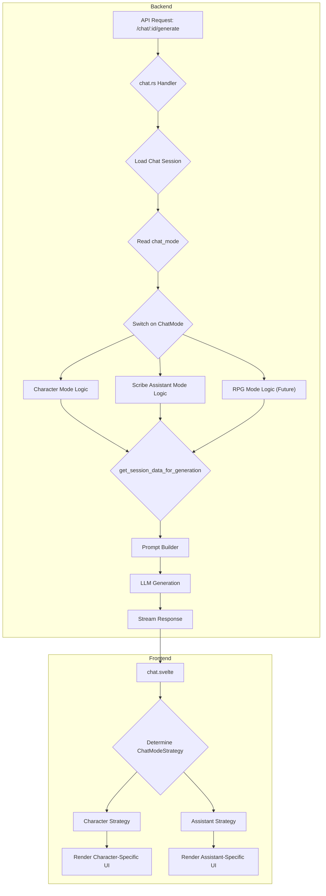

# Scribe Modular Chat System: Design Specification

## 1. Introduction & Project Goal

### 1.1. The Challenge: A Character-Centric System

The current Scribe chat implementation is powerful but fundamentally character-centric. Every chat session (`chat_sessions` table) is directly and non-optionally linked to a `character_id`. This architecture has served us well for character roleplay but presents a significant roadblock to introducing new, non-character-based interaction modes, such as:

*   **Scribe Assistant:** A meta-level assistant to help users with content creation, world-building, and character development.
*   **RPG Mode:** A future game mode with mechanics like stat tracking, inventory, and dice rolls, which may not be tied to a single character.
*   **Chronicle Integration:** Direct interaction with the Chronicle system for narrative management.

### 1.2. The Solution: A Modular, Mode-Driven Architecture

This document outlines a plan to refactor the chat system into a modular, extensible architecture. The core of this new design is the **`ChatMode`**, a concept that decouples the chat session from a specific entity (like a character) and allows for different types of interactions within the same core framework.

This will enable us to seamlessly switch between different modes (Character, Assistant, RPG) while reusing the existing robust infrastructure for message handling, streaming, and UI components.

## 2. High-Level Architecture

The new system will be built around a `ChatMode` enum and a corresponding `ChatModeStrategy` on the frontend. This will allow us to abstract the unique logic and UI for each mode while maintaining a common core.

### 2.1. Backend Architecture

The backend will introduce a `chat_mode` column to the `chat_sessions` table. This will be the primary discriminator for how a chat session behaves. The `character_id` will become nullable to accommodate non-character modes.

### 2.2. Frontend Architecture

The frontend will use a strategy pattern to manage the different UI and interaction logic for each chat mode. A central `chat.svelte` component will delegate to a specific `ChatModeStrategy` based on the session's mode.

## 3. Phased Implementation Plan

### Phase 1: Backend Refactoring & Schema Changes

**Goal:** Decouple the chat session from the character and introduce the `ChatMode` concept.

#### 3.1. Database Schema Modifications

1.  **Modify `chat_sessions` Table:**
    *   Add a new column: `chat_mode` (Type: `VARCHAR`, Default: `'Character'`). This will store the active mode for the session.
    *   Make the `character_id` column `NULLABLE`. It will only be populated for `Character` mode chats.

2.  **Create `ChatMode` Enum in Rust:**
    *   Create a `ChatMode` enum in `backend/src/models/chats.rs` with variants: `Character`, `ScribeAssistant`, `Rpg`.
    *   Implement `FromSql` and `ToSql` for Diesel to map the enum to the `VARCHAR` column.

#### 3.2. Service Layer Refactoring

1.  **Update `get_session_data_for_generation`:**
    *   This function in `backend/src/services/chat/generation.rs` is the core of the system. It will be modified to:
        *   First, load the `ChatSession` and determine its `chat_mode`.
        *   Based on the `chat_mode`, it will conditionally execute logic.
        *   **For `Character` mode:** The existing logic will be largely preserved, fetching character data, persona, lorebooks, etc.
        *   **For `ScribeAssistant` mode:** It will bypass character-specific fetching and construct a system prompt tailored for the assistant.
        *   The function's return signature will be updated to handle cases where character-specific data is absent.

2.  **Update `create_chat_session_handler`:**
    *   The handler in `backend/src/routes/chat.rs` will be updated to accept a `chat_mode` parameter.
    *   When creating a session, it will set the `chat_mode` and only require a `character_id` if the mode is `Character`.

### Phase 2: Frontend Implementation

**Goal:** Implement the UI and state management for the new chat modes.

#### 3.1. State Management

*   The `ScribeChatSession` type in `frontend/src/lib/types.ts` will be updated to include the new `chat_mode` field.

#### 3.2. UI Strategy Pattern

1.  **Create `ChatModeStrategy` Interface:**
    *   Define a `ChatModeStrategy` interface in `frontend/src/lib/strategies/chat.ts`. This will define a common set of methods and properties for all modes, such as:
        *   `getChatHeader()`: Returns the component or props for the chat header.
        *   `getSystemPrompt()`: Returns the base system prompt for the mode.
        *   `getInitialMessages()`: Provides any initial messages for the mode.
        *   `renderUI()`: A method to render mode-specific UI elements.

2.  **Implement Concrete Strategies:**
    *   **`CharacterModeStrategy`:** This will encapsulate the existing logic for character chats, displaying the character header, using the character's first message, etc.
    *   **`ScribeAssistantStrategy`:** This will define the UI and behavior for the assistant, such as displaying a generic "Scribe Assistant" header and providing a default welcome message.

3.  **Refactor `chat.svelte`:**
    *   The main `chat.svelte` component will:
        *   Read the `chat_mode` from the `ScribeChatSession` object.
        *   Instantiate the appropriate `ChatModeStrategy`.
        *   Use the strategy to render the header, initial messages, and any other mode-specific UI.

### Phase 3: Scribe Assistant Implementation

**Goal:** Build out the full functionality for the Scribe Assistant mode.

#### 3.1. Assistant-Specific API Endpoints

*   While the main `/generate` endpoint will be reused, we may need new endpoints for assistant-specific actions, such as:
    *   `/api/assistant/create-character-scaffold`: An endpoint that takes a brief description and generates a full character JSON object.
    *   `/api/assistant/create-lorebook-entry`: An endpoint to generate a new lorebook entry based on a topic.

#### 3.2. Frontend UI for Assistant

*   Develop UI components that allow the user to interact with the assistant's special capabilities. This will reuse the `GenerationWidget` for consistency.
*   The chat input for the assistant will be tailored to content creation tasks.

## 4. Long-Term Vision & Extensibility

This modular design provides a robust foundation for future expansion. Adding a new `Rpg` mode, for example, will simply involve:

1.  Adding an `Rpg` variant to the `ChatMode` enum in the backend.
2.  Implementing the logic for the `Rpg` case in `get_session_data_for_generation`.
3.  Creating an `RpgModeStrategy` on the frontend to handle the unique UI for stats, inventory, and dice rolls.

This ensures that the core chat system remains clean and maintainable as Scribe continues to grow in complexity and power.