# User Persona Management Implementation Plan

**Overall Goal:** Enable users to define their identity in chats, either by creating custom "user personas" (which are essentially user-owned character cards) or by "impersonating" existing AI characters. This active persona's details (name, description, and other available fields) will be sent to the LLM to contextualize the user's side of the conversation. Users should be able to switch personas easily, even mid-chat.

---

### 1. Core Concepts & Terminology

*   **User Persona:** The representation of the user in a chat. This is an abstract concept.
*   **Custom User Persona:** A specific, user-created and owned character card. These will have a structure very similar to AI characters, supporting all fields but only requiring `name` and `description` at a minimum.
*   **Impersonated Character:** An existing AI character (from the `characters` table) that the user chooses to embody for a chat.
*   **Active Persona:** The specific Custom User Persona or Impersonated Character currently selected by the user for their interactions in a given chat session.

---

### 2. Database Design

We'll introduce a new table for `user_personas` and update `chat_sessions` to store the active persona.

**Mermaid Diagram:**

```mermaid
erDiagram
    users {
        uuid id PK
        string username
        string email
        string hashed_password
        string role
        string account_status
        datetime created_at
        datetime updated_at
        binary dek_encrypted_dek_kek
        binary dek_nonce
        binary salt
        binary kek_salt
    }

    characters {
        uuid id PK
        uuid user_id FK
        string name
        string spec
        string spec_version
        bytea description
        bytea personality
        bytea scenario
        bytea first_mes
        bytea mes_example
        bytea creator_notes
        bytea system_prompt
        bytea post_history_instructions
        text_array tags
        string creator
        string character_version
        text_array alternate_greetings
        string nickname
        jsonb creator_notes_multilingual
        text_array source
        text_array group_only_greetings
        datetime creation_date
        datetime modification_date
        datetime created_at
        datetime updated_at
        bytea persona
        bytea world_scenario
        string avatar
        string chat
        bytea greeting
        bytea definition
        string default_voice
        jsonb extensions
        integer data_id
        string category
        string definition_visibility
        integer depth
        bytea example_dialogue
        boolean favorite
        string first_message_visibility
        decimal height
        datetime last_activity
        string migrated_from
        bytea model_prompt
        string model_prompt_visibility
        decimal model_temperature
        bigint num_interactions
        decimal permanence
        string persona_visibility
        integer revision
        string sharing_visibility
        string status
        string system_prompt_visibility
        text_array system_tags
        integer token_budget
        jsonb usage_hints
        bytea user_persona
        string user_persona_visibility
        string visibility
        decimal weight
        string world_scenario_visibility
        bytea description_nonce
        bytea personality_nonce
        bytea scenario_nonce
        bytea first_mes_nonce
        bytea mes_example_nonce
        bytea creator_notes_nonce
        bytea system_prompt_nonce
        bytea persona_nonce
        bytea world_scenario_nonce
        bytea greeting_nonce
        bytea definition_nonce
        bytea example_dialogue_nonce
        bytea model_prompt_nonce
        bytea user_persona_nonce
        bytea post_history_instructions_nonce
    }

    user_personas {
        uuid id PK
        uuid user_id FK
        string name
        text description
        string spec
        string spec_version
        bytea personality
        bytea scenario
        bytea first_mes
        bytea mes_example
        bytea system_prompt
        bytea post_history_instructions
        text_array tags
        string avatar
        bytea personality_nonce
        bytea scenario_nonce
        bytea first_mes_nonce
        bytea mes_example_nonce
        bytea system_prompt_nonce
        bytea post_history_instructions_nonce
        datetime created_at
        datetime updated_at
    }

    chat_sessions {
        uuid id PK
        uuid user_id FK
        uuid character_id FK
        string title
        datetime created_at
        datetime updated_at
        jsonb settings
        integer history_limit
        string model_name
        uuid active_custom_persona_id FK
        uuid active_impersonated_character_id FK
    }

    users ||--o{ user_personas : owns
    users ||--o{ chat_sessions : participates_in
    chat_sessions }|--o| user_personas : "active_persona_is (custom)"
    chat_sessions }|--o| characters : "active_persona_is (impersonated)"
    characters }|--o| users : "created_by (optional)"
```

**Table Details:**

*   **`user_personas` Table:**
    *   `id` (UUID, PK)
    *   `user_id` (UUID, FK to `users.id`, NOT NULL) - Ensures personas are user-owned.
    *   `name` (String, NOT NULL)
    *   `description` (Text, NOT NULL)
    *   `spec` (String, default e.g., "user_persona_spec_v1")
    *   `spec_version` (String, default e.g., "1.0.0")
    *   **Mirrored Fields from `characters`:** All other relevant descriptive and instructional fields (e.g., `personality`, `scenario`, `first_mes`, `mes_example`, `system_prompt`, `post_history_instructions`, `tags`, `avatar`, etc.). These will be `OPTION<Vec<u8>>` for encrypted fields, `Option<String>`, `Option<Vec<Option<String>>>`, etc., and will be nullable in the database.
    *   Corresponding `_nonce` fields for all encryptable text fields.
    *   `created_at` (Timestamp)
    *   `updated_at` (Timestamp)

*   **`chat_sessions` Table (Modifications):**
    *   Add `active_custom_persona_id` (UUID, Nullable, FK to `user_personas.id`)
    *   Add `active_impersonated_character_id` (UUID, Nullable, FK to `characters.id`)
    *   (A CHECK constraint would ensure `active_custom_persona_id` IS NULL OR `active_impersonated_character_id` IS NULL, meaning only one can be active at a time for a given session.)

---

### 3. Backend Implementation

*   **New Model (`UserPersona`):**
    *   Create `backend/src/models/user_personas.rs`.
    *   The `UserPersona` struct will mirror the `Character` struct in terms of fields, derivations (Serialize, Deserialize, Queryable, Insertable, AsChangeset, etc.), and encryption handling for sensitive fields.
    *   It will belong to a `User`.

*   **Database Migrations:**
    *   Create a migration to add the `user_personas` table.
    *   Create a migration to add `active_custom_persona_id` and `active_impersonated_character_id` (and the CHECK constraint) to the `chat_sessions` table.

*   **Service Layer (`UserPersonaService`):**
    *   Create `backend/src/services/user_persona_service.rs`.
    *   **CRUD Operations for Custom User Personas:**
        *   `create_user_persona(user_id, name, description, optional_fields...) -> Result<UserPersona, AppError>`
        *   `get_user_persona(user_id, persona_id) -> Result<UserPersona, AppError>` (Ensure user owns the persona)
        *   `list_user_personas(user_id) -> Result<Vec<UserPersonaSummary>, AppError>` (Summary might include id, name, avatar)
        *   `update_user_persona(user_id, persona_id, updates...) -> Result<UserPersona, AppError>`
        *   `delete_user_persona(user_id, persona_id) -> Result<(), AppError>`
    *   Encryption/decryption logic for `UserPersona` fields will mirror that of `Character` fields, utilizing the `EncryptionService`.

*   **Chat Service Modifications (`ChatService` in `backend/src/services/chat_service.rs`):**
    *   **Set Active Persona for Chat Session:**
        *   `set_active_custom_persona(user_id, chat_session_id, custom_persona_id) -> Result<(), AppError>`
        *   `set_active_impersonated_character(user_id, chat_session_id, character_id) -> Result<(), AppError>`
        *   `clear_active_persona(user_id, chat_session_id) -> Result<(), AppError>`
    *   These methods will update the `active_custom_persona_id` or `active_impersonated_character_id` fields in the `chat_sessions` table.

*   **Prompt Engineering (`PromptBuilder` in `backend/src/prompt_builder.rs`):**
    *   When constructing the prompt for the LLM, the `ChatService` (or a helper it calls) will:
        1.  Fetch the current `chat_session`.
        2.  Check `active_custom_persona_id` and `active_impersonated_character_id`.
        3.  If `active_custom_persona_id` is set, fetch the corresponding `UserPersona` data.
        4.  If `active_impersonated_character_id` is set, fetch the corresponding `Character` data.
        5.  If an active persona is found, extract its `name`, `description`, and any other defined fields.
        6.  Incorporate this persona information into the system prompt or user message prefix. For example:
            *   System Prompt Addition: "You are chatting with [User's Active Persona Name]. [User's Active Persona Description]. They might also provide the following context about themselves: [other persona fields like personality, scenario, etc. if present]."
            *   Or, if the persona is meant to describe the user *to* the AI character: "You are [AI Character Name]. You are talking to [User's Active Persona Name]. Here is some information about them: [User's Active Persona Description]. [Other persona fields...]"
    *   The exact phrasing will need careful consideration to be effective. The key is that the LLM (acting as the AI character) is made aware of who the user is representing.

*   **DTOs for API Responses:**
    *   `UserPersonaDataForClient` (similar to `CharacterDataForClient`) for sending decrypted persona data.
    *   Input DTOs for creating/updating personas.

---

### 4. API Endpoints (`backend/src/routes/`)

*   **New Persona Routes (`backend/src/routes/user_personas.rs`):**
    *   `POST /api/user-personas`: Create a new custom user persona.
        *   Request Body: Name, description, other optional fields.
    *   `GET /api/user-personas`: List all custom user personas for the authenticated user.
    *   `GET /api/user-personas/{persona_id}`: Get details of a specific custom user persona.
    *   `PUT /api/user-personas/{persona_id}`: Update a custom user persona.
    *   `DELETE /api/user-personas/{persona_id}`: Delete a custom user persona.

*   **Chat Session Routes (Modifications in `backend/src/routes/chats.rs` or a new dedicated route file):**
    *   `PUT /api/chats/{chat_session_id}/persona/custom/{custom_persona_id}`: Set a custom user persona as active for the chat.
    *   `PUT /api/chats/{chat_session_id}/persona/impersonate/{character_id}`: Set an impersonated AI character as active for the chat.
    *   `DELETE /api/chats/{chat_session_id}/persona`: Clear the active persona for the chat.
    *   `GET /api/chats/{chat_session_id}/persona`: Get the currently active persona details for the chat.

*   **Character Listing for Impersonation:**
    *   The existing `GET /api/characters` endpoint can be used by the frontend to list available AI characters for impersonation.

---

### 5. Security & Ownership

*   All `UserPersonaService` methods must ensure that the authenticated user owns the `UserPersona` they are trying to access or modify.
*   When setting an active persona for a chat session, ensure the user owns the chat session and, if setting a custom persona, also owns that custom persona.

---

### 6. Future Considerations (Out of Scope for this Iteration but good to keep in mind)

*   **Persona-Aware Contextual Suggestions:** The logic in `docs/features/contextual_suggested_actions_feature.md` would eventually read the active persona to tailor suggestions.
*   **AI-Assisted User Message Generation:** Functionality for the AI to help write/rephrase/expand user messages based on the active persona.
*   **Multiplayer:** Restrictions on persona switching in shared sessions.
*   **Default Persona:** Allowing users to set a default persona for new chats.
*   **Handling Existing `user_persona` fields in `characters` table:** These fields (`user_persona`, `user_persona_visibility`, `user_persona_nonce`) in the `characters` table should eventually be deprecated and removed. A data migration strategy might be needed if there's any valuable data in them, but based on our investigation, they seem unused. For now, they can be ignored by the new persona system. New code should not reference them.

---

### 7. Frontend/CLI Impact (High-Level)

*   **Custom Persona Management UI:**
    *   Forms for creating and editing custom user personas (name, description, and all other mirrored character fields).
    *   A list view of their created personas.
*   **Active Persona Selection UI (in Chat Interface):**
    *   A dropdown or modal to select an active persona. This list would include:
        *   The user's Custom User Personas.
        *   Available AI Characters (for impersonation).
        *   An option for "No Persona / Default User."
    *   This selection should be easily accessible and updatable mid-chat.
*   **CLI:**
    *   Commands for managing custom user personas (`persona create`, `persona list`, `persona update`, `persona delete`).
    *   Commands for setting/switching the active persona in a CLI chat session (`chat use-persona <custom_persona_name_or_id>`, `chat impersonate <character_name_or_id>`, `chat clear-persona`).

---