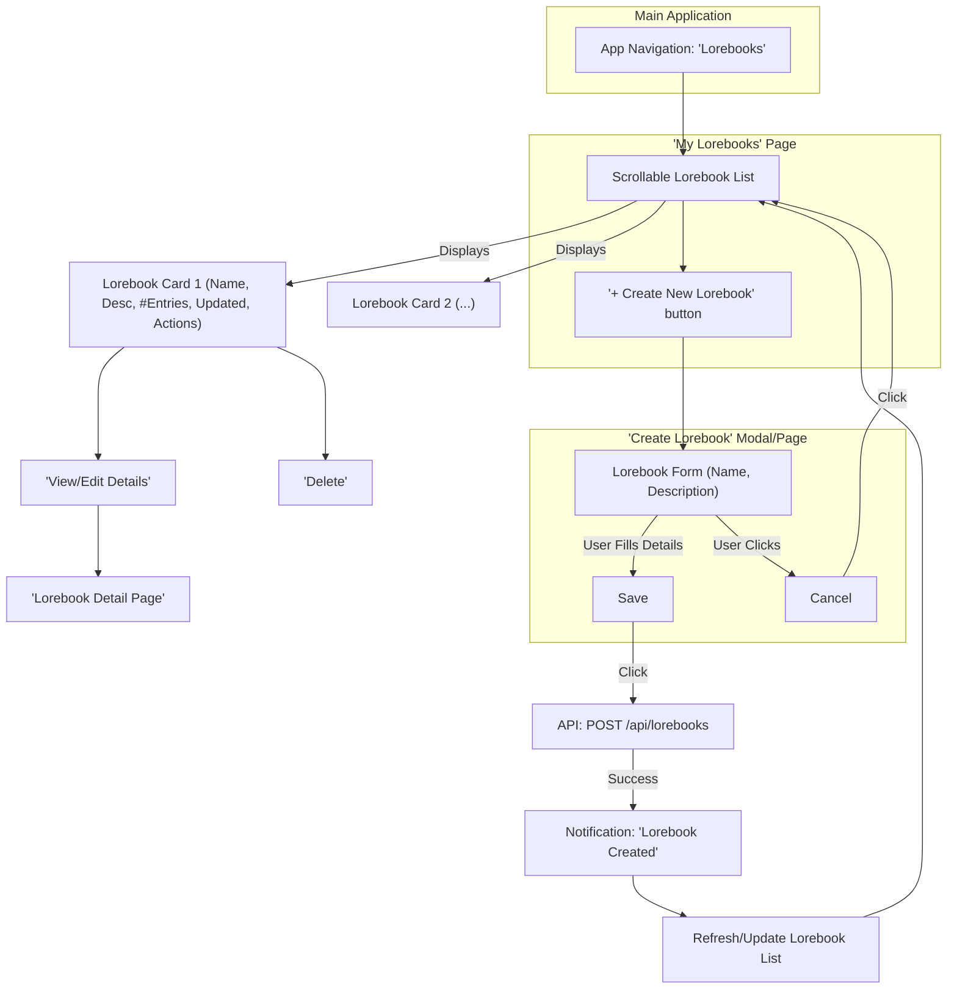
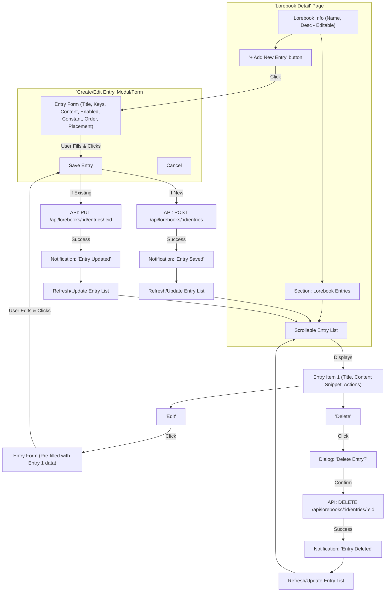

# Lorebook UI/UX Flow Definition

This document outlines the user interface (UI) and user experience (UX) flows for managing Lorebooks, Lorebook Entries, and their association with Chat Sessions.

## 1. Lorebook Listing

*   **Access Point:**
    *   A new top-level navigation item, labeled "**Lorebooks**," will be added to the main application sidebar or menu.
    *   Clicking "Lorebooks" navigates the user to a dedicated "My Lorebooks" page.
*   **Page Content & Display:**
    *   The "My Lorebooks" page will display a list of all lorebooks created by the user.
    *   Each lorebook in the list will be presented as a card or a row, showing the following information:
        *   **Name:** The lorebook's name (prominently displayed).
        *   **Description:** A brief snippet of the description (e.g., first 1-2 lines, expandable or shown on hover).
        *   **Number of Entries:** A count of active entries within the lorebook (e.g., "5 entries").
        *   **Last Updated:** Timestamp of the last modification (e.g., "Updated: 2023-10-27").
        *   **Actions:**
            *   A "View Details" or "Edit" button/icon to navigate to the Lorebook Detail View.
            *   A "Delete" button/icon.
    *   A clearly visible "**Create New Lorebook**" button will be present on this page, likely at the top.
    *   If the list is empty, a message prompting the user to create their first lorebook should be displayed.

## 2. Lorebook CRUD (Create, Read, Update, Delete)

*   **Create Lorebook:**
    *   **Initiation:** User clicks the "Create New Lorebook" button on the "My Lorebooks" page.
    *   **UI:** A modal dialog or a separate form page appears.
    *   **Input Fields (based on `CreateLorebookPayload`):**
        *   `name`: Text input. (Required, Min: 1, Max: 255 characters).
        *   `description`: Textarea. (Optional, Max: 10000 characters).
    *   **Actions:**
        *   "**Save Lorebook**" button: Submits the form. On success, the new lorebook appears in the "My Lorebooks" list, and a success notification is shown. The user might be navigated to the new Lorebook's Detail View or back to the list.
        *   "**Cancel**" button: Closes the modal/form without saving.
*   **Read/View Lorebook (Lorebook Detail View):**
    *   **Initiation:** User clicks the "View Details" / "Edit" button or the name of a lorebook in the "My Lorebooks" list.
    *   **UI:** Navigates to a dedicated "Lorebook Detail" page for the selected lorebook.
    *   **Page Content:**
        *   **Lorebook Name:** Displayed prominently. Can be made editable directly or via an "Edit" toggle (see Update).
        *   **Lorebook Description:** Displayed. Can be made editable (see Update).
        *   **Metadata:** Read-only display of `created_at`, `updated_at`, `source_format`.
        *   **Entries Section:** A dedicated area to list, create, and manage Lorebook Entries (see Section 3).
        *   **Actions:** "Delete Lorebook" button.
*   **Update Lorebook:**
    *   **Initiation:**
        *   On the "Lorebook Detail View," the name and description fields could be inline-editable or an "Edit Lorebook" button could toggle an edit mode or open an edit modal.
    *   **UI:** If a modal/form, it's pre-filled with existing data, similar to the Create form.
    *   **Editable Fields (based on `UpdateLorebookPayload`):**
        *   `name`: Text input. (Optional for update, Min: 1, Max: 255 characters if provided).
        *   `description`: Textarea. (Optional for update, Max: 10000 characters if provided).
    *   **Actions:**
        *   "**Save Changes**" button: Submits the changes. On success, UI updates, and a success notification is shown.
        *   "**Cancel**" button: Discards changes.
*   **Delete Lorebook:**
    *   **Initiation:** User clicks the "Delete" button for a lorebook (either on the "My Lorebooks" list or the "Lorebook Detail View").
    *   **Confirmation:** A confirmation dialog appears: "Are you sure you want to delete the lorebook '[Lorebook Name]'? This will also delete all its associated entries and cannot be undone."
    *   **Actions:**
        *   "**Confirm Delete**" button: Proceeds with deletion. On success, the user is navigated back to the "My Lorebooks" list, the lorebook is removed, and a success notification is shown.
        *   "**Cancel**" button: Closes the dialog.

## 3. Lorebook Entry CRUD

*   **Context:** All Lorebook Entry operations occur within the "Lorebook Detail View" of a specific lorebook.
*   **Create Lorebook Entry:**
    *   **Initiation:** User clicks an "**Add New Entry**" button within the "Entries" section of the "Lorebook Detail View."
    *   **UI:** A modal dialog or an inline form appears.
    *   **Input Fields (based on `CreateLorebookEntryPayload`):**
        *   `entry_title`: Text input. (Required, Min: 1, Max: 255 characters).
        *   `keys_text`: Textarea or a tag-style input for keywords. (Optional, Max: 10000 characters). Tooltip: "Comma-separated keywords that activate this entry."
        *   `content`: Large textarea (e.g., with Markdown support). (Required, Min: 1, Max: 65535 characters).
        *   `comment`: Textarea for author's notes. (Optional, Max: 10000 characters). Tooltip: "Private notes, not sent to the model."
        *   `is_enabled`: Checkbox/toggle. (Defaults to true). Tooltip: "If disabled, this entry will not be used."
        *   `is_constant`: Checkbox/toggle. (Defaults to false). Tooltip: "If enabled, this entry is always active and doesn't rely on keywords."
        *   `insertion_order`: Number input. (Defaults to 100). Tooltip: "Determines the order of inclusion; lower numbers go first."
        *   `placement_hint`: Dropdown/select. (Optional, Max: 50 characters). Options to be defined (e.g., "Before Character Bio," "After Character Bio," "Start of Prompt," "End of Prompt"). Defaults to a sensible value like "before_prompt".
    *   **Actions:**
        *   "**Save Entry**" button: Submits the form. On success, the new entry appears in the list on the "Lorebook Detail View," and a success notification is shown.
        *   "**Cancel**" button: Closes the modal/form.
*   **Read/View Lorebook Entries:**
    *   **UI:** Within the "Entries" section of the "Lorebook Detail View," entries are listed.
    *   **Display per Entry (e.g., in an accordion, a table, or cards):**
        *   `entry_title`: Prominently displayed.
        *   `content`: A snippet or an expander to view/hide the full content.
        *   `keys_text`: Displayed if present.
        *   Status Indicators: Visual cues for `is_enabled` and `is_constant`.
        *   `insertion_order`: Displayed.
        *   **Actions:** "Edit" and "Delete" buttons/icons for each entry.
    *   The list should be sortable (e.g., by `insertion_order`, `entry_title`, `updated_at`).
*   **Update Lorebook Entry:**
    *   **Initiation:** User clicks the "Edit" button for an entry in the list.
    *   **UI:** A modal dialog or inline form (similar to Create Entry) appears, pre-filled with the entry's current data.
    *   **Editable Fields:** Same as Create Entry, but all fields are optional for update (as per `UpdateLorebookEntryPayload`).
    *   **Actions:**
        *   "**Save Changes**" button: Submits changes. On success, the entry list updates, and a success notification is shown.
        *   "**Cancel**" button: Discards changes.
*   **Delete Lorebook Entry:**
    *   **Initiation:** User clicks the "Delete" button for an entry.
    *   **Confirmation:** A confirmation dialog: "Are you sure you want to delete the entry '[Entry Title]'? This action cannot be undone."
    *   **Actions:**
        *   "**Confirm Delete**" button: Proceeds with deletion. On success, the entry is removed from the list, and a success notification is shown.
        *   "**Cancel**" button: Closes the dialog.

## 4. Chat Association

*   **Associate Lorebook(s) with a Chat Session:**
    *   **Location 1: Chat Creation / Chat Settings:**
        *   When creating a new chat or editing an existing chat's settings (e.g., via a "Chat Settings" modal or a dedicated settings panel for the chat).
        *   A section titled "**Associated Lorebooks**."
        *   An "**Add/Manage Lorebooks**" button.
        *   Clicking this button opens a UI (e.g., multi-select dropdown, checklist modal) listing all available lorebooks by name. The user can select one or more lorebooks.
        *   Saving the chat settings will trigger API calls to associate the selected lorebooks.
    *   **Location 2: During an Active Chat (Quick Access - Optional):**
        *   A button/icon within the chat interface (e.g., near model/persona settings) labeled "Manage Lorebooks."
        *   This opens a similar selection UI as above for quick association/disassociation without leaving the chat view.
*   **Display Currently Associated Lorebooks:**
    *   In the "Chat Settings" UI, the "Associated Lorebooks" section lists the names of currently associated lorebooks.
    *   Each listed lorebook name has a "**Remove**" (or "X") icon next to it for disassociation.
    *   (Optional) In the main chat interface, an icon or text could indicate active lorebooks (e.g., "3 Lorebooks active," with a tooltip listing their names).
*   **Disassociate a Lorebook from a Chat:**
    *   **Initiation:** User clicks the "Remove" / "X" icon next to a lorebook name in the list of associated lorebooks (within Chat Settings or the quick access UI).
    *   **Confirmation:** (Optional, could be a direct action for speed). If used: "Remove '[Lorebook Name]' from this chat?"
    *   **Action:** Triggers the API call to disassociate.
    *   **Feedback:** The list of associated lorebooks updates immediately. A brief notification may confirm the action.

## Mermaid Diagrams

### Lorebook Create & List Flow


### Lorebook Entry CRUD Flow (within Lorebook Detail Page)


### Chat-Lorebook Association Flow (within Chat Settings)
```mermaid
graph TD
    subgraph "'Chat Settings' Modal/Page"
        direction TB
        ChatConfig["General Chat Configuration"]
        AssociatedLBsSection["Section: 'Associated Lorebooks'"]
        CurrentLBsList["List of Currently Associated Lorebooks (Name + Remove Icon)"]
        BtnManageLBs["'Add/Manage Lorebooks' button"]
        BtnSaveChangesForSettings["'Save Chat Settings'"]
    end

    subgraph "'Select Lorebooks' Modal"
        direction LR
        AvailableLBsList["Searchable/Scrollable List of All User's Lorebooks (with Checkboxes)"]
        BtnConfirmSelection["'Apply Selection'"]
        BtnCancelSelection["'Cancel'"]
    end

    ChatConfig --> AssociatedLBsSection
    AssociatedLBsSection --> CurrentLBsList
    CurrentLBsList -- "Displays" --> AssocLB1["Lorebook Alpha <button>X</button>"]
    CurrentLBsList -- "Displays" --> AssocLB2["Lorebook Beta <button>X</button>"]
    AssociatedLBsSection --> BtnManageLBs

    BtnManageLBs -- "Click" --> AvailableLBsList
    AvailableLBsList -- "User Selects/Deselects" --> BtnConfirmSelection
    BtnConfirmSelection -- "Click" --> UpdateTempAssociationList["Internal UI state updates"]
    UpdateTempAssociationList --> CurrentLBsList


    AssocLB1 -- "Click 'X'" --> ConfirmDisassociateDialog["Dialog: 'Remove Lorebook Alpha?'"]
    ConfirmDisassociateDialog -- "Confirm" --> UpdateTempDissociation["Internal UI state updates for immediate feedback"]
    UpdateTempDissociation --> CurrentLBsList
    
    BtnSaveChangesForSettings -- "Click" --> ProcessAssociations["Process Changes"]
    ProcessAssociations -- "For each newly selected LB" --> CallAssociateApi["API: POST /api/chats/:id/lorebooks"]
    ProcessAssociations -- "For each deselected LB" --> CallDisassociateApi["API: DELETE /api/chats/:id/lorebooks/:lbid"]
    
    CallAssociateApi -- "Success" --> NotifyAssociation["Notification: 'Lorebook(s) Associated'"]
    CallDisassociateApi -- "Success" --> NotifyDisassociation["Notification: 'Lorebook(s) Disassociated'"]

    NotifyAssociation --> CloseChatSettings["Close Settings / Refresh View"]
    NotifyDisassociation --> CloseChatSettings