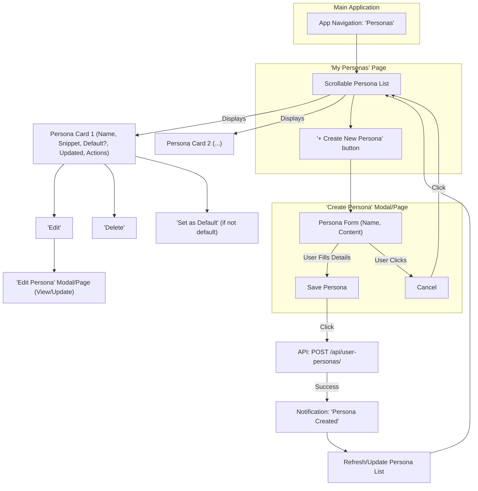
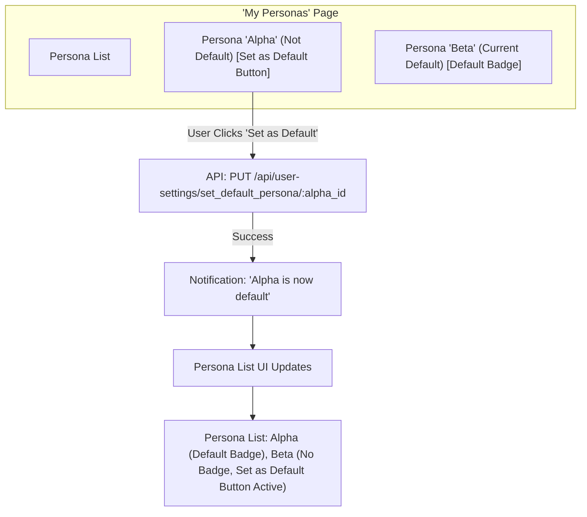

# User Persona UI/UX Flow Definition

This document outlines the user interface (UI) and user experience (UX) flows for managing User Personas, including listing, CRUD operations (Create, Read, Update, Delete), and setting a default persona.

## 1. Persona Listing

*   **Access Point:**
    *   A new top-level navigation item, labeled "**Personas**," will be added to the main application sidebar or menu (similar to "Lorebooks").
    *   Alternatively, if a "User Settings" or "Account" page exists or is planned, "Personas" could be a dedicated section within it. For now, we'll assume a top-level "Personas" navigation item leading to a "My Personas" page.
    *   Clicking "Personas" navigates the user to the "My Personas" page.
*   **Page Content & Display ("My Personas" Page):**
    *   The page will display a list of all personas created by the user.
    *   Each persona in the list will be presented as a card or a row, showing:
        *   **Name:** The persona's name (prominently displayed).
        *   **Content Snippet:** A brief preview of the persona content (e.g., first 1-2 lines, expandable or shown on hover/click).
        *   **Default Indicator:** A clear visual cue (e.g., a "Default" badge, an icon like a star) if the persona is currently set as the user's default.
        *   **Last Updated:** Timestamp of the last modification.
        *   **Actions:**
            *   An "**Edit**" button/icon to navigate to the Persona edit view/form.
            *   A "**Delete**" button/icon.
            *   A "**Set as Default**" button/toggle (this button would be disabled or hidden if the persona is already the default).
    *   A clearly visible "**Create New Persona**" button will be present on this page, likely at the top.
    *   If the list is empty, a message prompting the user to create their first persona should be displayed (e.g., "You haven't created any personas yet. Create one to customize your interaction style!").

## 2. Persona CRUD (Create, Read, Update, Delete)

*   **Create Persona:**
    *   **Initiation:** User clicks the "Create New Persona" button on the "My Personas" page.
    *   **UI:** A modal dialog or a separate form page appears (consistent with Character/Lorebook creation).
    *   **Input Fields (based on `UserPersonaCreatePayload`):**
        *   `name`: Text input. (Required, Min: 1, Max: 255 characters).
        *   `persona_content`: Large textarea for the persona text. (Required, Min: 1, Max: ~65535 characters or as defined by backend).
    *   **Actions:**
        *   "**Save Persona**" button: Submits the form. On success, the new persona appears in the "My Personas" list, and a success notification is shown. The user might be navigated back to the list or to an edit/view page for the new persona.
        *   "**Cancel**" button: Closes the modal/form without saving.
*   **Read/View Persona:**
    *   **Initiation:**
        *   Viewing is implicitly part of the "Update" flow. When a user clicks "Edit" on a persona in the list, they are taken to a view where they can see the full details and modify them.
        *   The "Content Snippet" in the list view provides a partial read. A click on the snippet could expand it in place or open a read-only modal if a dedicated "view-only" mode is desired before editing. For simplicity, direct edit access might be sufficient.
    *   **UI:** The Persona edit form (see Update Persona) will display the full `name` and `persona_content`.
*   **Update Persona:**
    *   **Initiation:** User clicks the "Edit" button/icon for a persona in the "My Personas" list.
    *   **UI:** A modal dialog or a separate form page appears, pre-filled with the persona's existing `name` and `persona_content`. This is the primary way to view the full persona details.
    *   **Editable Fields (based on `UserPersonaUpdatePayload`):**
        *   `name`: Text input. (Optional for update, Min: 1, Max: 255 characters if provided).
        *   `persona_content`: Large textarea. (Optional for update, Max: ~65535 characters if provided).
    *   **Actions:**
        *   "**Save Changes**" button: Submits the changes. On success, the "My Personas" list updates (e.g., name, snippet, last updated), and a success notification is shown.
        *   "**Cancel**" button: Discards changes and closes the modal/form.
*   **Delete Persona:**
    *   **Initiation:** User clicks the "Delete" button/icon for a persona in the "My Personas" list.
    *   **Confirmation:** A confirmation dialog appears: "Are you sure you want to delete the persona '[Persona Name]'? This action cannot be undone."
        *   No special warning is needed if it's the default persona, as per the decision to allow deletion and set `default_persona_id` to `NULL`.
    *   **Actions:**
        *   "**Confirm Delete**" button: Proceeds with deletion. On success, the user is returned to the "My Personas" list, the persona is removed, and a success notification is shown. If the deleted persona was the default, the "Default" indicator will disappear from it (as it's removed) and will not automatically transfer to another persona.
        *   "**Cancel**" button: Closes the dialog.

## 3. Setting Default Persona

*   **Initiation:**
    *   User clicks the "**Set as Default**" button/toggle associated with a non-default persona in the "My Personas" list.
*   **UI Indication:**
    *   The currently default persona is clearly marked (e.g., with a "Default" badge or star icon) in the "My Personas" list.
    *   When a new persona is set as default:
        *   The "Default" indicator moves from the old default persona (if any) to the newly selected one.
        *   The "Set as Default" button on the new default persona becomes disabled or hidden.
        *   The "Set as Default" button on the old default persona (if it still exists) becomes active.
*   **Action:**
    *   Clicking "Set as Default" triggers an API call to update the user's `default_persona_id` setting.
    *   On success, the UI updates immediately to reflect the change, and a success notification is shown (e.g., "'[Persona Name]' is now your default persona.").
*   **Impact of Deleting the Default Persona:**
    *   As decided, if the currently default persona is deleted, it is removed from the list, and the user will no longer have an explicitly set default persona (`default_persona_id` becomes `NULL` on the backend). The UI will reflect this by no persona having the "Default" indicator.

## 4. Mermaid Diagrams

### Persona Create & List Flow



### Set Default Persona Flow



### Delete Persona (Including Default) Flow

```mermaid
graph TD
    subgraph "'My Personas' Page"
        PList["Persona List"]
        PCardDefault["Persona 'Gamma' (Current Default) [Default Badge] [Delete Button]"]
        PCardOther["Persona 'Delta' (Not Default) [Delete Button]"]
    end

    PCardDefault -- User Clicks 'Delete' --> ConfirmDeleteDefaultDialog["Dialog: 'Delete Gamma?'"]
    ConfirmDeleteDefaultDialog -- "Confirm" --> CallDeleteDefaultApi["API: DELETE /api/user-personas/:gamma_id"]
    CallDeleteDefaultApi -- "Success" --> NotifyPDeletedDefault["Notification: 'Persona Gamma Deleted'"]
    NotifyPDeletedDefault --> UpdatePListUIDefaultDel["Persona List UI Updates (Gamma removed, No default shown if Delta is only other)"]

    PCardOther -- User Clicks 'Delete' --> ConfirmDeleteOtherDialog["Dialog: 'Delete Delta?'"]
    ConfirmDeleteOtherDialog -- "Confirm" --> CallDeleteOtherApi["API: DELETE /api/user-personas/:delta_id"]
    CallDeleteOtherApi -- "Success" --> NotifyPDeletedOther["Notification: 'Persona Delta Deleted'"]
    NotifyPDeletedOther --> UpdatePListUIOtherDel["Persona List UI Updates (Delta removed)"]