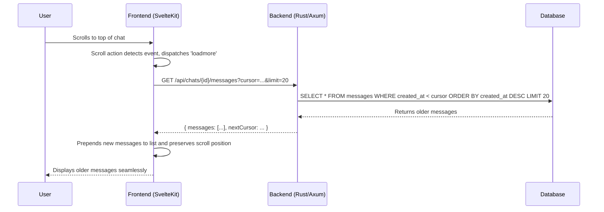

# Infinite Scroll Implementation Plan

This document outlines the architecture and implementation plan for adding an "infinite scroll" (reverse pagination) feature to the chat application.

## 1. Backend API Enhancement (Rust/Axum)

The first step is to create a paginated API endpoint. We will modify the existing `get_messages_by_chat_id_handler` in `backend/src/routes/chats.rs` to support cursor-based pagination.

*   **File to Modify:** `backend/src/routes/chats.rs`
*   **Endpoint:** `GET /api/chats/:id/messages`
*   **New Query Parameters:**
    *   `limit`: The number of messages to fetch per request (e.g., `20`).
    *   `cursor`: The `created_at` timestamp of the last message from the previous batch. This will be used to fetch the next set of older messages. For the initial request, this will be omitted.
*   **Database Query Logic:**
    *   The query will be modified to fetch messages in reverse chronological order (`created_at.desc()`).
    *   When a `cursor` is provided, a `WHERE` clause will be added to fetch messages created *before* the cursor's timestamp.
*   **API Response:** The JSON response will be updated to include the paginated data and the next cursor:
    ```json
    {
      "messages": [ ... ],
      "nextCursor": "timestamp_of_the_oldest_message_in_this_batch" 
    }
    ```
    If there are no more messages, `nextCursor` will be `null`.

## 2. Frontend Implementation (SvelteKit)

Next, we'll refactor the frontend to consume the new paginated API and implement the infinite scroll UI.

*   **Svelte Action for Scroll Detection:**
    *   A new, reusable Svelte Action will be created in `frontend/src/lib/actions/infinite-scroll.ts`.
    *   This action will detect when the user has scrolled to the top of the message container and dispatch a custom `loadmore` event.

*   **State Management & Data Fetching (`chat.svelte`):**
    *   New state variables will be introduced to manage pagination: `cursor`, `isLoadingMore`, and `hasMoreMessages`.
    *   A `loadMoreMessages` function will be triggered by the `loadmore` event. This function will:
        1.  Set `isLoadingMore` to `true`.
        2.  Call the paginated API with the current `cursor`.
        3.  Preserve scroll position using the "before and after" measurement technique.
        4.  Prepend the new messages, update the `cursor`, and set `isLoadingMore` to `false`.

*   **UI Updates (`messages.svelte`):**
    *   A loading spinner will be added to the top of the message list, visible when `isLoadingMore` is `true`.
    *   The `infiniteScroll` action will be applied to the scrollable message container.

## 3. Scroll Position Preservation Mechanism

This is the most critical part of the user experience. Here's the detailed breakdown:

1.  **Capture "Before" State:** Before fetching new messages, record the `scrollHeight` of the scroll container and identify the first visible message element.
2.  **Fetch New Data:** Make the API call to get the next batch of older messages.
3.  **Prepend and Wait:** Prepend the new messages to the data array and use Svelte's `tick()` to wait for the DOM to update.
4.  **Calculate and Adjust:** After the DOM update, get the `newScrollHeight`. The difference between the new and old scroll heights is the height of the content that was added. Adjust the `scrollTop` of the container by this difference to keep the user's view stable.

## 4. Visual Flow Diagrams

### Data Flow



### Scroll Preservation Logic

```mermaid
graph TD
    subgraph "Before DOM Update"
        A[Scroll Container]
        A -- `scrollHeight = 1500px` --> B((User's View))
        B -- `scrollTop = 0px` --> A
    end

    subgraph "Action"
        C{Fetch & Prepend 20 New Messages}
    end

    subgraph "After DOM Update (Without Adjustment)"
        D[Scroll Container]
        D -- `scrollHeight = 2500px` --> E((User's View at New Top))
        E -- `scrollTop = 0px` --> D
        F((Old Top Message is now 1000px down))
    end
    
    subgraph "After DOM Update (With Adjustment)"
        G[Scroll Container]
        G -- `scrollHeight = 2500px` --> H((User's View on Same Message))
        H -- `scrollTop = 1000px` --> G
    end

    A --> C
    C --> D
    D --> F
    C --> G